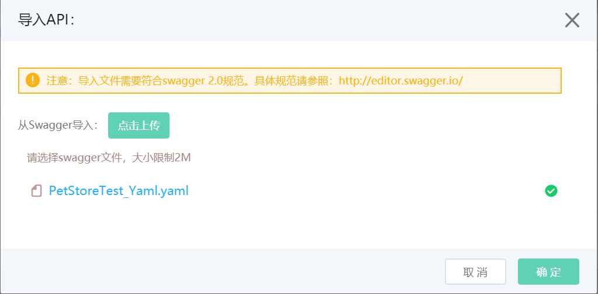
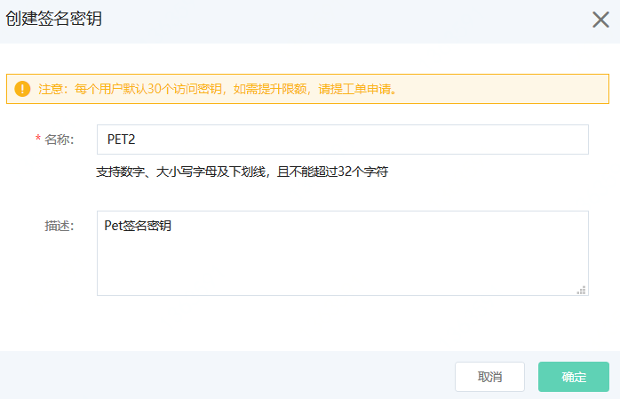
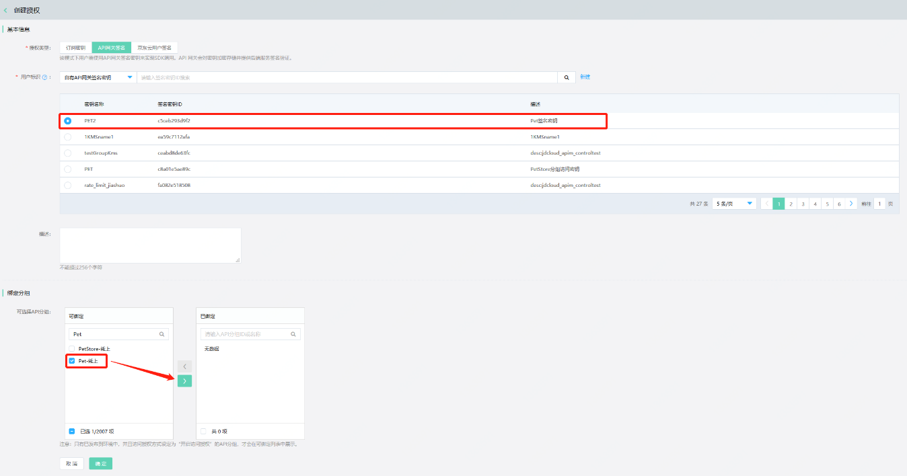

# Build API with the method of signature key pair


## Step I: Create API Group-Create API-Release:

The following process is the guide for creating API in the API Gateway Console and authorizing and making API calls with the method of Signature Key Pair.


### 1. Log in the API Gateway Console and turn on [API Group Management](https://apigateway-console.jdcloud.com/apiGroupList).

### 2. Click the **Create Group** button


### 3. After redirecting to the created API group page, please fill in the API group information.


### 4. After clicking **OK**, the "Creation Succeeded" notification will be given. In such case, please select "API Management" in the pop-up window and redirect to the API list interface of this group.


### 5. You can deploy API via the two methods below.

(1) Create API: Click the **Create API** button, click **OK** after configuring "Name", "Sub-path", "Search Parameter", "Request Body Format" and "Normal Return Format" of API on Details, therefore, API is created successfully. If SDK is required to be generated, Request Body Format and Normal Return Format are required to be defined. If SDK is not required, **Request Body Format** and **Normal Return Format** are left blank.


(2) Import API: Click **Import API**, upload yaml files conforming to the swagger2.0 specification, and click **OK**. Then, API set in the yaml file will be displayed in the API list interface. ([Yaml File Download Link](https://apigateway.s3.cn-north-1.jdcloud-oss.com/demo/demo_PetStoreTest_Yaml.zip))





### 6. Click the tag page of **Version Amendment List**, click **Release**, configure the following options and click **OK**.

- Release version: 0.0.1;
- Released as: On-line;
- Backend service: Unique backend;
- Backend Service Address: http://petstore-demo-endpoint.execute-api.com.


### 7. When the release is conducted, click [Produce SDK and Document] to download the JavaSDK, PythonSDK and API documents.


## Step II: Obtain Key-create access authorization-associate groups:

### 1. Turn on [Signature Key Pair](https://apigateway-console.jdcloud.com/accessSecretKey), and click **Create Key Pair**.


### 2. Fill in the name and description (optional) and click **OK**.



### 3. Turn on [Access Authorization](https://apigateway-console.jdcloud.com/authorizationList), click **Create Authorization**, and select the authorization type as "API Gateway Signature Key Pair". You can select the target key pair from an existing list of API Gateway Signature Key Pair and authorize the API group. When different authorization types access the same API group, API Gateway will verify the authorization information of "Subscription Key" type in priority in the API call process.


    
    
Via the above steps, the operation in the API Gateway Console interface is completed. Then, the call can be made to API.
    
    
## Step III: Call API

### (1) Call via Java SDK

#### 1. 	Unzip the downloaded Java SDK.

#### 2.	Switch to the PetStore directory and edit a Demo.java file. ([Project Download Link](https://apigateway.s3.cn-north-1.jdcloud-oss.com/demo/demo_PetStoreTest_javaSDK_jdcloud.zip))

- accessKeyId refers to the APIKey when viewing detailed information of key pairs;
- secretAccessKey refers to the APISecret when viewing detailed information of key pairs;
- Select corresponding environment address as per the environment selected at the time of release;
- Others are called by API.
   
 ```Java
package net.jdcloud.PetStore;

import com.jdcloud.sdk.auth.CredentialsProvider;
import com.jdcloud.sdk.auth.StaticCredentialsProvider;
import com.jdcloud.sdk.client.Environment;
import com.jdcloud.sdk.http.HttpRequestConfig;
import com.jdcloud.sdk.http.Protocol;
import net.jdcloud.PetStore.client.PetStoreClient;
import net.jdcloud.PetStore.model.*;

import java.math.BigDecimal;

/**
 * Demo
 */
public class Demo {

    private static String accessKeyId = "";
    private static String secretKey = "";
    private static CredentialsProvider credentialsProvider = new StaticCredentialsProvider(accessKeyId, secretKey);
    private static PetStoreClient client = PetStoreClient.builder()
            .credentialsProvider(credentialsProvider)
            .httpRequestConfig(new HttpRequestConfig.Builder().connectionTimeout(10000).protocol(Protocol.HTTPS).build())
//                .environment(new Environment.Builder().endpoint("xue0ivjzhif3-test.cn-north-1.jdcloud-api.net").build()) // Test Environment Address
//                .environment(new Environment.Builder().endpoint("xue0ivjzhif3-preview.cn-north-1.jdcloud-api.net").build()) // Pre-release Environment Address
            .environment(new Environment.Builder().endpoint("xue0ivjzhif3.cn-north-1.jdcloud-api.net").build()) // On-line Environment Address
            .build();

    public static void main (String[] args){

        GetPetInfoRequest getPetInfoRequest = new GetPetInfoRequest();
        getPetInfoRequest.setPetId(1);
        GetPetInfoResponse getPetInfoResponse = client.getPetInfo(getPetInfoRequest);
        System.out.println(getPetInfoResponse.getResult());

        CreatePetRequest createPetRequest = new CreatePetRequest();
        net.jdcloud.PetStore.model.createpet.Body createpetBody = new net.jdcloud.PetStore.model.createpet.Body();
        createpetBody.setId(1);
        createpetBody.setPrice(BigDecimal.valueOf(12.3));
        createpetBody.setType("cat");
        createPetRequest.setBody(createpetBody);
        CreatePetResponse createPetResponse = client.createPet(createPetRequest);
        System.out.println(createPetResponse.getResult());

    }
}
```
#### 3.	 Run SDKTest.java to obtain returned results.


### (2) Call via Python SDK

#### 1.	Unzip the downloaded Python SDK and execute the setup.py file.

#### 2.	Switch to the PetStore directory and create a PetStoreTest.py file. [Project Download Link](https://apigateway.s3.cn-north-1.jdcloud-oss.com/demo/demo_PetStoreTest_pythonSDK_jdcloud.zip)

```Python
# coding=utf-8

from jdcloud_apim_sdk.core.credential import Credential
from jdcloud_apim_sdk.core.config import Config
from jdcloud_apim_sdk.core.const import SCHEME_HTTPS, SCHEME_HTTP
from client.PetStore_client import *
from apis.get_pet_info_request import *
from apis.create_pet_request import *
from apis.test_function_request import *


if __name__ == "__main__":
    access_key = ''
    secret_key = ''
    credential = Credential(access_key, secret_key)
    # config = Config('xueki79b37y4-test.cn-north-1.jdcloud-api.net', scheme=SCHEME_HTTPS) # Test Environment Address
    # config = Config('xueki79b37y4-preview.cn-north-1.jdcloud-api.net', scheme=SCHEME_HTTPS) # Pre-release Environment Address
    config = Config('xueki79b37y4.cn-north-1.jdcloud-api.net', scheme=SCHEME_HTTPS)  # On-line Environment Address
    client = PetStoreClient(credential, config)

    parameters = dict()
    body = ''
    header = dict()

    get_pet_info_request = GetPetInfoRequest(parameters= {"petId": 1}, body=body, header=header)
    GetPetInfo_response = client.send(get_pet_info_request)
    print(GetPetInfo_response)

    create_pet_request = CreatePetRequest(parameters=parameters, body={"id":1, "price": 12, "type": "cat"}, header=header)
    CreatePet_response = client.send(create_pet_request)
    print(CreatePet_response)
```

#### 3.	 Run PetStoreTest.py to obtain returned results.


### You are allowed to obtain your API calling conditions in real time via the [API Gateway Monitoring](http://cms-console-north-2a-backup.jdcloud.com/monitor/apigateway), including: success number, traffic, response time, request exception and other information as well as exception condition alarm setting.
