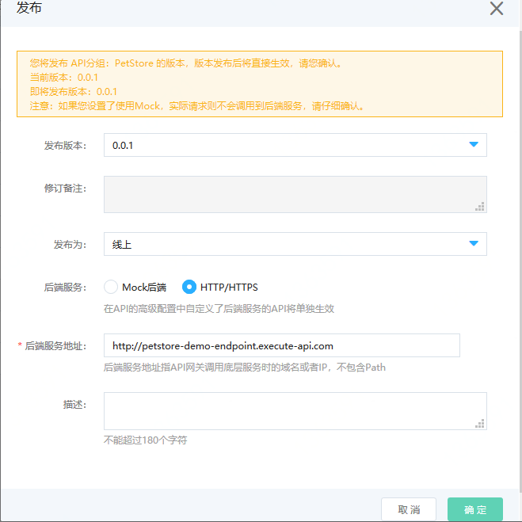
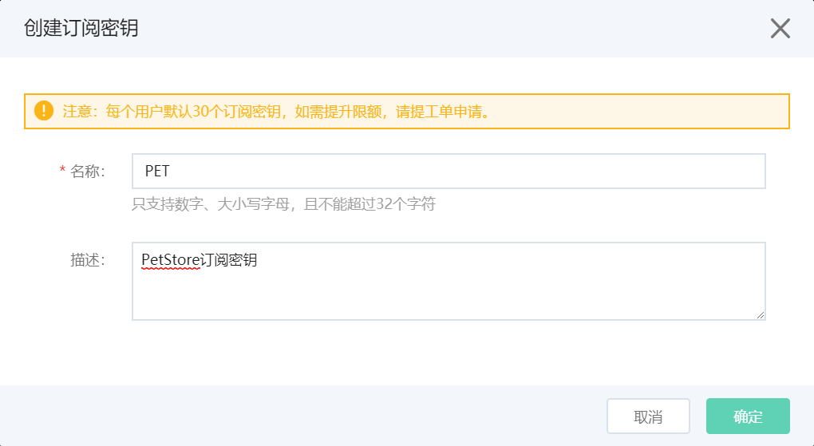
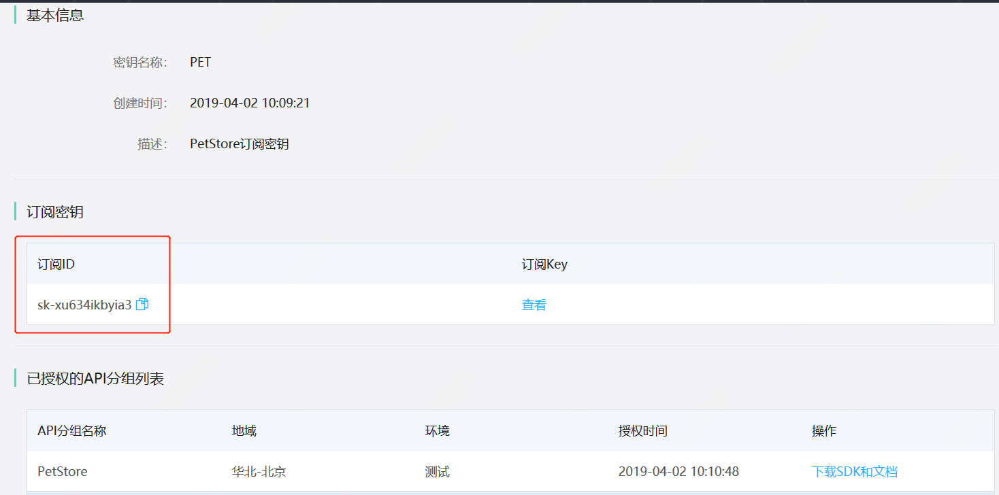
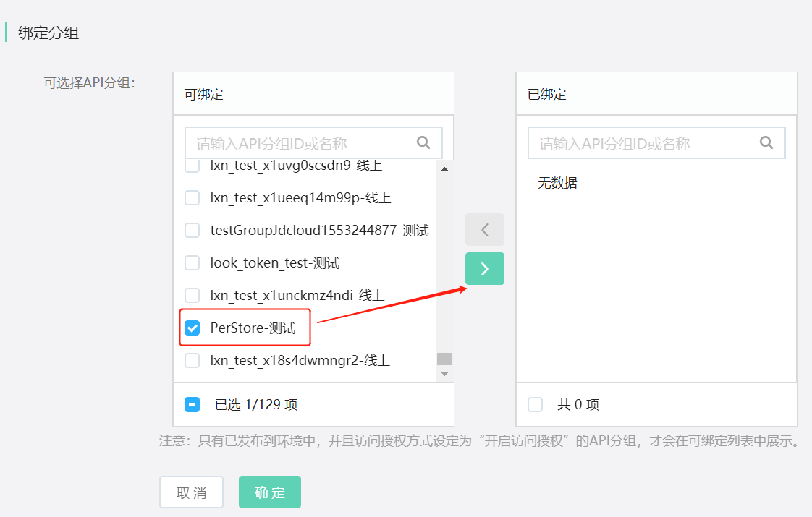
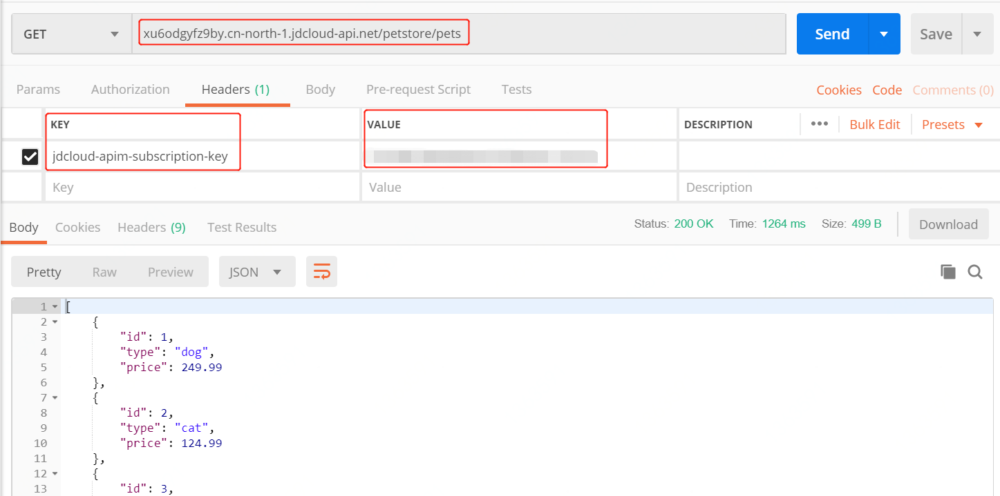

# Build API using the method of subscription Key

## Step I: Create API Group-Create API-Release:

The following process is the guide for creating the API in the API Gateway Console and authorizing and making API calls using a method of subscription Key.

### 1. Log in the API Gateway Console and turn on [API Group Management](https://apigateway-console.jdcloud.com/apiGroupList).

### 2. Click **Create Group

### 3. After redirecting to the created API group page, please fill in the API group information.

### 4. After clicking **OK**, the "Creation Succeeded" notification will be given. In such case, please select "API Management" in the pop-up window and redirect to the API list interface of this group.

### 5. You can deploy API via the two methods below.

(1) Create API: Click **Create API** click **OK** after configuring "Name", "Sub-path", "Search Parameter", "Request Body Format" and "Normal Return Format" of API on Details, therefore, API is created. If SDK is required to be generated, Request Body Format and Normal Return Format are required to be defined. If SDK is not required, **Request Body Format** and **Normal Return Format** are left blank.

(2) Import API: Click **Import API**, upload yaml files conforming to the swagger2.0 specification, and click **OK**. Then, API set in the yaml file will be displayed in the API list interface. [Yaml File Download Link](https://apigateway.oss.cn-north-1.jcloudcs.com/demo/PetStoreTest_Yaml.zip)

### 6.	Click the tag page of **Version Amendment List**, click **Release**, configure the following options and click **OK**.

- Release Version: 0.0.1;
- Released As: On-line;
- Backend Service: Unique backend;
- Backend Service Address: http://petstore-demo-endpoint.execute-api.com.

## Step II: Obtain Key-create access authorization-associate groups:

1. Turn on [Subscription Key](https://apigateway-console.jdcloud.com/subscriptionKey), and click **Create Key**.

    

2. Fill in the name and description (optional) and click **OK**.

    

3. Click Key name after creation succeeded, view details of the subscription Key and copy subscription key ID.

    

4. Turn on [Access Authorization](https://apigateway-console.jdcloud.com/authorizationList) and click **Create Authorization**, select the authorization type as "Subscription Key". You can select the target key from an existing list of subscription Keys and authorize the API group. When different authorization types access the same API group, API Gateway will verify the authorization information of "Subscription Key" type in priority in the API call process.

    

    
    
Via the above steps, the operation in the API Gateway Console interface is completed. Then, the call can be made to API.
    
## Step III: Call API
1.	 During the call, please enter the required header name when using the subscription Key: jdcloud-apim-subscription-key
2.	Here, an example of calling the API using postman: at the Headers part of postman, enter jdcloud-apim-subscription-key at KEY Location, enter Key of subscription Key at VALUE Location.
3.	Fill in the access path of API group and request path of API at the GET Request part to call API.

    

    
    
    
    
    

### You are allowed to obtain your API calling conditions in real time via the [API Gateway Monitoring](http://cms-console-north-2a-backup.jdcloud.com/monitor/apigateway), including: success number, traffic, response time, request exception and other information as well as exception condition alarm setting.

