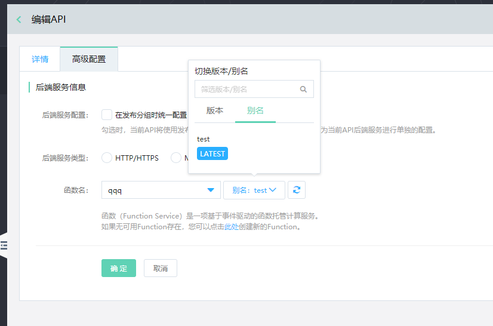

# Function Backend Service

In the process of releasing API group, the advanced configuration function provides the option for users to separately configure function backend service for API.

#### Entry:
Middleware>API Gateway>API Group Management>API List, select API and click the Advanced Configuration function in the operation.

##  Operation Steps:
In the advanced configuration, when "unified configuration at the time of releasing groups" is not checked, the function backend service can be selected. If this type is used as the backend, you need to create a function in the function first, then find and select the function in the drop-down box, and finally select the version/alias corresponding to the function. When the user doesn’t select the version/alias, the LATEST version is applicable for API Gateway by default.
Special description: Currently, it supports to configure the function type backend for a single API only, while the configuration function type backend for API group is not supported.
 
 
 

##  Configuration Rules:
- Backend service configurable by API group: HTTP/HTTPS and Mock
- Backend service configurable by API: HTTP/HTTPS, Mock and Function (Function Service)
- When all APIs in a API group share the same backend, only the backend of the group needs to be configured; when most of the APIs in a API group share the same backend and a few of others use other backends, the backend shared by most of APIs can be configured for the group, and other backends can be separately configured for other APIs.

