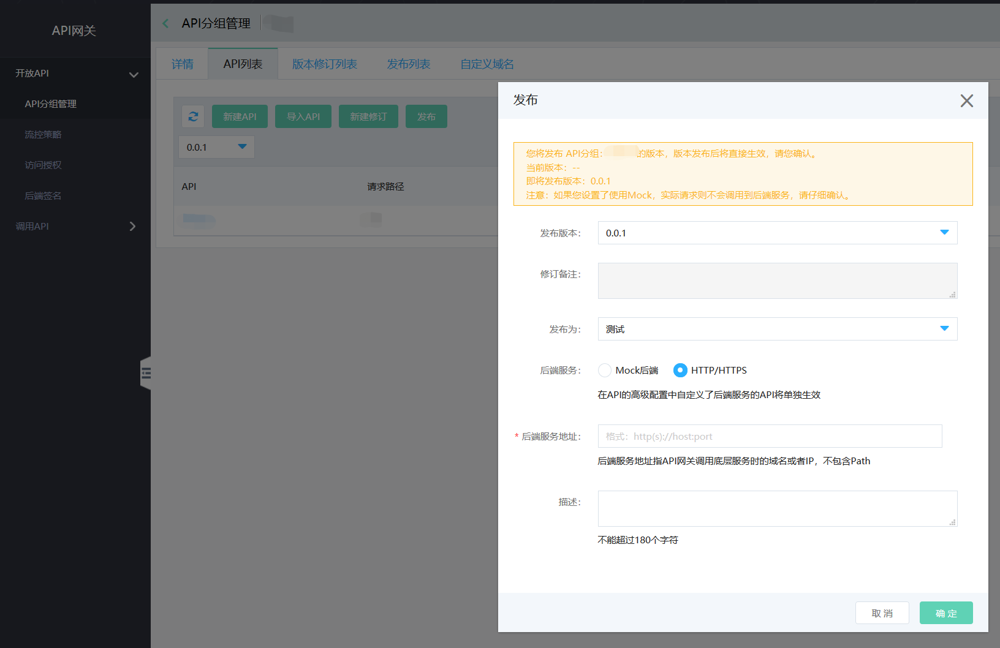
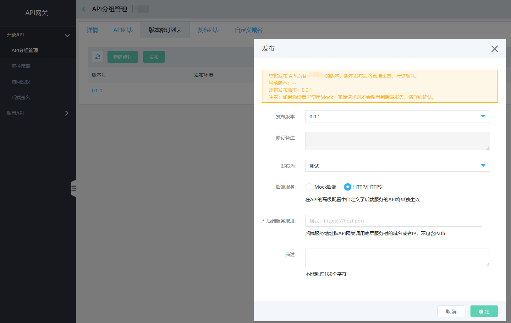
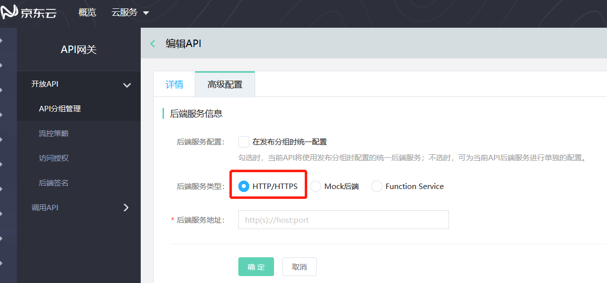

# HTTP/HTTPS Backend Service

API Gateway supports not only configuration of the unified backend service for API group during the group release, but also that of separate HTTP/HTTPS backend service by the user for APIs in advanced configuration.

#### Entry I:
Middleware > API Gateway > API Group Management > API List > Release

#### Entry II:
Middleware > API Gateway > API Group Management > Version Modification List > Release

#### Entry III:
Middleware>API Gateway>API Group Management>API List, select API and click the Advanced Configuration function in the operation.

## Operation Steps:

- In the API List page, after clicking the **Release** button, the unified HTTP/HTTPS backend service can be configured for the API group by filling in the backend service address.
  

- In the Version Modification List page, after clicking the **Release** button, the unified HTTP/HTTPS backend service can be configured for the API group by filling in the backend service address.
 

- In the advanced configuration, when "unified configuration at the time of releasing groups" is not checked, the HTTP/HTTPS backend service type can be selected, and the true backend service address of API calling shall be filled in, so as to configure the HTTP/HTTPS backend for the current API.
  

##  Configuration Rules:
- Backend service configurable by API group: HTTP/HTTPS and Mock
- Backend service configurable by API: HTTP/HTTPS, Mock and Function (Function Service)
- When all APIs in a API group share the same backend, only the backend of the group needs to be configured; when most of the APIs in a API group share the same backend and a few of others use other backends, the backend shared by most of APIs can be configured for the group, and other backends can be separately configured for other APIs.

