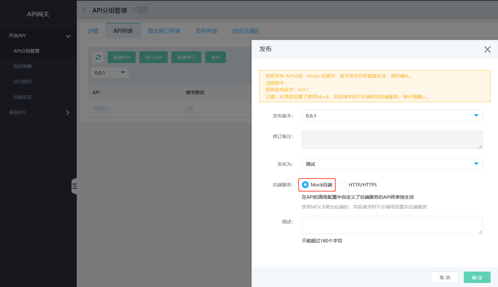
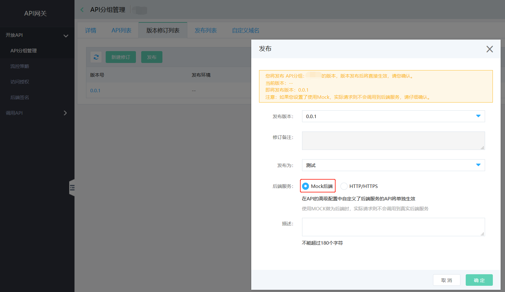
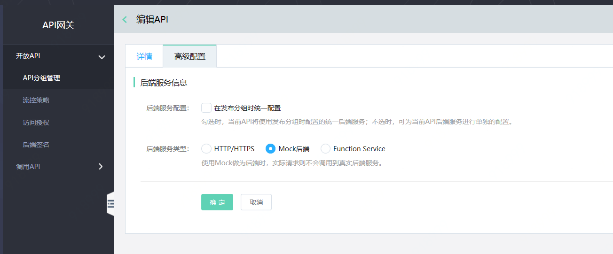

# Mock Backend Service

API Gateway not only supports the configuration of the unified backend service for API group during the group release, but also provides the option to separately configure Mock backend service for APIs in the advanced configuration function.

#### Entry I:
Middleware > API Gateway > API Group Management > API List > Release

#### Entry II:
Middleware > API Gateway > API Group Management > Version Modification List > Release

#### Entry III:
Middleware>API Gateway>API Group Management>API List, select API and click the Advanced Configuration function in the operation.

##  Operation Steps:
- In API List page, after clicking the **Release** button, Mock can be selected as the backend, and the actual request will be not called to the true backend service.

 
 

- In the Version Modification List page, after clicking the **Release** button, Mock backend service can be selected, and the actual request will not be called to the true backend service.

 
 
 
- In the advanced configuration, when "unified configuration at the time of releasing groups" is not checked, the Mock backend service type can be selected, and when Mock is used as the backend, the actual request will not be called to the true backend service.

 

##  Configuration Rules:
- Backend service configurable by API group: HTTP/HTTPS and Mock
- Backend service configurable by API: HTTP/HTTPS, Mock and Function (Function Service)
- When all APIs in a API group share the same backend, only the backend of the group needs to be configured; when most of the APIs in a API group share the same backend and a few of others use other backends, the backend shared by most of APIs can be configured for the group, and other backends can be separately configured for other APIs.
