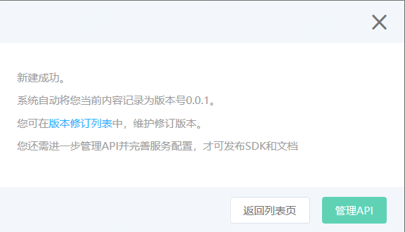
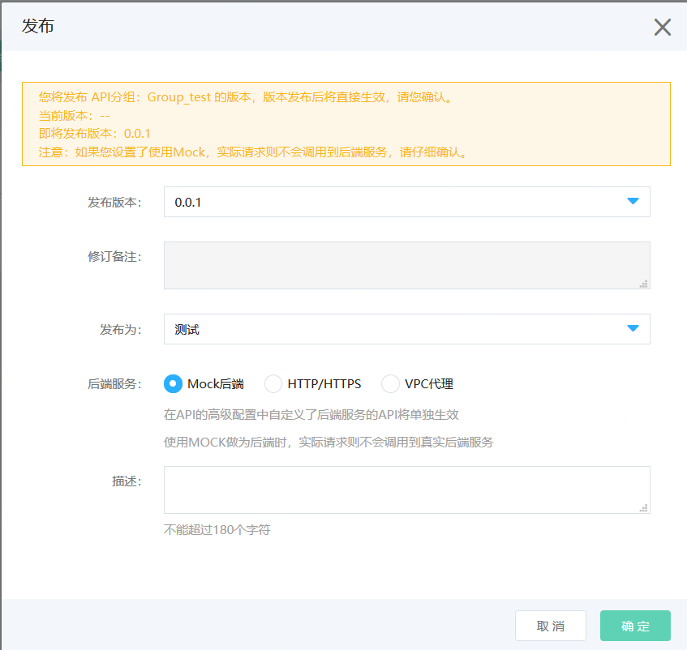

# Dynamic Route

API Gateway supports the dynamic route function. When the dynamic route function is used, you can customize several route rules. By defining different frontend parameters, backend services under different environments can be configured to the same API group,
so as to be applicable to more business scenarios.

#### Entry:
Middleware>API Gateway>API Group Management>Dynamic Route

##  Operation Steps:
1. Click **Create Group** in the API Group Management. Please select API group type as **General API Group**. You can enable access authentication or select free authentication.

 
 
 
2. After creation, select **Manage API**.
 
 
 

3. Click **Create API** to create API in this group. (This step can be omitted)

 
 

4. Select the "Dynamic Route" module, select one environment from "test, pre-release or on-line", and click the **Create** button to create the dynamic route rule.

 
 

5. When dynamic route rules are created, the total number of Query parameters and Header parameters in each rule cannot exceed 20. Users can select Mock backend service or HTTP/HTTPS backend service as the backend service of this rule.

 
 

6. The created dynamic route rules can be viewed, edited or deleted. Users can create multiple dynamic route rules, while API Gateway will be matched with backend service as per creation sequence of dynamic route rules.

 
 

7. Next, API groups are released. Only when the release environment corresponds to the creation environment of dynamic route rules, all dynamic route rules created under the environment can take effect.

 
 

8. If the free authentication mode is selected when API group is created, group access can be made with Postman. If the access authorization mode is selected when API group is created, access authorization is the next step. You need to create your own [Subscribe Key Pair](https://apigateway-console.jdcloud.com/subscriptionKey), [Signature Key Pair](https://apigateway-console.jdcloud.com/accessSecretKey) or [JD Cloud User Access Key](https://uc.jdcloud.com/account/accesskey) first, then select the created key pair in the [Access Authorization](https://apigateway-console.jdcloud.com/authorizationList) module of API Gateway, and finally associate corresponding general API group. API gateway signature authorization and JD Cloud user signature authorization to other users are similar to this process.

 
 
 
 

9. Next, the user can access API group with SDK.

