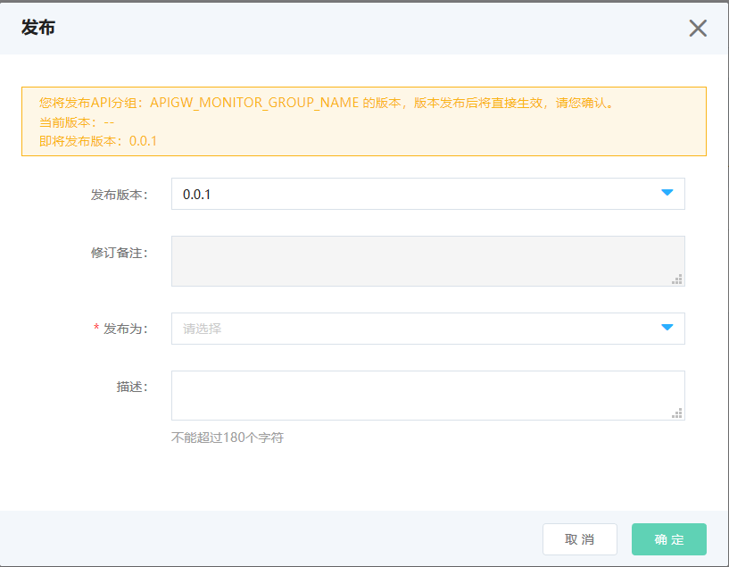
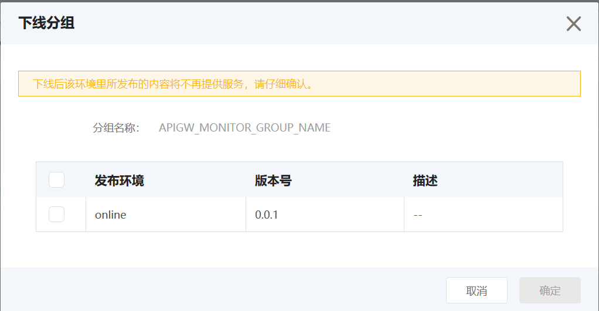

# Release API Groups

After API group created, it is required to publish the API group before using it. Currently, the JD Cloud provides 3 sets of publishing environment: Test, Pre-release and On-line. API caller can access and call the API through custom domain or secondary domain after publishing.

Please note that:

* You need to make backend configuration to API group and release it then.

## Operation Steps:

### STEP1: select the group to be published

Firstly, enter the **API Group Management** page and find the group to be published

### STEP2: click the **Publish**:

Description:

1) Select the version to be published. API gateway supports the version management of group, so you need to pay attention to select the version to be published when publishing. Subsequently, you can switch or log off different versions in environment management.
   
2) Select the environment to be published. API gateway provides three environments: Test, Pre-release, On-line.

### STEP3: Manage versions in the release list, which are released under each environment:
The deployment of different environments can be seen in the page of deployment management after publishing.

API Gateway supports version management for testing/pre-releasing/on-line API groups. You can release API groups and off-line API groups and switch versions, with switched versions taking effect in real time.

### STEP4: logoff
Directly click the "Off-line" if required, it will take effect in real time.

