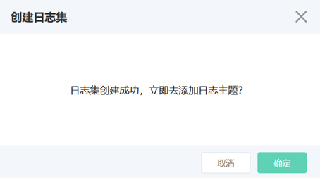
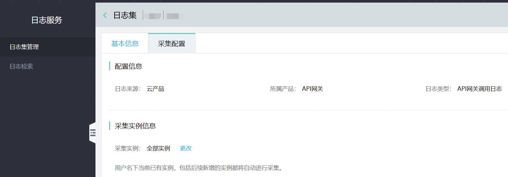
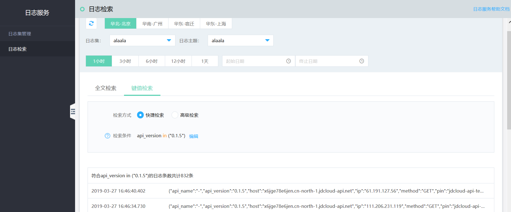

# Log Service

You can realize real-time log collection, log storage, log retrieval, intelligent analysis and other functions currently in API group management of JD Cloud to help users solve business operation, workload monitoring, log analysis and other problems through logs.

#### Entry I:

Middleware > API Gateway > Open API > API Group Management > Log Service

#### Entry II:

Management > Log Service

##  Operation Steps:
###  Step 1: Enter the management page of API group, click **Log

 

###  Step 2: Click **Create Log Set** on the [Log Set Management](https://logs-console.jdcloud.com/logset/list) module to open the Create Log Set page.

 
 

###  Step 3: Set the log set name, description (non-compulsory), and save time. After clicking **OK**, the notification "Log set creation succeeded, go to add the log subject immediately?" will pop up "

###  Step 4: After clicking **OK**, redirect to the log set details to create a log subject.

###  Step 5: After adding the log subject name, click **OK**, the notification "Log subject creation succeeded, go to add the collection configuration immediately?" will pop up "

###  Step 6: After clicking **OK**, enter the collection configuration page. Click **Add Collection Configuration** to enter the adding collection configuration page and select "API Gateway" from the corresponding options of "Products", click **OK** to complete configuration.

###  Step 7: Go back to the log subject list page in the log set management, select the log set ID/Name, click **Preview** to view the latest log data under the log subject. If it is required to search the log data, you can go to [Log Retrieval](https://logs-console.jdcloud.com/search)for search.

###  Step 8: Select the log subject to be viewed in the log subject list, click **Retrieve**, or switch to the [Log Retrieval](https://logs-console.jdcloud.com/search) module in the left menu to perform the corresponding full text retrieval or key value retrieval to the log:
1. Full Text Retrieval

2. Key Value Retrieval

(1) Quick Retrieval

(2) Advanced Retrieval

