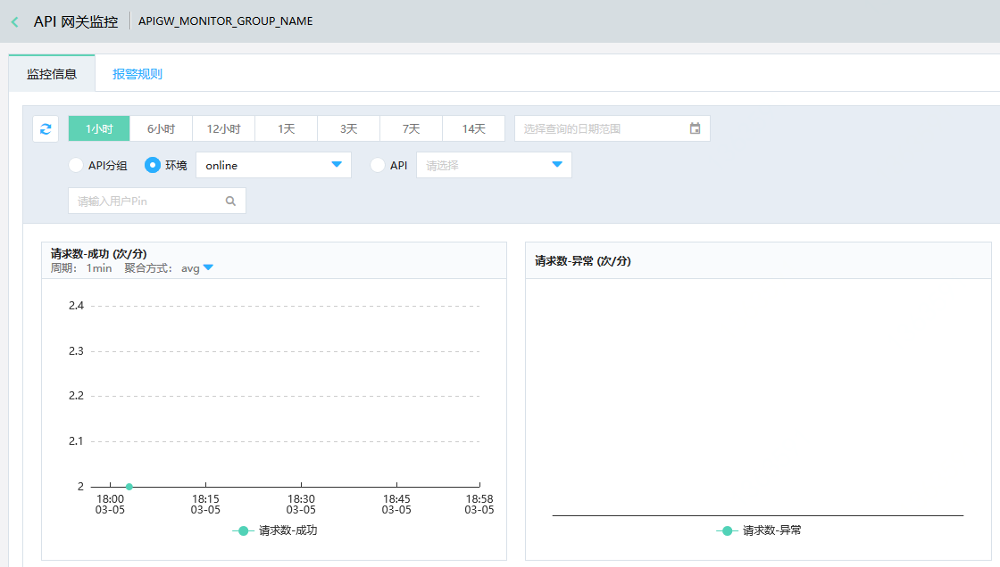

# Access Monitoring

At present, you can view the real-time monitoring information of API in the API Gateway on-line deployment environment in JD Cloud Monitoring, and set alarm rules for API groups.

#### Entry

Management > Monitoring > Resource Monitoring > Gateway Monitoring

##  Operation Steps:
###  Step 1: Enter the monitoring page

 

###  Step 2: View the monitoring details for API groups

 You can view monitoring data by the following ways:
 
(1) In respect of the current grouping, you can select the test, pre-release or on-line environment to view all released APIs in the corresponding environment.

(2) In respect of the current grouping, you can select the test, pre-release or on-line environment and an API to view this API in the corresponding environment.

(3) In respect of the current grouping, you can select the test, pre-release or on-line environment and enter the user Pin to view the calling of APIs by this user in the corresponding environment.

(4) In respect of the current grouping, you can select the test, pre-release or on-line environment, select an API and enter the user Pin to view the calling of this API by this user in the corresponding environment.

 

###  Step 3: Set alarm rules

In step 1, select the API group where you want to set the alarm rule, and then click **Add New Alarm Rules**

 
 
 
 
 
For more detailed setting, please refer to:

- [Set Alarm Rules](https://docs.jdcloud.com/en/monitoring/createrule)

