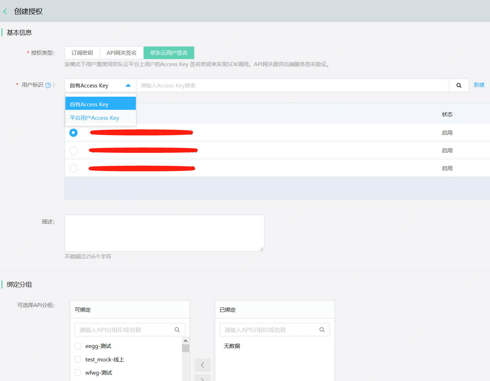

# Access Key of JD Cloud User Signature

JD Cloud API Gateway supports the authorization types of JD Cloud user signatures, the key of the authorization type originates from the Access Key created by the user in account management of JD Cloud, and after such authorization the user can use SDK to call API. API Gateway can check its backend signature.

#### Entry:

JD Cloud Account Management>AccessKey Management

## Operation Steps:

### (1) 	Log in to JD Cloud to enter AccessKey Management. 

  
  
- Click **Create Access Key**, which requires SMS verification. After such verification turns out to be successful, the system will automatically generate the Access Key ID and Access Key Secret and display the status and creation time. Also, the user can disable and delete Access Key.

  

- The API caller needs to tell the Access Key ID of JD Cloud user signatures to the API provider, who will then authorize access.

### (2) 	 The API provider authorizes APIs to the API caller in groups for their use

- Enter the "Access Authorization" list page of the "open API" part and click **Create Authorization**.

  
  
- Select "JD Cloud User Signature" of the authorization type in the "basic information" part. "Owned Access Key" or "Platform User Access Key" can be selected for the user identifier part, and the user needs to select the Access Key ID created by the current user from the corresponding key list or enter the Access Key ID of other users to search and select keys.

- After selecting the Access Key of JD Cloud users, select the corresponding group that can be associated in the "associate group" part for association, and click **OK**. At this point, the authorization between the Access Key and API group of JD Cloud user signatures has been completed.

  Note: The API groups can only be exhibited in the associated list only when by releasing API groups in the environment and setting the access authorization method as "Enable Access Authorization".

  
  
- Next, the user can achieve the API access in the API group with SDK.
