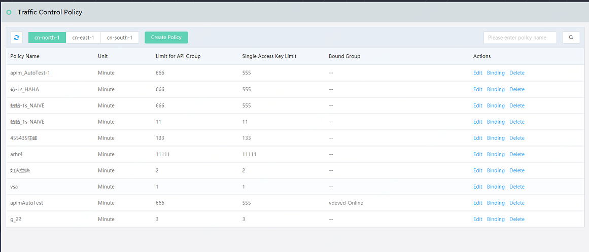
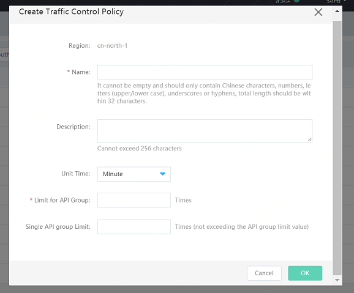
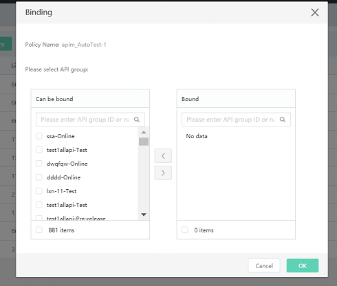

# Traffic Control Policy

API Gateway offers Flow Control Policy to have API call under control. The Flow Control Policy needs to be bounded to API grouping to work on the API under the grouping.

*  The Flow Control Policy can have restrictions on API grouping times and single Access Key times.

*  Please note that restrictions of single Access Key times shall not be greater than that of API grouping flow, that is, restrictions of single Access Key times <= restrictions of API grouping flow.

*  The upper limit of Flow Control for each API grouping is 500 QPS by default (the figure can be increased by submitting the Open Ticket application).

*  The Flow Control Policy takes effect upon binding with API grouping. One policy can be bounded to multiple API groupings and each API grouping takes effect separately.

*  In the case that an API grouping has been bounded with certain policy, the policy will be replaced when you are binding a new policy, which takes effect in real time.

*  At the API Gateway Console, such basic operations as creating, modifying, deleting, checking, binding and unbinding of the Flow Control Policy can be completed.

*  Flow Control unit: minute(s), day(s).

When a Flow Control Policy is created, Region shall be selected and cannot be changed once selected, it can only be applied for the API under the same Region.

## Operational Steps

1. Click the **Traffic Control Policy** at left menu to enter the page of traffic control policy list to configure and associate the policy.

2. Add new traffic control policy

3. Associate the policy to group

