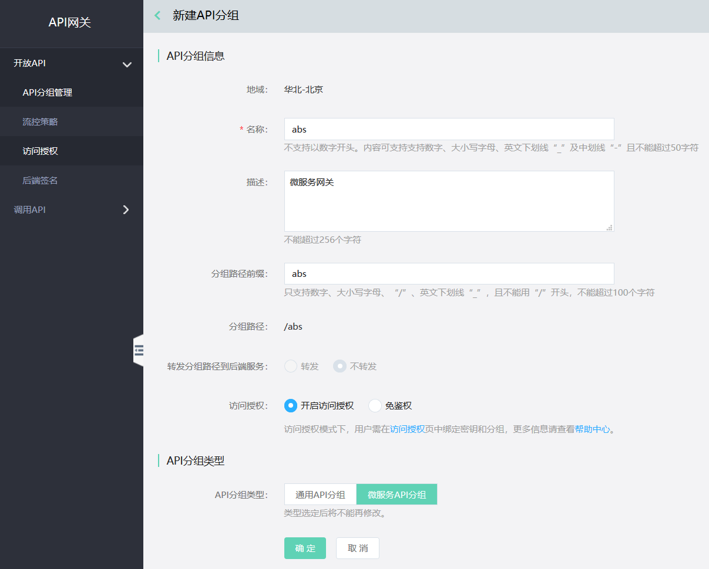
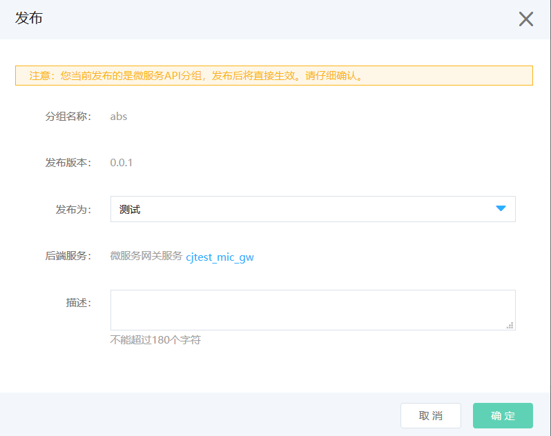

# JD Distributed Service Gateway

After creating your own JD Distributed Service application on JD Cloud via the JD Distributed Service Framework, you can release it via JD Cloud API Gateway to the public network for calling by customers. In such process, JD Distributed Service gateway needs to play its role.

The following process is the guide for adopting JD Distributed Service gateway as the backend service in API Gateway Console and calling JD Distributed Service API.


## Operation Steps:

#### 1. Log in the API Gateway Console and turn on [API Group Management](https://apigateway-console.jdcloud.com/apiGroupList).

#### 2. Click the **Create Group** button.


#### 3. Fill in API group information on the created API group page. Please select API group type as "JD Distributed Service API Group". "Enable Access Authorization" or "Free Access Authentication" can be selected.


   
   
#### 4. After clicking **OK**, the "Creation Succeeded" notification will be given. In such case, please select **Associate** button on the API Group List Page. If the JD Distributed Service gateway service is not created, it needs to create the JD Distributed Service gateway service on the "JD Distributed Service Framework" (for details, please refer to [JD Distributed Service Gateway](https://jdsf-console.jdcloud.com/gateway?regionId=cn-north-1)). If the JD Distributed Service gateway service has been created, you can select one JD Distributed Service gateway and associate target API groups, their regions and release environments.


#### 5. After association is made, you can release JD Distributed Service API group on the API gateway and the backend service is the JD Distributed Service gateway service.





#### 6. After release, you can view release details on the release list of this API group.


#### 7. Then, access authorization is made. You need to create your own [Subscribe Key Pair](https://apigateway-console.jdcloud.com/subscriptionKey), [Signature Key Pair](https://apigateway-console.jdcloud.com/accessSecretKey) or [JD Cloud User Access Key](https://uc.jdcloud.com/account/accesskey) first, and then select the created key pair from the [Access Authorization](https://apigateway-console.jdcloud.com/authorizationList) module of API gateway, and associate corresponding JD Distributed Service API group. API gateway signature authorization and JD Cloud user signature authorization to other users are similar to this process.


#### 8. For this JD Distributed Service API group, please select **Produce SDK** and **Document** in **More** to produce and download SDK and document.


#### 9. Next, you can access JD Distributed Service API group with SDK.
(1) Call via Java SDK, with Java SDK examples as follows:

 ```Java
import com.google.api.client.http.HttpResponse;
import com.google.api.client.http.HttpResponseException;
import com.google.api.client.util.Maps;
import com.jdcloud.sdk.http.Protocol;
import com.jdcloud.sdk.utils.BinaryUtils;
import net.jdcloud.Abs.client.JdcloudSDKClient;


/**
 * Demo
 */
public class Main {

    public static void main(String[] args) throws UnsupportedEncodingException, HttpResponseException {
        String assessKey = "ak";//Null transmission in case of free authentication
        String secretKey = "sk";//Null transmission in case of free authentication
        String host = "w22bzgeav4by.cn-north-1.jdcloud-api.net";// domain: Do not add http:// or https://
    // String host = "w22bzgeav4by-test.cn-north-1.jdcloud-api.net"; // Test environment address
    // String host = "w22bzgeav4by-preview.cn-north-1.jdcloud-api.net"; // Pre-release environment address
        String path = "/v1/test";// Request path: do not contain query parameter, such as /test?queryParam1=value1&queryParam2=value2, only transmit /test
        String method = "POST";// Request method, in uppercase
        Map<String, String> headers = Maps.newHashMap();// header
        headers.put("header1", "headerValue1");
        Map<String, Object> queryMap = Maps.newHashMap();// query parameter, can be null
        queryMap.put("key1", "value1");
        String body = "{\"title\":\"qq\",\"description\":\"222\"}";// request body, can be null
        try {
            HttpResponse httpResponse = JdcloudSDKClient.execute(assessKey, secretKey, Protocol.HTTP, host, path, method, headers,
                    queryMap, body);
            System.out.println(BinaryUtils.toByteArray(httpResponse.getContent()));
        } catch (HttpResponseException e) {
            e.printStackTrace();
        } catch (IOException e) {
            e.printStackTrace();
        }
    }

}
```

(2) Call via Python SDK, with Python SDK examples as follows:

```Python

# coding: utf-8

from jdcloud_apim_sdk.core.credential import Credential
from jdcloud_apim_sdk.core.config import Config
from jdcloud_apim_sdk.core.logger import Logger
from jdcloud_apim_sdk.core.const import SCHEME_HTTPS
from jdcloud_apim_sdk.simpleclient import SimpleClient
from jdcloud_apim_sdk.simplerequest import SimpleRequest

if __name__=="__main__":
    access_key = 'ak' # Null transmission in case of free authentication
    secret_key = 'sk' # Null transmission in case of free authentication
    credential = Credential(access_key, secret_key)
    # config = Config('w5f70cfq9ili-test.cn-north-1.jdcloud-api.net', scheme=SCHEME_HTTPS, timeout=60) # Test environment address
    # config = Config('w5f70cfq9ili-preview.cn-north-1.jdcloud-api.net', scheme=SCHEME_HTTPS, timeout=60) # Pre-release environment address
    config = Config('w5f07gqcm7ri.cn-north-1.jdcloud-api.net', scheme=SCHEME_HTTPS, timeout=60) # On-line environment address, do not add http:// or https://
    logger = Logger(3)
    client = SimpleClient(config, credential, logger)

    url = '/todo/api/v1/tasks/createTask/json' # Request path, do not contain query parameter, such as /test?queryParam1=value1&queryParam2=value2, only transmit /test
    method = 'POST' # Request method, in uppercase
    header = dict()
    header['header1'] = "headerValue1" # header
    parameter = dict()
    parameter['queryParam'] = 'this is query param' # query parameter, can be null
    body = {"description": "1234567890", "title": "title"} # request body, can be null
    request = SimpleRequest(url, method, parameter, body, header)

    resp = client.send(request)
    print(resp.status_code)
```

