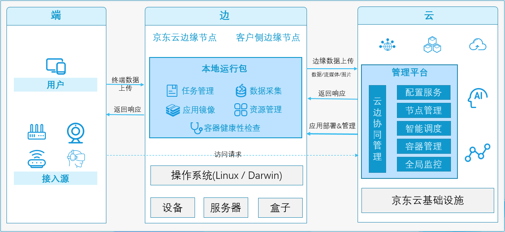

**Basic Architecture Chart:**

**Key Component:** 
  Serving as an edge computation platform, in addition to underlayer service management capacities, JEES also provides some basic function modules which are divided into a cloud management platform (cloud) and a local operation package (edge), with details as follows:
- Cloud-edge collaboration management (epnc-core): Is the only entrance of edge node and cloud center, which is mainly responsible for receiving edge node information report and distributing corresponding computation task;

- Intelligent scheduling (epnc-scheduler): Is responsible for scheduling the arrangement task submitted by users to appropriate edge nodes;

- Configuration service (epnc-config): Is responsible for storing the arrangement task information submitted by users;

- Global monitoring (epnc-stats): Is responsible for collecting usage information of edge node and computation task and for saving the same in the time sequence database and Monitoring;

- Local running package primary program (epnc-edge): Is responsible for receiving management of cloud instructions and service instances, such as start, exit and protection, and for managing user’s computation tasks at the edge side. Two operation modes are supported, i.e., Native progress mode and Docker container mode;

- Container health check: Is responsible for viewing if the container runs normally after created. If container running has error, it must be handled according to the set restart policy;

- Data collection: Monitor use of resources in the node and regularly report to the cloud. Collecting data of resources in all nodes of the whole cluster is essential to task scheduling and normal running.
