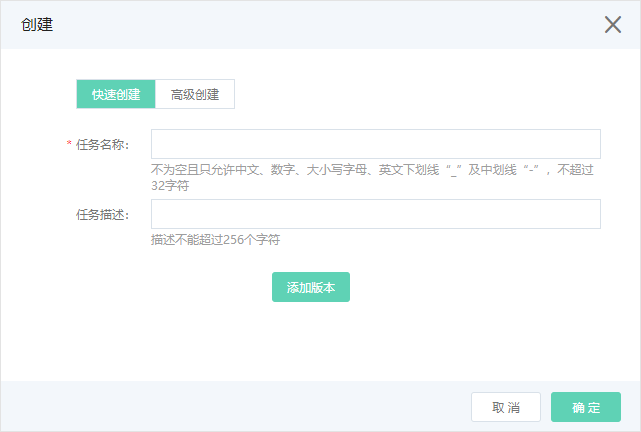
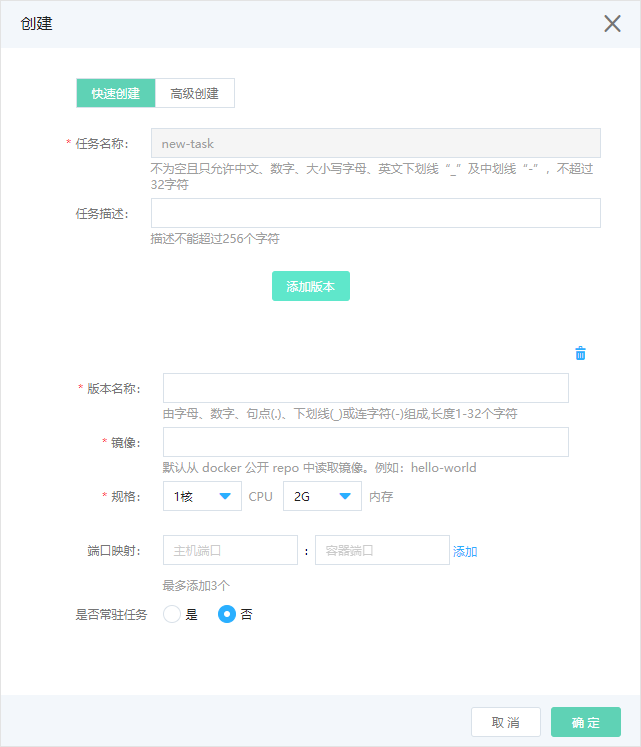
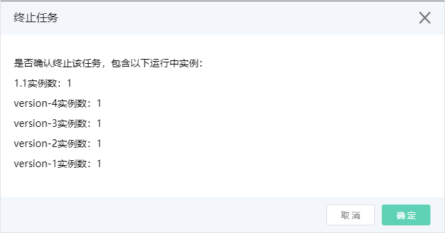

### Step 1: Product Subscription 
1. Apply for Beta first, users fill in the application information (including business scenario description) for ‘JDCloud Equal Edge Service’ product on the [Official Website Product Page](https://www.jdcloud.com/en/products/jd-cloud-equal-edge-service) and then subscribe the product upon manual evaluation and approval; 
2. Conduct services to subscribe the product, users log in the [Console](https://epnc-console.jdcloud.com/consumer), read and agree the JDCloud Equal Edge Service Terms and then click **Instant Account Setup** to complete the product subscription.

### Step 2: Task Generation 
On the task list page as shown in the following figure:

Click ***Location 1*** to create a task: Fill in basic information of the task, and you can at the same time add new versions and click **Add New Version** at the task operation items on the list page. You can refer to the following operations: 
 

Click ***Location 2*** to add a new version: 
 
Image selection: Support pulling images from the third-party image library docker.io (read images from docker open repo); 
Specification: Select resources (CPU, memory) necessary for your business, this attribute is a paid item of the product (the product now is in Beta, so you can use it free trial); 
Port mapping: Enter the port number necessary for the business in container; 
Whether resident task or not: If select **Yes**, then the task will be automatically pulled no matter it ends for whatever reasons so as to guarantee continuous availability of business. 
*Note that after a version is added, we just record the resources information to complete this version but we do not release a version, so you need to click **Blue-green Release** in the list page to release and deploy the task*

Click ***Location 3*** to conduct blue-green release: Select here to release count of instances under the task, click **Release** to release and deploy the task: 
 

Click ***Location 4*** to view version information of the task: After the version is added, you can extend each task on the task list page to view the added version information. 

Click ***Location 5*** to terminate the task: Destroy instances of the selected version to stop the instance running of this version: 

### Step 3: View Instance 
 
Display all of the instance information here. You can screen by task to get the instance running situation under this task.

### Step 4: Device Access 
Users can click **Device Access** to download an installation package, modify a configuration file, and after registering, users can manage their own idle computation capacities and obtain corresponding remuneration according to their harsh rate contribution value (to be launched).
