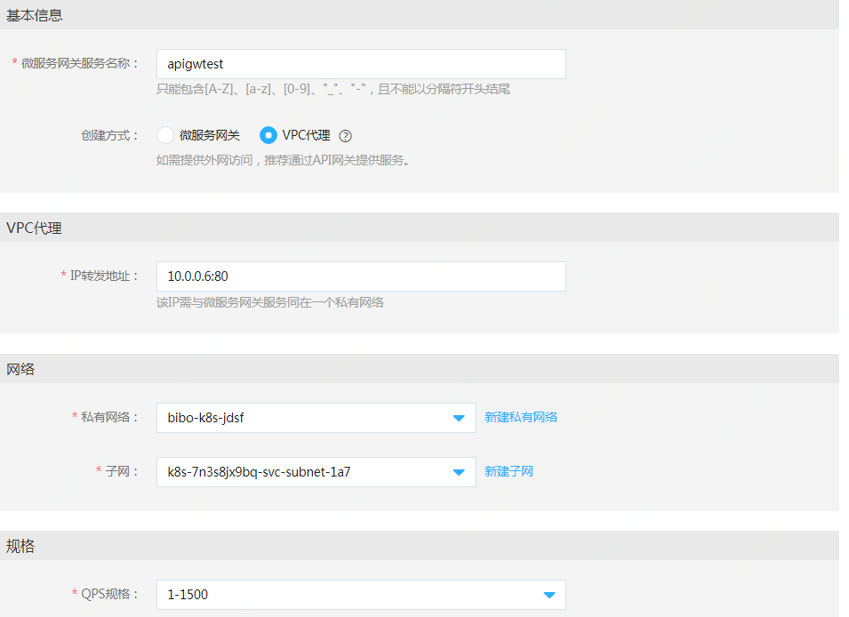
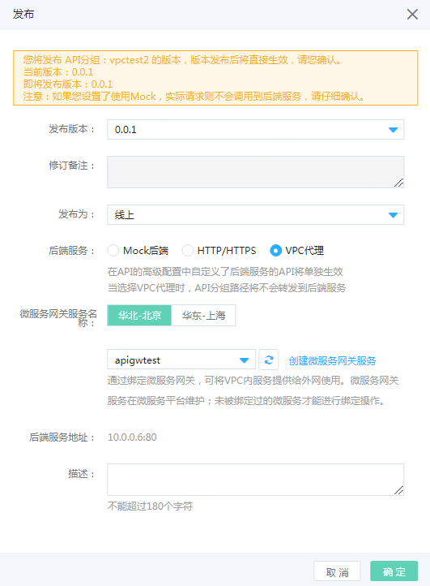
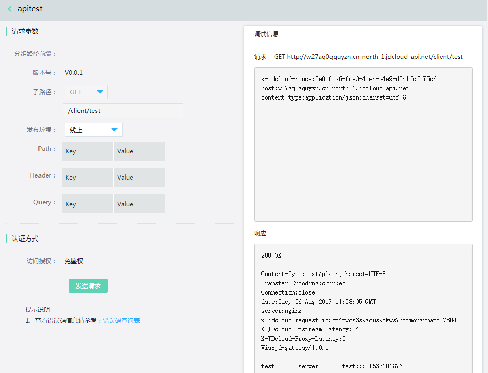

# Use APIs in Open VPC of API Gateway

You can directly open APIs in VPC via the API gateway without applying for Public IP or directly exposing the public network.

If the service address in VPC is 10.0.0.6/client/test,

    # curl 10.0.0.6/client/test
    server successed!
    
you need to directly release this service to the API Gateway via the following two steps:

<b>Configure VPC agent -> Configure API Gateway group</b>

## Configure VPC agent
Create the gateway service via Middleware -》JD Distributed Service gateway menu of JD Distributed Service Framework product in the Console, with the name such as apigwtest, select VPC agent as the creation method, and configure the forwarding address as the backend service address, such as 10.0.0.6 of this example

For more data about creating JD Distributed Service gateway, please refer to the product [JD Distributed Service Gateway](../Operation-Guide/Resource-Manage/JDSFGW.md)

## Configure API Gateway group

Create a new API group via Middleware -》 API Gateway in the Console, such as vpctest. For simplicity, access authorization is authentication-free here. (Be sure to enable access authorization for actual on-line API.)

Click **Manage API**, create one API such as apitest via the path /client/test in this demo, leave other fields null and click **OK**.

Then, release. Click **Release**, select **On-line Release**, select VPC agent for backend service, select apigwtest built in the last step from the JD Distributed Service Gateway drop-down box, and click **OK**.

  

For more data about creating API, please refer to products of [API Gateway](../../API-Gateway/Introduction/Product-Overview.md)

Click **Debugging api**, send requests, and VPC service response can be viewed in response.

  

## Supplementary Description

Addresses in VPC can be the service process address, the address of Load Balancer such as Nginx or the address of Cloud Intranet Load Balancer.

Examples of releasing service of Virtual Machines to Intranet Load Balancer are as follows:

Assume that the backend is the HTTP service deployed in VPC, please deploy 31169 ports of three Virtual Machines in VPC at the addresses of 10.0.224.3, 10.0.224.4 and 10.0.224.5.

    # curl 10.0.224.3:31169/client/test
    test<------server------>test

Create an application type Load Balancer via Network -》 Load Balancer in the Console. Select VPC and subnet deployed by HTTP service in the network area. As this service is not open to the public network, "The default security group allows all traffic" can be selected to all Security Groups here (or create an open 80 Security Groups by yourself). Click **Buy Now**.

After creation, please "Create Listener" at the listener page, keep the listening protocol and port at Http/80 by default, and click **Next**;

Fill in backend service name, select the port 31169, and click **Next**;

Fill in health check configuration and click **Next**;

Add server groups, select **Do not Add Now** and click **OK

"Create Virtual Server Groups" on the Virtual Sever Page, select the Virtual Machines of the service among the optional instances and click **Add**.

Click the created backend service on the backend service page, click **Edit**, select **Server Group** and **Virtual Server Group** on the pop-up interface, select the created group and click **OK**.

The service can be accessed via the Load Balancer Vip on the resource information page. The API Gateway access can be realized by configuring this address at the VPC agent.
    
For more data about creating the Intranet Load Balancer, please refer to the product [Application Load Balancer](../../../Networking/Application-Load-Balancer/Introduction/Overview.md)
