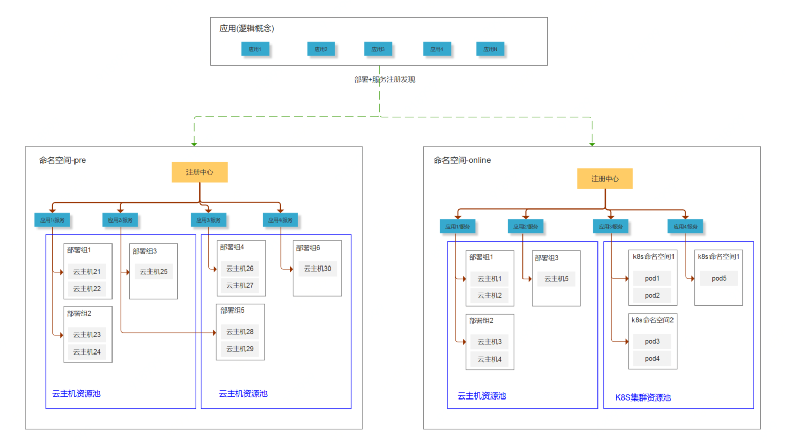

# Core Concepts

## Relevant Glossaries of Microservice

| Concept | Interpretation |
| :- | :- |
|  Microservice |  Microservice consists of some small and autonomous services working cooperatively, which have advantages such as easy elastic extension, simple deployment, being composable, etc. A microservice can be either a service provider, or a service consumer. |
|  Spring Boot  |  Spring Boot It is a framework used for initial setting up and development process of simplified Spring application, which the framework uses the principle of convention over configuration to greatly simplify development.  |
|  Spring Cloud  | Spring Cloud It is a set of service governance functions, which uses Spring Boot development style to simplify the development of distributed system infrastructure and provides functions including Service Registration and Discovery, Configuration Center, Messages Bus, Load Balancer, Breaker, Gateway, Data Monitoring, etc. |
|  Microservice Instance  |  One minimum running and deployment unit of microservice usually corresponds to one application process. |
|  Service Provider  |  A service that is at the side of being called in the calling relationship of microservice |
|  Service Consumer  |  A service that is at the side of calling in the calling relationship of microservice. |
|  Calling Chain  | Based on the idea of Google Dapper thesis, every request will generate a global ID that can link different isolated calling data together for reforming calling path data. |
|  Node   | 	A specific service instance in the cluster.  |
|  Configuration Management   |  Configuration management is used for settling unified configuration management of several service instances under the distributed environment. Now, the supported configurations include multi-version management, release and rollback. |

	

## Product Function Glossaries

| Concept | Interpretation |
| :- | :- |
| Namespace | Provide separated running environments to resources, such as development environments, test environments and production environments. Under one namespace, 1 registration center can manage all application services deployed in this space. |
|  Registration Center | Registration Center mainly provides functions of service registration and discovery. When a namespace is created, a registration center will be created. When the namespace is deleted, the registration center information will be synchronously deleted.|
| Resource Pool | Concept of a group of resource collection. With the resource pool, Virtual Machines, containers and other resources can be managed for deploying applications. One resource pool can only serve namespaces in the same VPC. |
|  Application  | A group of collections with specific functions.  |             
|  Services  | Services refer to functions run on JD Distributed Service Framework and logical component able to communicate with each other. One service belongs to one namespace and can be run on one or more instances at the same time.  |  
| Program Package | Program package used for deploying application codes. |
| Deployment Group | Unit used for implementing application deployment. A user can deploy applications with a deployment group and instances of the same deployment group run the same applications. The same application can be deployed to different resource pools under different registration centers via different deployment groups. |
| JD Distributed Service Gateway | It is used for open service and can keep the public network from exposing its service. The service is open to other Intranet services and also open to the public network for access in cooperation with the API gateway. If the registration center service of JD Distributed Service Framework is used, JD Distributed Service Gateway can automatically complete service discovery and Load Balancer when being called, without using another Load Balancer or gateway service. |
| TPS | This TPS is the write-in value for collecting calling chain data by a calling chain. TPS calculation method is: application number * (requests per second of a service entry) * 2 * sampling rate. Where, 2 means each application has two data. |
| Running Instance |Instance passes the health check in a registration center.  |
| Total Number of Instances | In the registration center, it shall be the total number of successfully registered service instances. |
|  Region  | Different regions mean different geographic regions. Now, this product can be subscribed in cn-north-1 and cn-east-2. |
|  Cluster Network  | Customized Virtual Network Space can implement logical separation between resources. |
|  Calling Chain Analysis Service   |  Calling Chain Analysis Service can trace the calling path for every request of distributed service, which helps user understand and analyze the time consuming and status of each stage for request processing, so as to completely grasp  the service calling relationships and accurately discover the bottleneck of the system and the services with hidden trouble. |
|  Service Dependent Map  | Obtain calling roles and processes between services according to Calling Chain Data Analysis, which help the users understand the calling paths, service performance and status statistics between services, providing the users with data support for problem positioning, troubleshooting and optimization. |

## Correspondence of Related Resources

