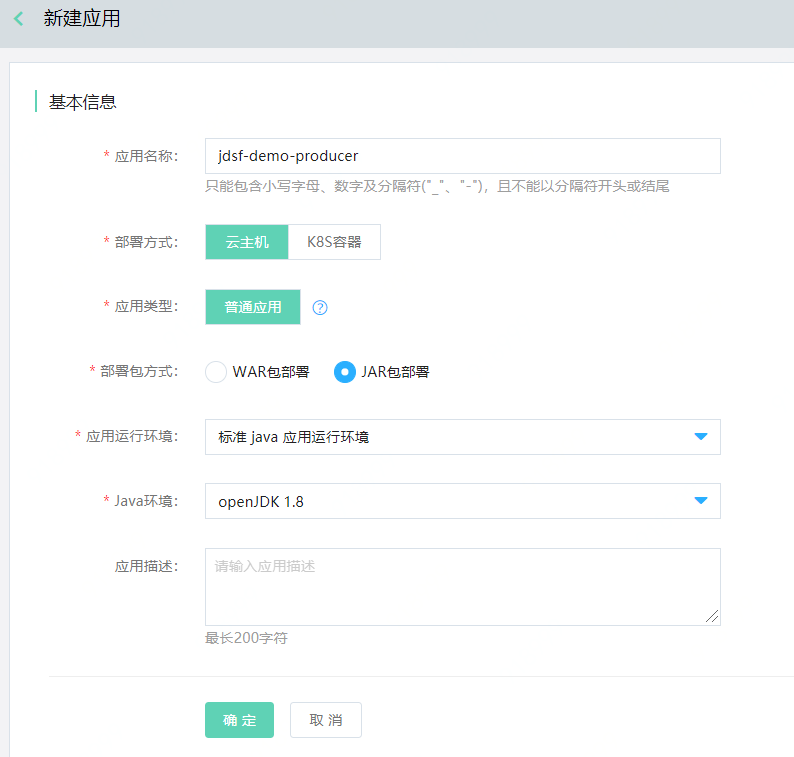
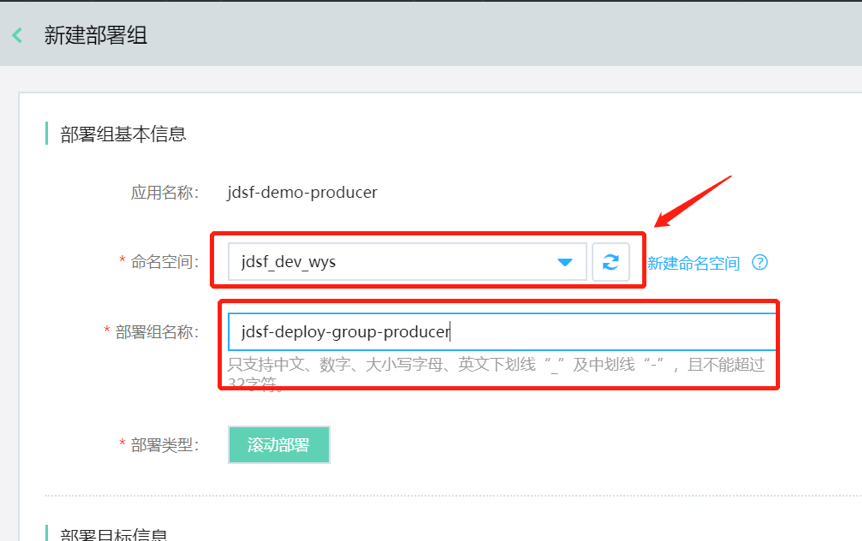
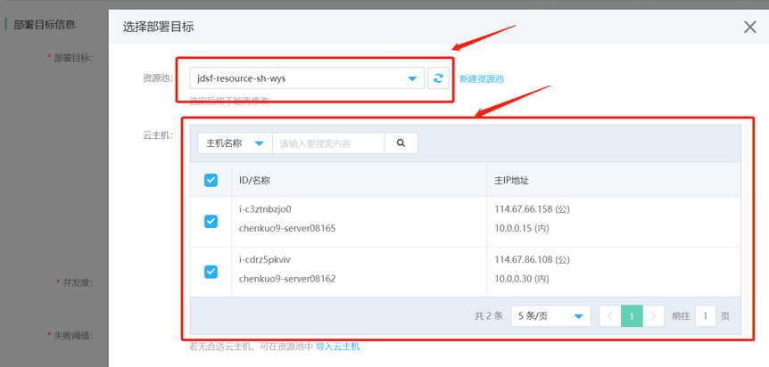
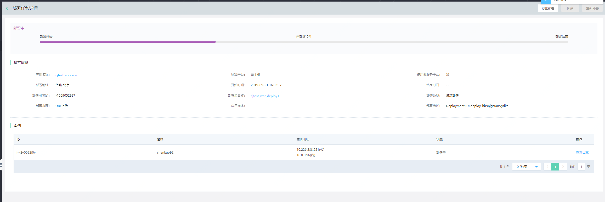

#  Virtual Machines Application Deployment

On JDSF, users can deploy applications by way of Virtual Machines, specifically, by way of deployment group.

## Operation Scenario

When an application is created, if users need to deploy applications by way of Virtual Machines, they need to deploy a program package to implement the registration and discovery of the applications on the instance.


## Environment Preparation

1. To prepare the Virtual Machine, Security Group requires fully opening the Intranet ports. Ports must be opened including: 50001 and JD Distributed Service port.

2. Resources required are enabled, such as: Virtual Machine, JD Distributed Service Framework platform.


## Operation Steps

### Step 1: Create a namespace and a VM resource pool in JDSF

After logging in the JD Distributed Service Framework Console, the following contents can be successively created by reference.

1. Create a namespace in JDSF. Process reference: [Namespace](../Namespace.md).

2. Create Resource Pool. Import Virtual Machine to resource pool for application deployment. Process reference: [Create Resource Pool and Import of Virtual Machine](../Resource-Manage/Resource-List.md).


### Step 2: Create application

In the page of creating applications, select the creation of VM applications. Note: Java running environment currently supports JDK1.7, OpenJDK1.8 and OpenJDK11.

**For example:**

You can create an application named as jdsf-demo-producer, and select JAR package deployment, standard Java application running environment, OpenJDK1.8.




### Step 3: Deployment group creation

Click an application name, enter the deployment group list page, configure the deployment group information to be executed.

If no deployment group is created, then create a new one. Creation process reference: [Create Deployment Group](Deploy-Group.md).

**For example:**

After the application named as jdsf-demo-producer is created, you can operated according to the following steps:

1. Enter the deployment group tab page of the application.

2. Create a new deployment group, fill in basic information, and select deployment target.

For example: deployment group name (jdsf-deploy-group-producer), select the namespace we just created (such as: jdsf_dev_wys).



3. Associate Virtual Machines.

For example: Select a resource pool under the namespace, such as jdsf_resource_sh_wys we just created, and then select two Virtual Machines under the resource pool.

Selecting Deployment Target


Complete the association of the Virtual Machines.


4. Fill in additional information of the deployment group. As default if there is no requirement.


5. Complete the deployment group creation.


### Step 4: Configure the relevant information on deployment initiation

Currently, two deployment sources are supported: Program Package and CodeBuild. They are respectively introduced as follows:
 


#####  Program Package Deployment


Note:

- To improve user experience, ** system will manage user service by adopting Supervisor in Virtual Machines.**

- Select the program package to be deployed. Upload first if there is no program package.

- Configure the startup parameters.


#####  CodeBuild Deployment

If you have already built it with CodeBuild, you can directly deploy through CodeBuild.


Note:

- Please use the construction SN which has been executed with the construction type of application package.

- Path refers to the relative path to run jar/war package. It is a path relative to the CodeBuild out_dir folder.

- "Application Version Number" will be registered in appVersion in the Registration Center tag. You can view this parameter in the service instance details in the registration center. Location of service instance detailed information: Registration Center > Service Management > Instance Detail > Instance Detailed Information.


### Step 5: Implement deployment




**Description:**

- After deployment, operation such as rollback and re-deployment can be made.

- A user can view deployment information of each instance as well.

- When deleting the application, the program package and historical records can be deleted at the same time.


### Step 6: Verification and deployment.

The following methods can be adopted to verify whether the deployed application has been normally enabled:

##### Method 1: If there is Internet and the corresponding ports are opened, it can be accessed directly.

```
{ip}:{port}/API path
```  
If the response code is 200 and return "status": "Information such as OK" indicates the call succeeded. The figure below is shown as an example for reference:


##### Method 2: Log in the machine where the application is deployed to view.

Execute codes below:

```
   curl -v http://127.0.0.1:{port}/API path
```  
If the response code is 200 and return "status": "Information such as OK" indicates the call succeeded. The figure below is shown as an example for reference:


##### Method 3: judge the call between services.

If Consumer and Producer Applications are deployed under the same namespace, a call to Producer can be initiated at an address below the requested Consumer. The figure below is shown as an example for reference:


If return "status": "Messages as OK" indicates that the call between services is normal.


##### Method 4: By curl method.

If the service administration authentication is enabled, the status code can be viewed by using the following codes or Internet IP in POSTMAN to determine if the request has been intercepted.

```
    curl -v 
```  

The figure below is shown as an example for reference:


(The above figure shows the status of the intercepted request after authentication is enabled)

