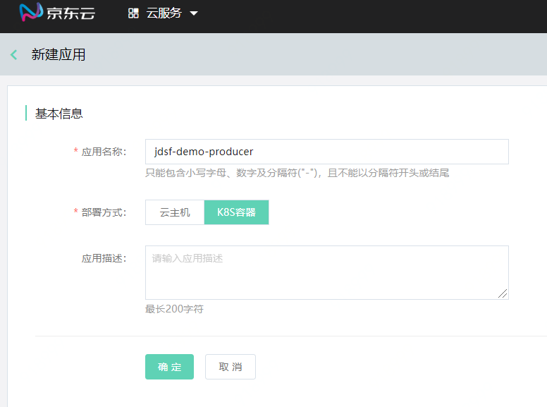
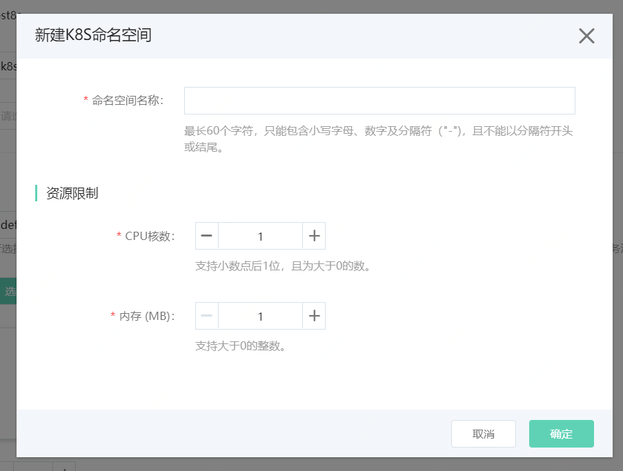

# Deployment Application in K8S

By adopting the fully-hosted management node, JCS for Kubernetes provides simple, easy-to-use, high-reliable and powerful container management service to users. While on JDSF, users can easily implement K8S container application deployment by way of K8S deployment. It will be described in the following how to deploy a container application through the JDSF Console.

## Operation Scenario

If a JD Cloud user has created JCS for Kubernetes on JD Cloud, then the application will need to be deployed in the cluster. At this point, the user can complete the application deployment through the interface operation via the JDSF Console.

## Environment Preparation

1. JCS for Kubernetes of JD Cloud has been purchased and enabled.

2. Resources required are enabled, such as: JDSF, etc.

3 Information needed to be deployed have been uploaded to the image.

4. **Note:** 

-  It requires authorization during pulling image when using the K8S deployment. Therefore, please enable authorization in advance in K8S. For details of authorization, please refer to [Integrated Container Registry](../../../../Elastic-Compute/JCS-for-Kubernetes/Best-Practices/Deploy-Container-Registry.md).

-  Load Balancer cost will be generated when using K8S.

## Operation Steps

### Step 1: Create a namespace and a K8S cluster resource pool in JDSF

1. Create a namespace in JDSF. For the process, refer to: [Namespace](../Namespace.md).

This step is optional. You can also use the K8S namespace directly instead of the JDSF namespace.

If you choose to deploy in the JDSF namespace, you can use either the JDSF registration center or the K8S for service registration discovery, which can facilitate user to conduct operation and management on the console. If you do not choose the JDSF namespace, you can use K8S only for service registration discovery.

2. Create a K8S cluster resource pool in JDSF. For the process, refer to: [Create Resource Pool](../Resource-Manage/Resource-List.md).

### Step 2: Create application

In the page of creating applications, select the creation of K8S application. 

### Step 3: Initiate deployment to application

Select the K8S application to be deployed in the application management list, and click **Initiate Deployment** in the operations to enter configuration deployment information page. Wherein, the basic information, container and image information are required to be filled in, while advanced configuration portion is optional.

1. Description on basic information, container and image information items.

| Field | Description |
| :- | :- |
|  Resource Pool |  The cluster created by the user in JCS for Kubernetes, in which the application will be deployed currently. |
|  JDSF Namespace | JDSF namespace of the target for the current deployment operation. If you choose to deploy in the JDSF namespace, you can use either the JDSF registration center or the K8S for service registration discovery, which can facilitate user to conduct operation and management on the console. If you do not choose the JDSF namespace, you can use K8S only for service registration discovery.   |
|  K8S Namespace | K8S namespace of the target for the current deployment operation. |
|  Image |  Container Registry and image tag information, etc. |

2. Create a K8S namespace.

In JDSF, click to operate **Create a K8S Namespace", to create a namespace directly under K8S.

### Step 4: Execute deployment

After deployment, operation such as rollback and re-deployment can be made.

