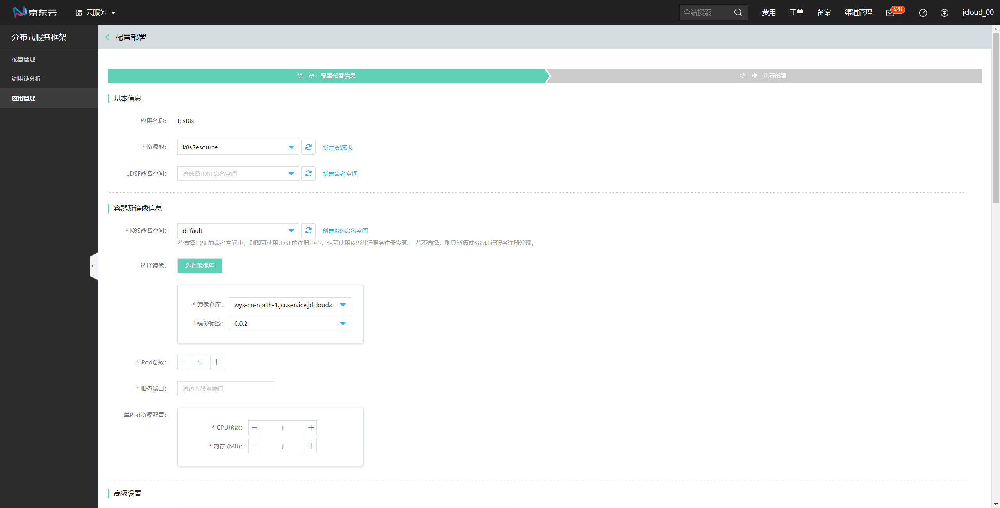

#  Kubernetes Application Deployment

By adopting the fully-hosted management node, JCS for Kubernetes provides simple, easy-to-use, high-reliable and powerful container management service to users. However, on the JD Distributed Service Framework, users can conveniently deploy Kubernetes Container application via Kubernetes deployment. How to realize Kubernetes container application deployment, deletion, application expansion and contraction, configuration of Load Balancer, etc. via JDSF Console are specified as follows.

 

## Operation Scenario

If a JD Cloud user has created JCS for Kubernetes on JD Cloud, then the application will need to be deployed in the cluster. At this point, the user can complete the application deployment through the interface operation via the JDSF Console.

## Environment Preparation

1. JCS for Kubernetes of JD Cloud has been purchased and enabled.

2. Resources required are enabled, such as: JDSF, etc.

3 Information needed to be deployed have been uploaded to the image.

4. **Note:** 

-  It requires authorization during pulling image when using the Kubernetes deployment. Therefore, please enable authorization in advance in Kubernetes. For details of authorization, please refer to [Integrated Container Registry](../../../../Elastic-Compute/JCS-for-Kubernetes/Best-Practices/Deploy-Container-Registry.md).

-  Load Balancer cost will be generated when using Kubernetes.

## Operation Steps

### Deployment Application

### Step 1: Create a namespace and a Kubernetes cluster resource pool in JDSF

1. Create a namespace in JDSF. For the process, refer to: [Namespace](../Namespace.md).

This step is optional. You can also use the Kubernetes namespace directly instead of the JDSF namespace.

If you choose to deploy in the JDSF namespace, you can use either the JDSF registration center or the Kubernetes for service registration discovery, which can facilitate user to conduct operation and management on the console. If you do not choose the JDSF namespace, you can use Kubernetes only for service registration discovery.

2. Create a Kubernetes cluster resource pool in JDSF. For the process, refer to: [Create Resource Pool](../Resource-Manage/Resource-List.md).

#### Step 2: Create application

In the page of creating applications, select the creation of Kubernetes application. 

#### Step 3: Initiate deployment to application

Select the K8S application to be deployed in the application management list, and click **Initiate Deployment** in the operations to enter configuration deployment information page. Wherein, the basic information, container and image information are required to be filled in, while advanced configuration portion is optional.

1. Description on basic information, container and image information items.

| Field | Description |
| :- | :- |
|  Resource Pool |  The cluster created by the user in JCS for Kubernetes, in which the application will be deployed currently. |
|  JDSF Namespace | JDSF namespace of the target for the current deployment operation. If you choose to deploy in the JDSF namespace, you can use either the JDSF registration center or the K8S for service registration discovery, which can facilitate user to conduct operation and management on the console. If you do not choose the JDSF namespace, you can use Kubernetes only for service registration discovery.   |
|  Kubernetes Namespace | Kubernetes namespace of the target for the current deployment operation. |
|  Image |  Container Registry and image tag information, etc. |

2. Create a Kubernetes namespace.

In JDSF, click to operate "Create a Kubernetes Namespace", to create a namespace directly under Kubernetes.

#### Step 4: Execute deployment

After deployment, operation such as rollback and re-deployment can be made.

###  Delete Application

1. Log in the JD Distributed Service Framework Console. Click **Application Management** on the left side navigation bar and log in the application list page.

2. For applications to be deleted, click **Delete** on the operation bar.

3. Before deleting the data, a user needs to well complete data backup work on his/her own.

###  Scaling

For expansion in Kubernetes resource pool, you can make configuration in JD Distributed Service Framework.

1. Log in the JD Distributed Service Framework Console. Click **Application Management** on the left side navigation bar and log in the application list page.

2. Select the application for configuration expansion and contraction, click application name and enter the application details.

Click **Details** in the operation bar and adjust total number and specification of running Pod in application setting.

3. Configure expansion and contraction conditions. At present, auto expansion and contraction as well as manual expansion and contraction are supported.

1) Auto Expansion and Contraction

For example, when auto expansion is configured as above, it means when cpu load exceeds 50% of the cap of resource configured for application deployment at present, Kubernetes will automatically create one Pod expansion application instance. If all Pod resources exceed 50% of the resource cap of each Pod after completion of expansion, Kubernetes will continue the expansion and contraction until 5 Pods are left. When application load falls back, Kubernetes will be automatically contracted, with some Pod removed to recover resources. It should be noted that auto expansion and contraction (HPA) is supported only when above version 1.12.3-jcs.4 JD Cloud Kubernetes is supported.

2) Manual Expansion and Contraction

For example, when configuration is made as shown above, the number of application instance will be modified to the number setting. If the current setting value is less than the number of instances deployed at present, contraction will be made; if the current setting value is greater than the number of instances deployed at present, expansion will be made.

4. Configure expansion and contraction specification.

###  Configure Load Balancer

1. Log in the JD Distributed Service Framework Console. Click **Application Management** on the left side navigation bar and log in the application list page.

2. Select the application for configuration expansion and contraction, click application name and enter the application details.

3. Click **Details** in the operation bar and carry out Load Balancer configuration in application setting.

Please refer to [Nginx-ingress controller Deployment](../../../../Elastic-Compute/JCS-for-Kubernetes/Best-Practices/Ingress/Deploy-Ingress-NGINX-Controller.md)
