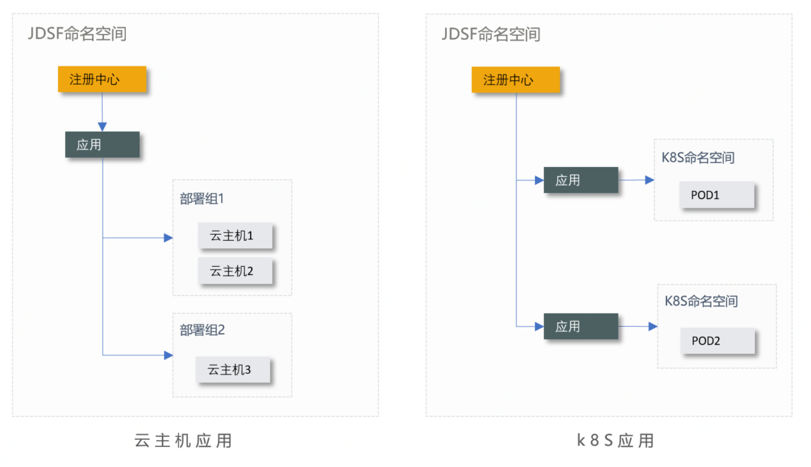
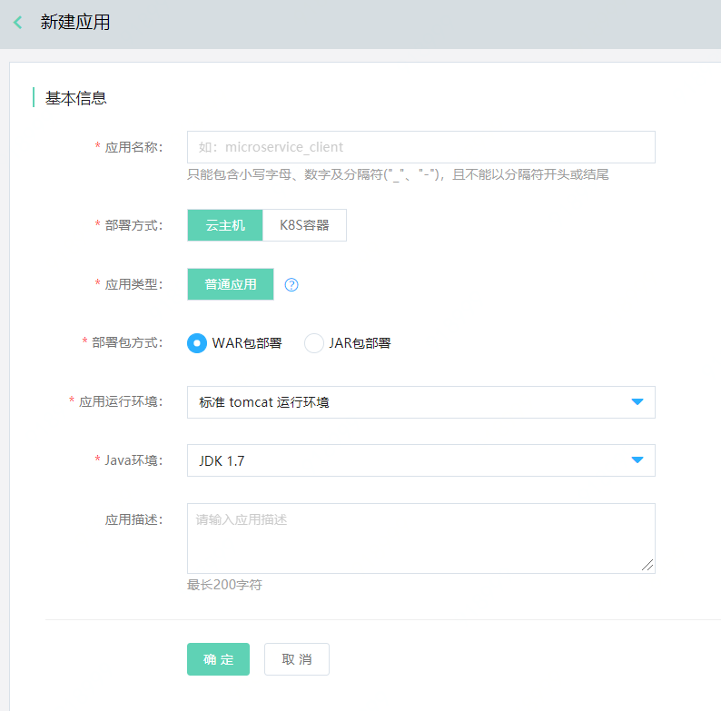

#  Application Management Overview
Application refers to a group of collections with specific functions. When developed, an application can be deployed through the Console. Currently, Virtual Machines application deployment and integrated K8S container application deployment are supported.

|   | Virtual Machines Deployment | K8S Container Application Deployment |
| :- | :- | :- |
| Operation Scenario | Is traditional deployment method. A user can deploy the program package, create applications and delete applications in a namespace (such as pre-release environment and on-line environment). | When using K8S cluster on JD Cloud, you can deploy K8S applications through JDSF. |
| Deployment Method | Deploy the program package to the Virtual Machines. One Virtual Machine can be deployed with one application. | Deploy the K8S application to the K8S cluster on JD Cloud.  |
| Resource Pool | Virtual Machines | K8S Cluster |
| Deployment Medium | WAR package, JAR package | Image |

## Basic Actions of Application

### Create Application

1. 	Log in the JD Distributed Service Framework Console. Click **Application Management** on the left side navigation bar and log in the application list page.

2.	 Click **Create Application** on the top of list and log in the creation page.

3.	 Set basic information, click **OK** and complete creation.

### Delete Application

1. Log in the JD Distributed Service Framework Console.	Click **Application Management** on the left side navigation bar and log in the application list page.

2. For applications to be deleted, click **Delete** on the operation bar.

**Description:**

- In case of having the deployment group, the application can be deleted only after the deployment group is deleted; otherwise, it cannot be deleted.

- When deleting the application, the program package and historical records will be deleted at the same time.

- Before deleting the data, a user needs to well complete data backup work on his/her own.

### Application Deployment

For more details about this, please refer to: [Application Deployment](APPDeloy.md).

For details, please refer to: [Deployment Application in Virtual Machines](APPDeloy.md)  
 
 
2. The K8S container application deployment process is as follows:

For details, please refer to: [Deploy Application in K8S Container](APPDeloyK8S.md)  
 

**Description:**

1. Import the Virtual Machines again in the resource pool, then you can open Port 50001 of the Security Group.

2. The Security Group will not be changed when a new operating system is built. After deployed, the application can be normally disabled/enabled.

3. If users manually change the firewall setting in Security Group or Virtual Machines, it may affect the disabling/enabling application functions.

### Instance Deployment Information

1. The user can view that the current applications are deployed to which instances via which deployment groups and enable or disable applications on each instance.

2. When you need to remove instances from the deployment group, please select such instances from the Details of Details of Deployment Group and delete the same. Deletion will take effect in real time. 

### Program Package Management

1. Program packages used by the current application in deployment is uploaded for program package management.

2. When deleting an application, all program packages under the application will be deleted. Before deletion, the user needs to back up on his/her own.

3. Currently, the program package supports two types, JAR and WAR.

### Deployment History

While deleting a deployment group, the deployment history will be deleted synchronously; before deletion, users need to back up the data by themselves.

### Deployment Group

When deploying an application by way of Virtual Machines, you need to implement the deployment through deployment group. For relevant contents, please refer to: [Deployment Group](Deploy-Group.md) Section.

