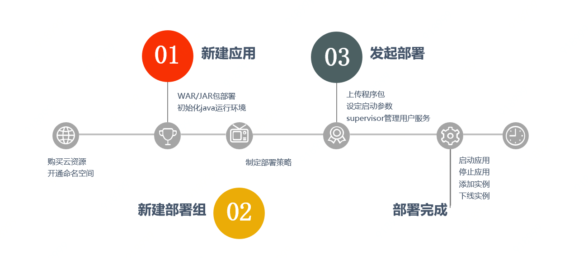
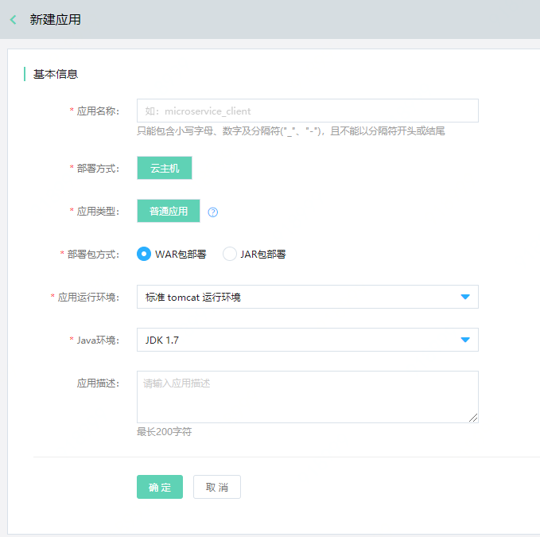
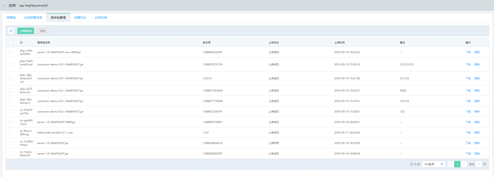

#  Application Management
Application refers to a group of collections with specific functions. The current platform provides application deployment on Virtual Machines. A user can deploy application packages on Virtual Machines via deployment of Virtual Machines.

- One Virtual Machine can be deployed with one application;
- WAR package and JAR package deployment are supported.

## Operation Scenario

For example, a user can deploy the program package, create applications and delete applications in a namespace (such as pre-release environment and on-line environment).

## Operation Steps

Application operation process is as follows:

### Create Application

1. 	Log in the JD Distributed Service Framework Console. Click **Application Management** on the left side navigation bar and log in the application list page.

2.	 Click **Create Application** on the top of list and log in the creation page.

3.	 Set basic information, click **OK** and complete creation.

**Description:**

-  Java running environments now supports JDK1.7 and OpenJDK1.8.

### Delete Application

1. Log in the JD Distributed Service Framework Console.	Click **Application Management** on the left side navigation bar and log in the application list page.

2. For applications to be deleted, click **Delete** on the operation bar.

**Description:**

- In case of having the deployment group, the application can be deleted only after the deployment group is deleted; otherwise, it cannot be deleted.

- When deleting the application, the program package and historical records will be deleted at the same time.

- Before deleting the data, a user needs to well complete data backup work on his/her own.

### Application Deployment

For more details about this, please refer to: [Application Deployment](APPDeloy.md).

### Instance Deployment Information

1. The user can view that the current applications are deployed to which instances via which deployment groups and enable or disable applications on each instance.

2. When you need to remove instances from the deployment group, please select such instances from the Details of Details of Deployment Group and delete the same. Deletion will take effect in real time. 

### Program Package Management

1. Program packages used by the current application in deployment is uploaded for program package management.

2. When deleting an application, all program packages under the application will be deleted. Before deletion, the user needs to back up on his/her own.

3. Currently, the program package supports two types, JAR and WAR, and its maximum SoftSize is 256 MB.

### Deployment History

For contents of this section, please view the deployment group section. When deleting a deployment group, a user can select to delete deployment history synchronously or not. Before deletion, the user needs to back up on his/her own.

### Deployment Group

For contents of this section, please view the section [Deployment Group](Deploy-Group.md).

