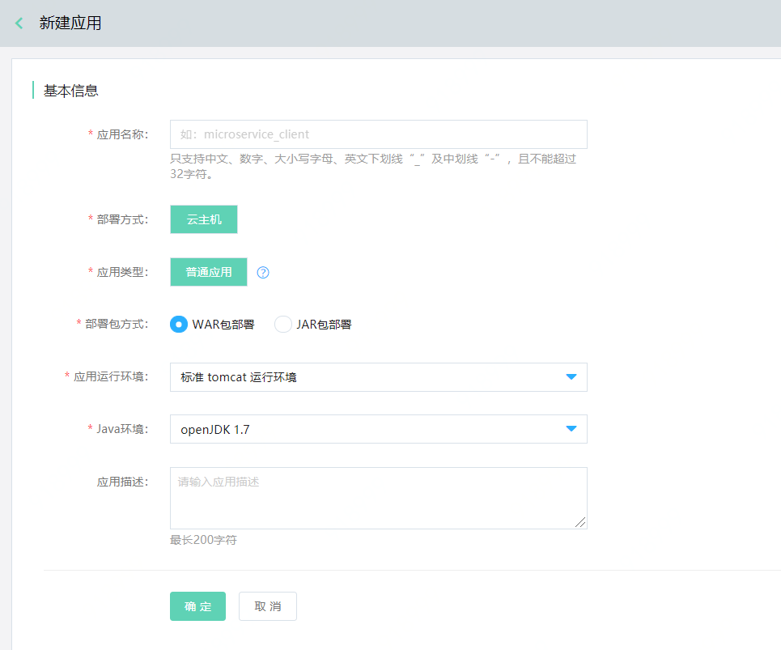
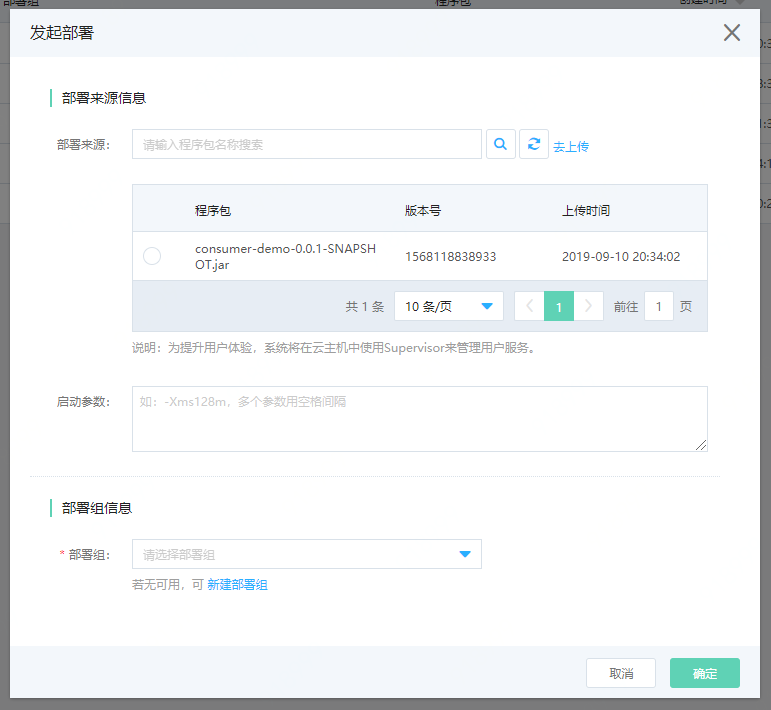
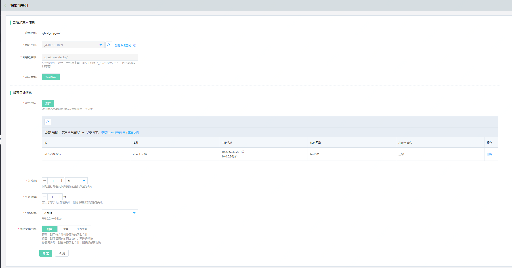
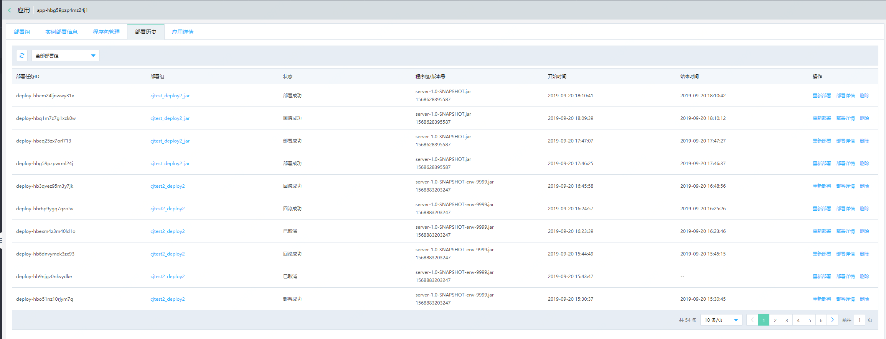

#  Application Management
Application refers to a group of collections with specific functions. The current platform provides application deployment on Virtual Machines. A user can deploy application packages on Virtual Machines via deployment of Virtual Machines.

- One Virtual Machine can be deployed with one application;
- WAR package and JAR package deployment are supported.

## Operation Scenario

For example, a user can deploy the program package, create applications and delete applications in a namespace (such as pre-release environment and on-line environment).

## Operation Steps

Application operation process is as follows:

### Create Application

1. 	Log in the JD Distributed Service Framework Console. Click **Application Management** on the left side navigation bar and log in the application list page.

2.	 Click **Create Application** on the top of list and log in the creation page.

3.	 Set basic information, click **OK** and complete creation.

**Description:**

-  Java running environments now supports OpenJDK1.7 and OpenJDK1.8.

### Delete Application

1. Log in the JD Distributed Service Framework Console.	Click **Application Management** on the left side navigation bar and log in the application list page.

2. For applications to be deleted, click **Delete** on the operation bar.

**Description:**

- Applications can be deleted after the deployment group is deleted; otherwise, it cannot be deleted.

- When deleting, a user can also select to delete the program package at the same time. By default, they are checked to be deleted at the same time.

- Before deleting the data, a user needs to well complete data backup work on his/her own.

### Deployment Application

1. Log in the JD Distributed Service Framework Console.	Click **Application Management** on the left side navigation bar and log in the application list page.

2. For applications to be deployed, click **Initiate Deployment** on the operation bar.

- To improve user experience, ** system will manage user service by adopting Supervisor in Virtual Machines.**

- If corresponding deployment groups have been created, please directly configure deployment source and select a deployment group and then initiate deployment.

- If no deployment group is created, please click **Create Deployment Group**, create a deployment group and deploy it. For deployment group contents, please view the section [Deployment Group](Deploy-Group.md).

3. Implement deployment.

**Description:**

- After deployment, operation such as rollback and re-deployment can be made.

- A user can view deployment information of each instance as well.

- When deleting an application, a user can also select to delete the program package at the same time. By default, they are checked to be deleted at the same time.

### Instance Deployment Information

1. A user can view that the current applications are deployed to which instances via which deployment groups and enable or disable applications on each instance.

2. When you need to remove instances from the deployment group, please select such instances from the Details of Details of Deployment Group and delete the same. Deletion will take effect in real time. 

### Program Package Management

Program packages used by the current application in deployment is uploaded for program package management. When deleting an application, a user can select to delete all program packages under the application synchronously or not. Before deletion, the user needs to back up on his/her own.

### Deployment History

For contents of this section, please view the deployment group section. When deleting a deployment group, a user can select to delete deployment history synchronously or not. Before deletion, the user needs to back up on his/her own.

### Deployment Group

For contents of this section, please view the section [Deployment Group](Deploy-Group.md).

