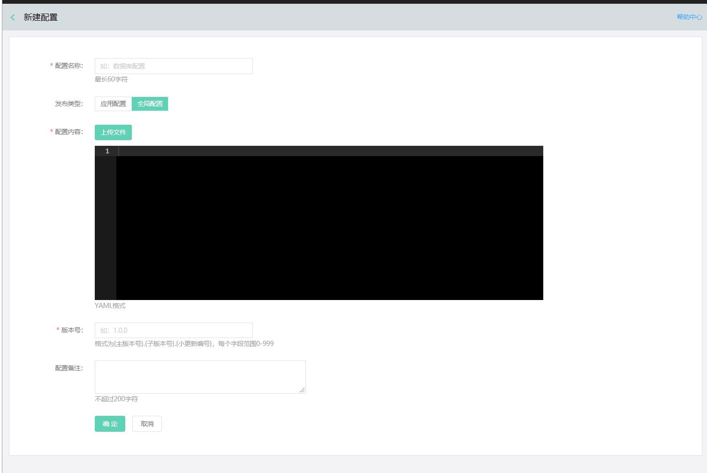
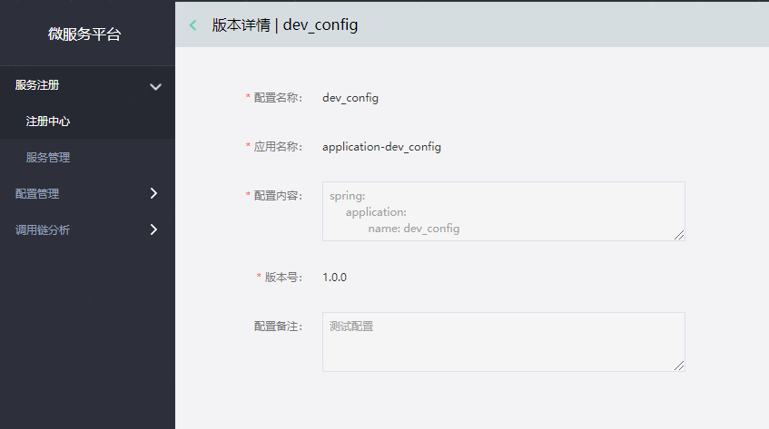
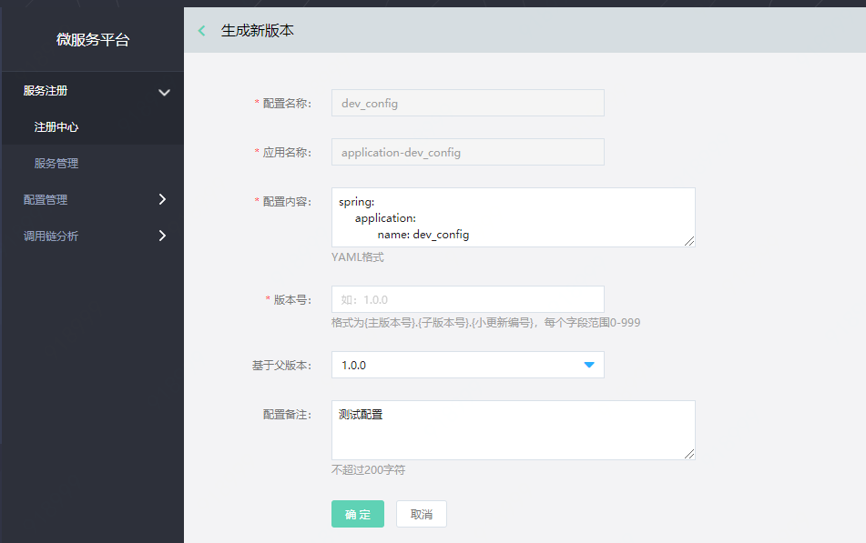
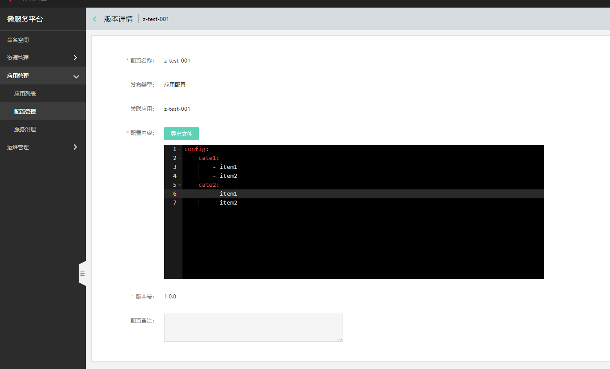

# Configuration Management
Configuration management provides users with the service to configure the application. The configured types include:

| Type	| Description	| 
| :- | :- | 
|  Application Configuration	|  It works for a specific application. In terms of priority, application configuration takes precedence over global configuration.	|  
|  Global Configuration	|  It works for namespace. 	|  
 
The offered features include:

| Features	| Description	| 
| :- | :- | 
|  Create Configuration	|  Application configuration or global configuration can be created according to needs.	|  
|  Multiple Versions	|  Each configuration can protect multiple versions. The latest version number shall be taken as the effective version. 	|  
|  Release Configuration	|  Take effect after releasing and configuring to a registration center. Note that for K8S applications deployed through JDSF platform, if you didn't select to use the registration center of JDSF platform to implement the registration and discovery of applications in the deployment, then the configuration will be unable to be released to this K8S application.	|  
|  Release History	|  Release history list of each configuration.	|  
|  Rollback	|  Roll back to the previous version.	| 
|  Configuration File Import/Export	|  Support import and export of configuration file.	| 

## Operation Steps

### Configure Management List

 
 

### Creation and Configuration

#### Create Application Configuration

Step 1: Select availability zone region, and click **Create a Configuration**.
 
Step 2: Fill in Information.

1. Please note that you cannot create a configuration with the same name on the same service.

2. Type selection: Create application configuration, and select the targeted application. Note that the application configuration function here only takes effect to Spring Cloud.

  
  
Step 3: Release the configuration  

Select the configuration to be released, and click **Release**.

  
Content descriptions of part of the field are as follows:

| Field	| Description	| 
| :- | :- | 
|  Profile	|  It is the method to isolate configuration files and only allows the configuration to take effect in the specified environment. The parameter will act on route policies. Select default value if there is no special requirement.  	|  
|  Configuration Storage 	|  The physical location of configure storage.	|
|  Resource Name 	|  The specific storage location of the configure storage. 	|  

####  Create Global Configuration

Step 1: Select availability zone region, and click **Create a Configuration**.
 
Step 2: Fill in Information.

1. Please note that you cannot create a configuration with the same name on the same service.

2. Type selection: Create global configuration.

  
  
Step 3: Release the configuration  

Select the configuration to be released, and click **Release**.

  
  
### View version information for configuration item

Click the name of the configuration item. Enter the version list page, you can view all versions released of the configuration.

   
   
Click the version number name to view the version details.

### View the release history of the configuration
Select a configuration in the configuration management list to view historic release records of the configuration.

### Generate New Version
Step 1: Log in the configuration management list, click the name of the configuration item, and enter the version management page of the configuration.

 

Step 2: Click **Generate a New Version** under action to enter the version edit page. Generate a new version after saving.

- The default parent version number here is the version number you selected in the previous step.

- The parent version content is displayed by default.

- The new version number needs to be greater than all the old version numbers.

  

Step 3: Release new version.

- After release, the new version will replace the original version as the on-line version.

- In the version revision list, at least 1 version record shall be kept. If you need to delete all records, please delete the entire configuration record in "Configuration Management" at the upper level.

### Configuration File Import/Export

1. Import. You can directly import a file when creating configuration.

2. Export. Entrance: Configure file>Select a version number to view details>Exported configuration in details

