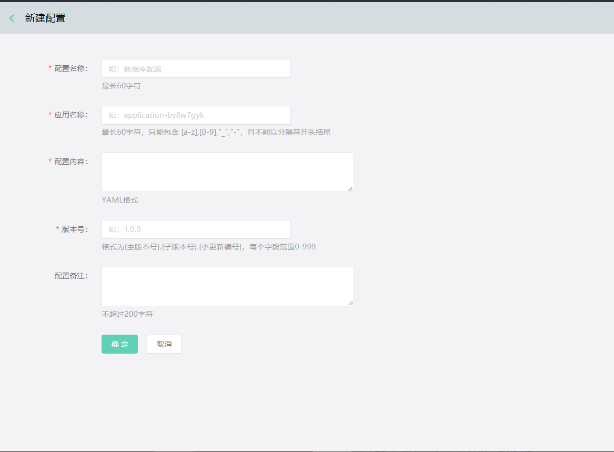
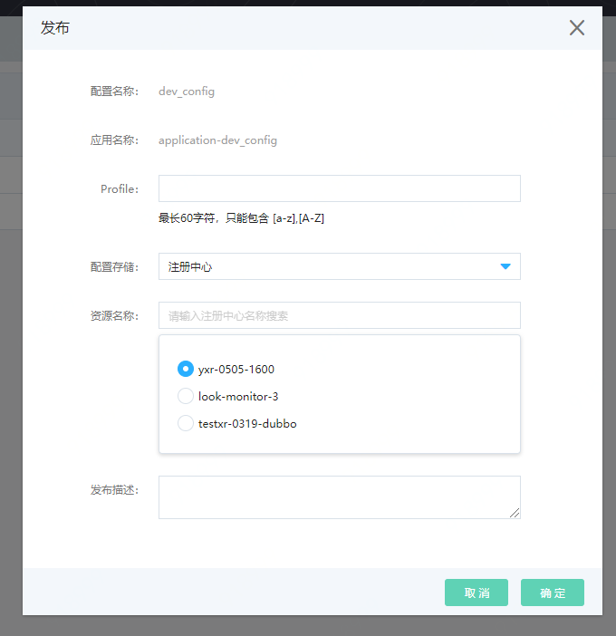

# Configuration Management
Configuration management provides users with the service to configure the application. Multiple versions can exist in each configuration, and each version can be released in different deployment groups for the same application.
 

## Operation Steps

### Configure Management List

 

### Creation and Configuration
Step 1: Select the available region, and create configuration.
-	Enter the configuration management list to select the available region
-	Click Create Configuration to conduct creation action
 
 
Step 2: In the region, click Create Configuration to enter the create page
  
  
Description:
-	The name of the application is to be entered by the user and shall be ensured correct.
-	You cannot create a configuration with the same name on the same service.
-	After a successful creation, the version information will be generated synchronously.

Step 3: View version management for configuration item
Click the name of the configuration item. Enter the version list page.
   
   
   
Step 4: View the version details.
Click the version number name to view the version details.
   

### Revision List
Select a configuration in the configuration management list to view historic release and amendment records of that configuration.
 

### Generate New Version
Step 1: Enter the configuration management list.
Click the name of the configuration item, as shown in the figure "Configuration Test-test" to enter the version list page for that configuration.
 
 
 
Step 2: Select the current version as the parent version; enter the configuration details, and click Generate a New Version under action to enter the version edit page. Generate a new version after saving.
 

  
  
**Description:**
- The default parent version number here is the version number you selected in the previous step.
- The parent version content is displayed by default.
- The new version number needs to be greater than all the old version numbers.
- 	When the parent version is switched, the information in "Configuration Content" will be automatically changed to the parent version content, and the user can modify and edit it himself/herself.

Step 3: Release new version.
- If you need to release a new version, directly select the version to be released and click Release button.
- And then fill in the release information to configure the release.
  
  
  
  
**Description:**
- After release, the new version will replace the original version as the on-line version.
- In the version revision list, at least 1 version record shall be kept. If you need to delete all records, please delete the entire configuration record in "Configuration Management" at the upper level.

