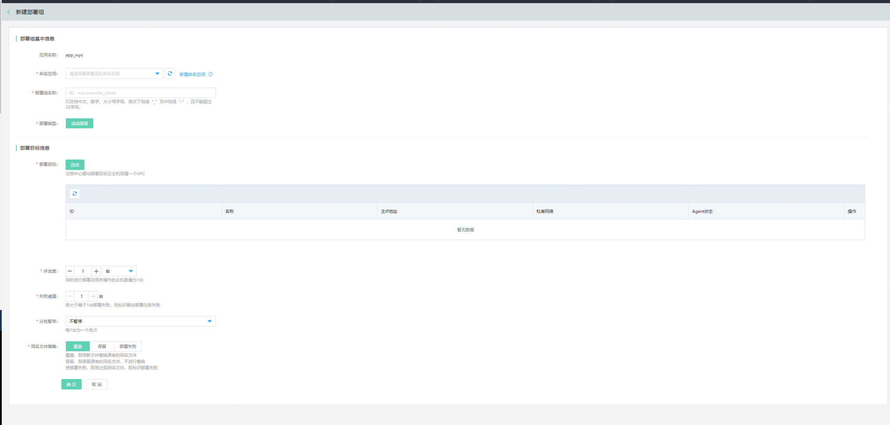

#  Deployment Group
A deployment group refers to a unit group used for executing deployment program packages to application instances in batches. Now, the platform supports application deployment of Virtual Machines.

## Operation Scenario

A user can deploy a program package, execute a deployment group, delete a deployment group and view deployment history. For application management, application can be started or stopped.

## Operation Steps
### Deployment Group Creation
1. 	Log in the JD Distributed Service Framework Console. Click **Application Management** on the left side navigation bar and log in the application list page.

2.	 Click the application name, enter the application details, click deployment group tab and view all deployment group information related to the current application

3.	 Click **Create** on the top of the list and enter the creation page.

| Information Item |Description  |
| :- | :- |
| Namespace | You need to select the current deployment group and determine a namespace where an application is deployed. |
| Deployment Group Name | Please fill in name of deployment group. In the same application, the deployment group name is unique. |
| Deployment Type | Now, [Rolling Deployment](../../../../Developer-Tools/CodeDeploy/Operation-Guide/Deployment-Type.md) is supported. |
| Deployment Target  | Click the **Select** button and select existing Virtual Machines of this region from a popup; a user needs to select a resource pool at first and then select names of Virtual Machines which are the deployment target under the resource pool. |
| Concurrency |  If "Rolling Deployment" is selected in the "Deployment Type", the concurrency deployment setting is supported. Two setting modes are supported, i.e. the setting based on percentage and the setting based on machine number. Taking the concurrency setting of 2 sets as example, the application deployment and the traffic routing are made via 2 machines when conducting the rolling deployment. |
| Failure threshold |  If deployment of n or more sets failed, it indicates that the deployment task failed. |
| Policy for Files with the Same Name | How to handle files of the same name in the same directory when deployment/rollback is set. There are three supporting methods currently: Deployment failed, namely if there is a file of the same name, it means deployment failed; replace, namely replace the original file of the same name with a new file; reserve, namely reserve and do not replace the original file of the same time. Default option: Replace. |

### Edit Deployment Group
1. Once being created, the namespace and deployment group name in the deployment group cannot be modified. However, other information can be modified.

2. Instances can be removed from the deployment target and take effect. Upon removal, the removed instances can be used by other deployment groups again.

### Deletion of Deployment Group

When a deployment group is deleted, all instances under such deployment group will be removed and all applications in it will be disabled.

