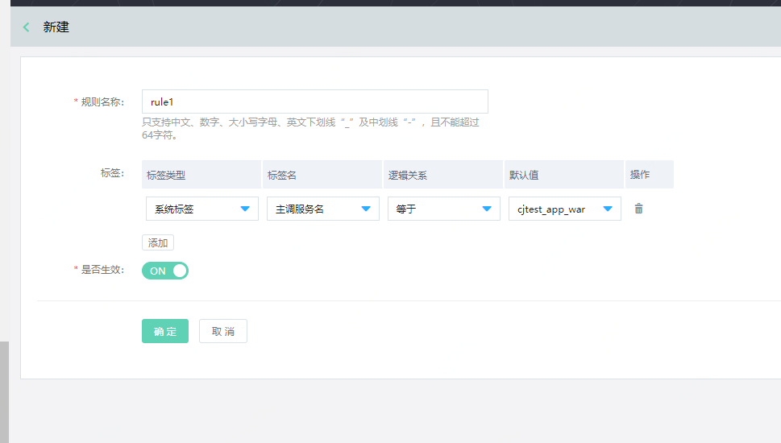

#  Service Administration
Service is the basic administration unit of JD Distributed Service. When an application is deployed in JD Distributed Service Framework and the service is registered and discovered in a registration center, such service can be found in the service administration list. Users can carry out the following operations: service authentication and route policy. The following document will introduce the service authentication.

## Authentication Rules

## Environment Preparation

If you need to use this function, you must quote the plug-in provided by JDSF. Currently, we have provided Spring Cloud plug-in and will provide the dubbo plug-in.

For configuring the environment dependence items, please refer to: [JDSF Spring Cloud Plug-in Description](../../Getting-Started/JDSF-Plugin.md)

## Operation Steps

### View service

1. Log in the JD Distributed Service Framework Console.	Click **Application Management** on the left side navigation bar and log in the service administration list.

2. Applications in the list are the service administration applications of users.

### View Service Authentication Information

1. Log in the JD Distributed Service Framework Console.	Click **Application Management** on the left side navigation bar and log in the service administration list.

2. Select an application requiring authentication configuration in the list and click **Service Authentication** on the operation bar.

3. Configure authentication rules and authentication methods for current service on the service authentication configuration page.

| Information Item |Description |
|---|---|
| Disable | When the disabling option is selected, the authentication rule will not take effect and any request can call the service. |
| Whitelist | When a request is sent to a gateway, if such request matches any authentication rule, it is allowed to be called; otherwise, it cannot be called. |
| Blacklist | When a request is sent to a gateway, if such request matches any authentication rule, it is rejected to be called; otherwise, it can be called. |

**Description:**
-  One service is allowed to be configured with several authentication rules. When several authentication rules are enabled at the same time, such rules are in logical or (OR) relationship, i.e., such request only needs to meet any authentication rule, the rule is passed.
-  A user can directly switch authentication method: switch the blacklist and the whitelist.

### Creation of Service Authentication Rules
1. Click add create rules.

2. Set basic information, click **OK** and complete creation.

