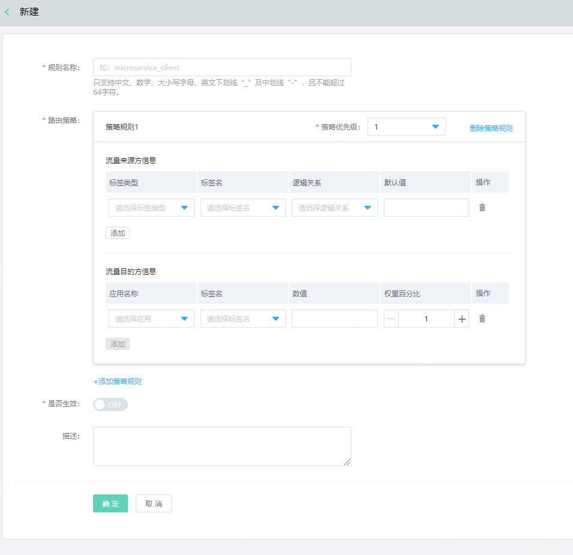

# Service Route

Users using JDSF can customize the distributed traffic on different instances according to the needs through the service route function in the process of business version update of an application. The nearest route and fault-tolerant protection are valid for the whole namespace.

## Introduction to Route Principle

To implement the service route, you need to complete three parts of operations:

-  When a service is enabled, set some metadata for the service and ensure that this metadata can be obtained when the service is selected. Currently, this metadata is automatically injected when JDSF is used for deployment.

-  On the Console, set route rules for the service client (consumer)

-  When obtaining the route rule after a service is enabled, the client will match according to the rules of the traffic source to determine the effectiveness of current rules against itself

Take the common ordering in online store for example, there is now the calling mode of order->goods->user. When a user places an order, it will first obtain the information of the commodity ordered; the commodity will call the user service to obtain the information that whether the current user can purchase the current commodity and that how many current commodities can be purchased. At last, it will confirm that whether the user can purchase the current commodity.

-  order: Spring Cloud application, use route sdk

-  goods: Spring Cloud application, use route sdk, there are two versions, v1 and v2-beta

-  user: Spring Cloud application, there are two versions, v1 and v2-beta

The service calling and routing are as shown in the figure below. Users need to create the following route rules on the Console:

-  In the order service details, configure the route rules: 90% traffic is assigned to goods v1 version and 10% traffic is assigned to goods v2-beta version.

-  In the goods service details, configure the route rules: If the current service version is v1, 100% is assigned to user v1 version when user service is requested; if the current service version is v2-beta, 100% is assigned to user v2-beta when user service is requested.

## Environment Preparation

If you need to use this function, you must quote the plug-in provided by JDSF. Currently, we have provided Spring Cloud plug-in and will provide the dubbo plug-in.

For configuring the environment dependence items, please refer to: [JDSF Spring Cloud Plug-in Description](../../Getting-Started/JDSF-Plugin.md)

## Operation Steps
### Create route rules
1. Log in the JD Distributed Service Framework Console.	Click **Application Management** on the left side navigation bar and log in the service administration list. Applications in the list are the service administration applications of users.

2. Click **Route Policies** in operation and configure the route policies for the application.

3. Click **Create Route Policies**. Each policy supports 15 rules at most.

| Concept | Description |
| :- | :- |
| Traffic Source Information | Traffic Request Sender Information Expression. |
| Traffic Target Information | Traffic Receiver Information Expression. Note that you need to ensure the weighting totaling is 100. |
| Policy Priority | The higher the value, the higher the policy priority. |

Too little request samples may lead to deviation. If you need to reach the expected effect in the configured request proportion, you need to configure at least 1,000 entries.

4. Nearest route and fault-tolerant protection are enabled by default. Users can disable them.

### Enable route rules

In the route policies status column on the route policies list page, you can directly enable or disable the route policies.

1. It takes 10s by default to take effect after the configuration. If you need to modify the effective time, you can configure it in SDK.

2. After the fault-tolerant protection is enabled, the save policy will be implemented. If the configured rule mismatches any instance, it will return the default available instance.

For example, if the service sets the following route rules, and all instances of v1.0 version are unavailable:

-  20% traffic is assigned to v1.0 version.

-  30% traffic is assigned to v2.0 version.

-  50% traffic request is assigned to v3.0 version.

Request Result:

- The traffic will be directly request to assign to v2.0 and v3.0 versions. The final result is that approximately 40% and 60% will be respectively requested to v2.0 and v3.0 versions.

- If the configured traffic source rule is matched, but the traffic target rule does not have a match value, it will randomly select the available instance of the targeted service and return via the default round robin policy.

### Edit route rules

1. Log in the JD Distributed Service Framework Console.	Click **Application Management** on the left side navigation bar and log in the service administration list.

2. Click **Edit** in the operation to edit the existing route rule.

### Delete route rules

1. Log in the JD Distributed Service Framework Console.	Click **Application Management** on the left side navigation bar and log in the service administration list.

2. Click **Delete** in the operation. It takes 10s by default to take effect after the deletion. If you need to modify it, you can configure it in SDK.

