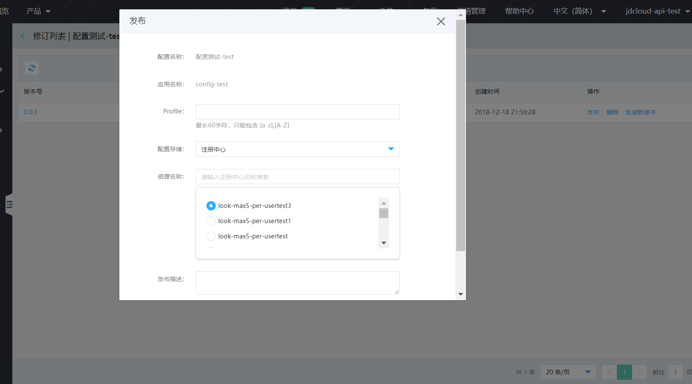

# Generate New Version

## Operation Steps:

### Step 1: Enter the configuration management list.
Click the name of the configuration item, as shown in the figure "Configuration Test-test" to enter the version list page for that configuration.
 
 
 
### Step 2: Select the current version as the parent version; enter the configuration details, and click Generate a New Version under action to enter the version edit page. Generate a new version after saving.
 

  
  
#### Note:
- The default parent version number here is the version number you selected in the previous step.
- The parent version content is displayed by default.
- The new version number needs to be greater than all the old version numbers.
- 	When the parent version is switched, the information in "Configuration Content" will be automatically changed to the parent version content, and the user can modify and edit it himself/herself.

### Step 3: Release new version.
- If you need to release a new version, directly select the version to be released and click Release button.
- And then fill in the release information to configure the release.
  
  
  
  
#### Note:
- After release, the new version will replace the original version as the on-line version.
- In the version revision list, at least 1 version record shall be kept. If you need to delete all records, please delete the entire configuration record in "Configuration Management" at the upper level.

