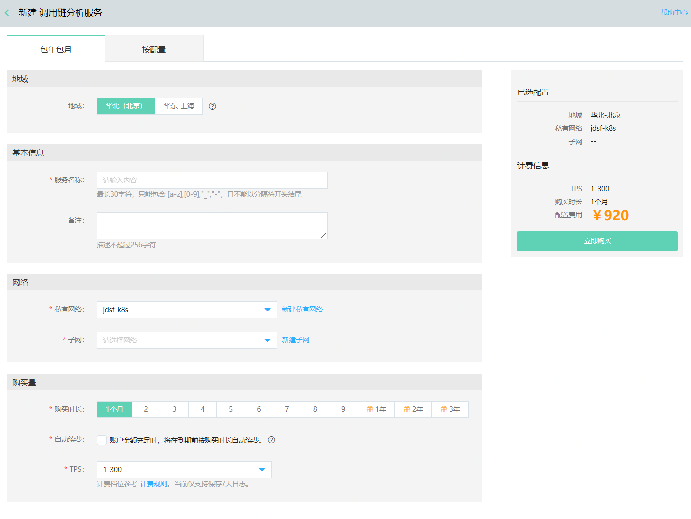
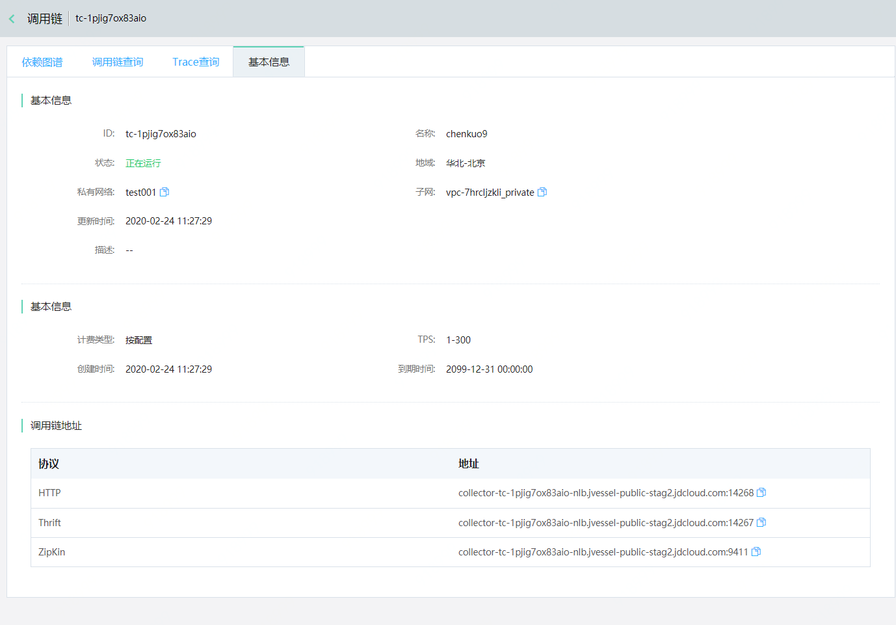
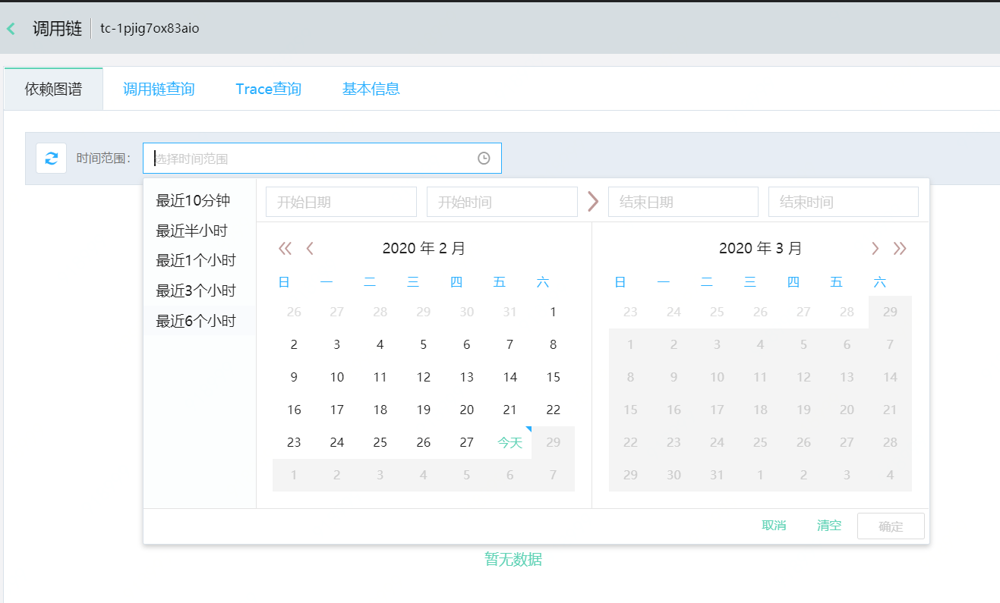
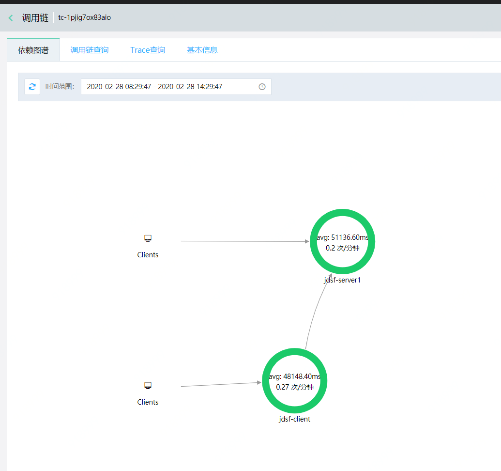
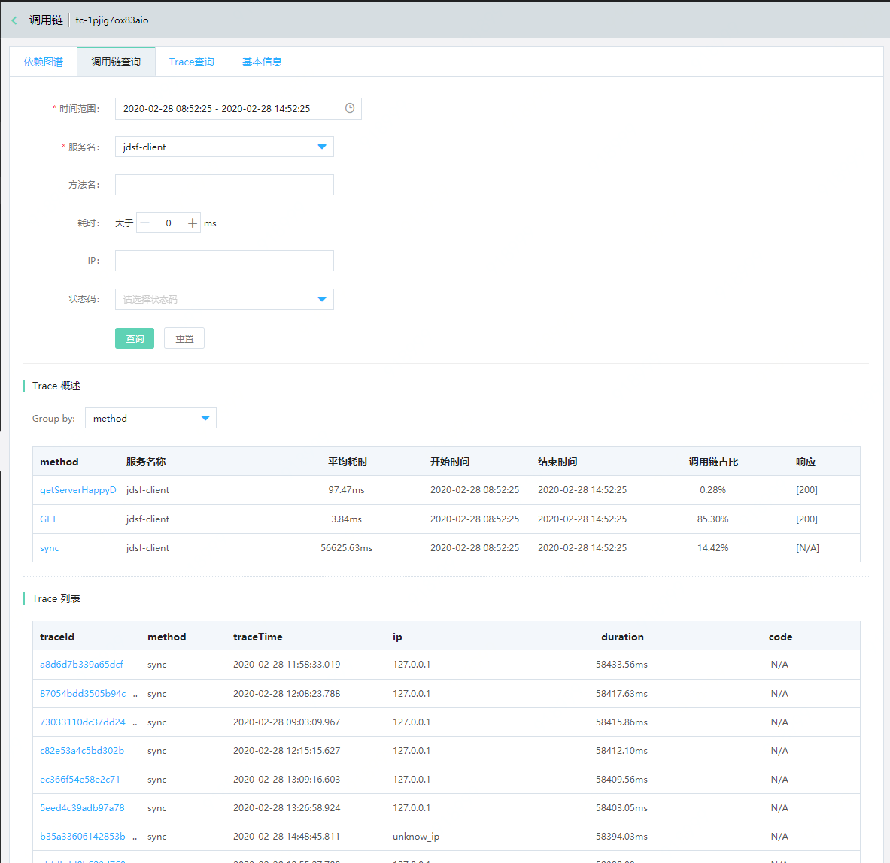
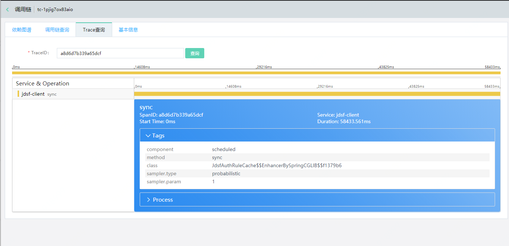
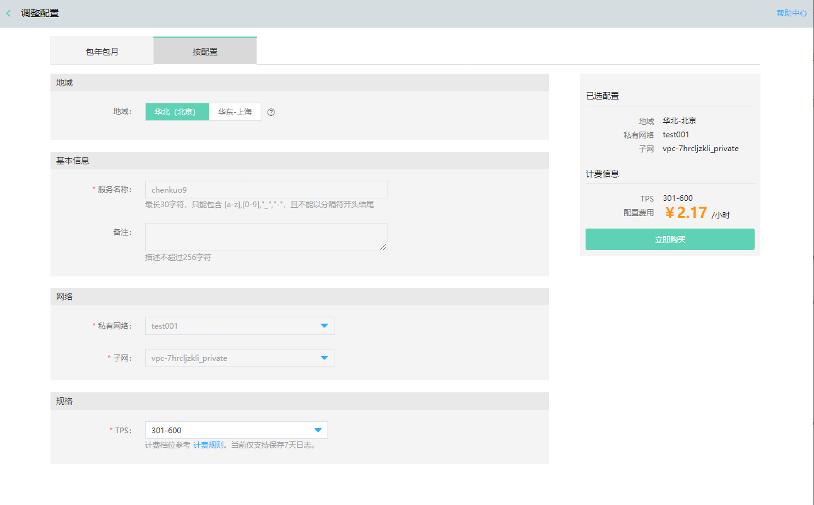
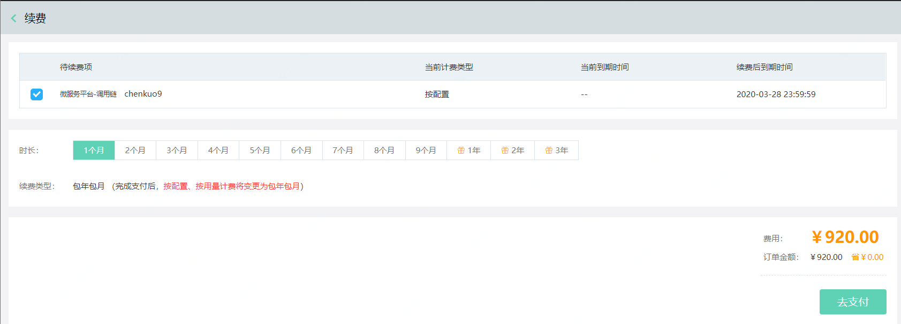

#  Calling Chain Analysis Service
Calling chain analysis service provides the function of monitoring the execution of a service and a logical action. In the JD Distributed Service architecture, a request may go through many service calls from issue to response. The calling chain analysis service is of great value in analyzing service calling relation, time-consuming action and performance bottleneck.
	
Calling chain analysis service includes creating analysis service, deleting, modifying, calling chain search, dependency map.

## Operation Steps:

### Create Analysis Service

Step 1: Select region.

Select the partition first, and then click Create Analysis Service in this partition. As shown in the figure, select "cn-north-1" partition first, and then click "Create Analysis Service".
   
   
   
Step 2: Create an analysis service

At present, the call chain supports two billing methods: Pay By Configuration and Monthly Package. You can choose different billing methods according to demands. For billing methods, please refer to: [Billing Instructions](../../Pricing/Billing-Overview.md)

You shall input service name and remark and select a cluster network, subnet ID, TPS, purchase information, etc. in turn. Then click **Save** to complete the creation process.

   
   
The count of calling log concurrent writes here requires to be estimated by you according to the TPS of the cluster, which can be understood as the total TPS of the entire business cluster multiplied by the sampling rate. If not sure, it is recommended to select a lower level, and then conduct expansion based on the actual TPS after the running of the system.

Now, the call chain analysis service only supports expansion, but not contraction. Please avoid choosing too large specifications.

The calling chain analysis service is deployed directly in the user’s VPC and will occupy different counts of private IP according to the different specifications selected by the user. Please ensure that the selected subnet dynamic ip is sufficient.
 
Step 3: After saving and creating successfully, you can see the increased calling chain analysis service in the calling chain analysis service list.

### View details of calling chain service

Step 1: Select the call chain and click the name of service to be viewed.

  
   

Step 2: Details.
 
   

You can select an appropriate call chain address according to the different network protocols used for the connection of calling chain service.

###  Dependent Map

Step 1: Select the call chain to be viewed and click the name of service to be viewed.

   
    
Step 2: Select the time unit to view the dependency graph.

   
 
 After the time range is selected, the graph information of this period will be loaded.
 
   
   
 ###  Call Chain Search
 
 The call chain service provides senior retrieval function. You can search the call chain information as per service name, method name, time consumption, IP, status code and others to search call chain information.

 
   
Step 3: Click a Trace id to search information of this trace id.
  
   

 ###  Search by Trace id
 
 You can directly retrieve information according to Trace id.
 

###   Resize

Now, only configuration upgrade is supported and configuration downgrade is not supported now.

 
Please feel free to contact the customer service where you have any doubts in the process of resizing.

###   Converting to the Monthly Package

For the resource adopting the "Pay by Configuration" billing type, switch to the billing type of "Monthly Package" is supported.

Conversion from "Monthly Package" billing type to the billing type of "Pay by Configuration" is not supported now. Please feel free to contact the customer service where you have any doubts about operation.

###   Delete Service

###  Step 1: Select the service to be deleted
   
 
###  Step 2: Click OK to delete.
   

Description:

- After deleting, the calling chain data will be discarded, please be careful for action.

- If you resource(s) cannot be deleted, please check if your account is in arrears. If yes, please pay the arrears first and then delete the resource(s). If you still have other problems, please contact us via the customer service or by opening ticket.

