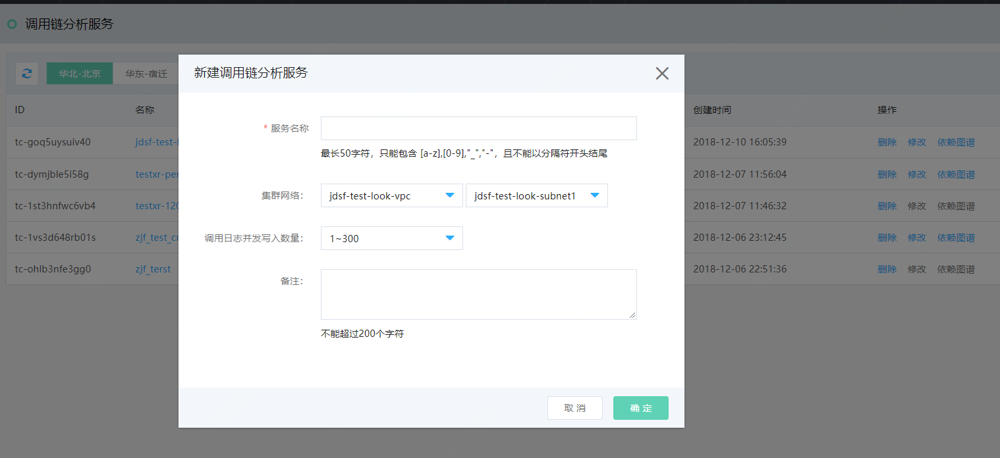
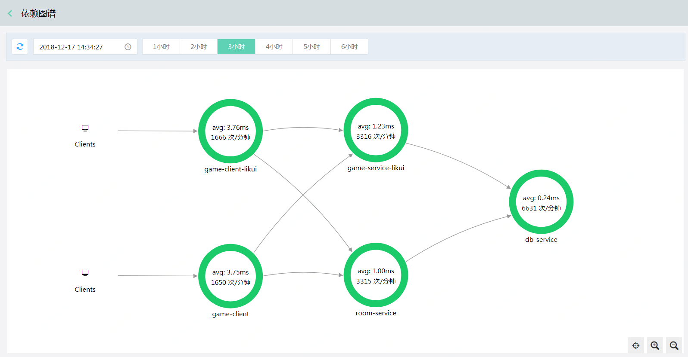
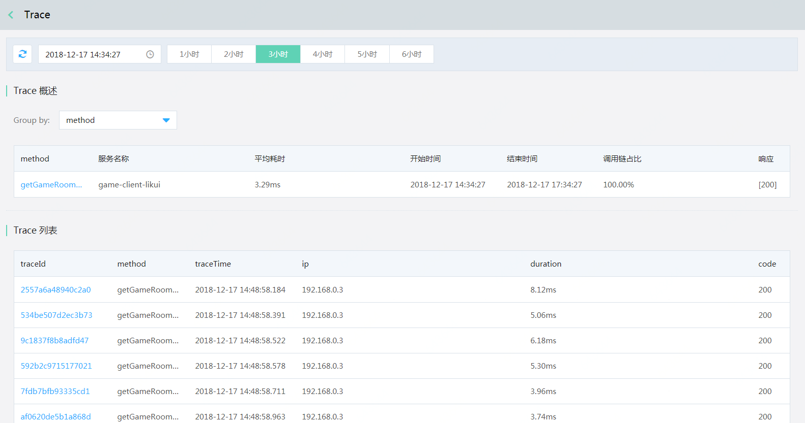

#  Calling Chain Analysis Service
Calling chain analysis service provides the function of monitoring the execution of a service and a logical action. In the JD Distributed Service architecture, a request may go through many service calls from issue to response. The calling chain analysis service is of great value in analyzing service calling relation, time-consuming action and performance bottleneck.
	
Calling chain analysis service includes creating analysis service, deleting, modifying, calling chain search, dependency map.

## Operation Steps:

### Create Analysis Service
Step 1: Select region.
Select the partition first, and then click Create Analysis Service in this partition. As shown in the figure, select "cn-north-1" partition first, and then click "Create Analysis Service".
   
   
   
Step 2: Create an analysis service
You should enter service name in turn, select cluster network and subnet ID, count of calling log concurrent writes, and fill in description. Then click Save to complete the creation process
   
   
The count of calling log concurrent writes here requires to be estimated by you according to the TPS of the cluster, which can be understood as the total TPS of the entire business cluster multiplied by the sampling rate. If not sure, it is recommended to select a lower level, and then conduct expansion based on the actual TPS after the running of the system. Calling chain analysis service only supports expansion, but not shrink, please avoid choosing too large specifications.

The calling chain analysis service is deployed directly in the user’s VPC and will occupy different counts of private IP according to the different specifications selected by the user. Please ensure that the selected subnet dynamic ip is sufficient.
 
Step 3: After saving and creating successfully, you can see the increased calling chain analysis service in the calling chain analysis service list.

### View details of calling chain service

Step 1: Select the calling chain and click the service name
   

Step 2: Details.
 
   

Select the appropriate calling chain address according to the different network protocols used for the connection of calling chain service.

###  Dependent Map

Step 1: Select the calling chain first, and then click the dependency map action on the right side of the list.
   
 
Step 2: Select the time unit to view the dependency map
   
   
Step 3: Click a specific service to view the Trace information
   
   
Step 4: Click a specific Trace to view the Trace details
   

###   Modify service specification and information
Modification function only supports the modification of count of calling log concurrent writes and descriptions, and the rest contents cannot be modified.

Step 1: Select the service to be modified
   
 
Step 2: Change the count of calling log concurrent writes
   

###   Delete Service

###  Step 1: Select the service to be deleted
   
 
###  Step 2: Click OK to delete.
   

Description:

- After deleting, the calling chain data will be discarded, please be careful for action.

- If you resource(s) cannot be deleted, please check if your account is in arrears. If yes, please pay the arrears first and then delete the resource(s). If you still have other problems, please contact us via the customer service or by opening ticket.

