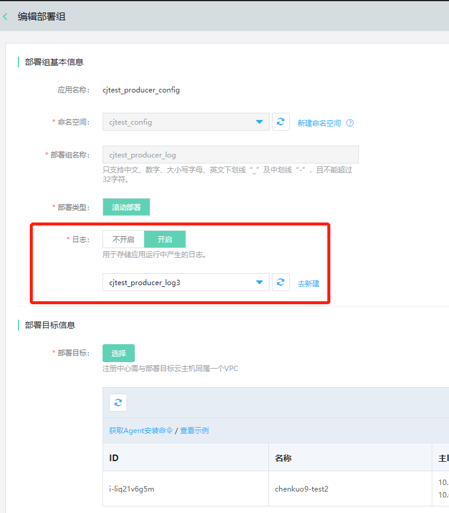
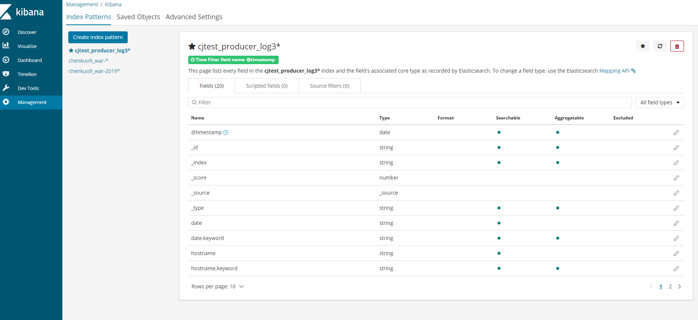
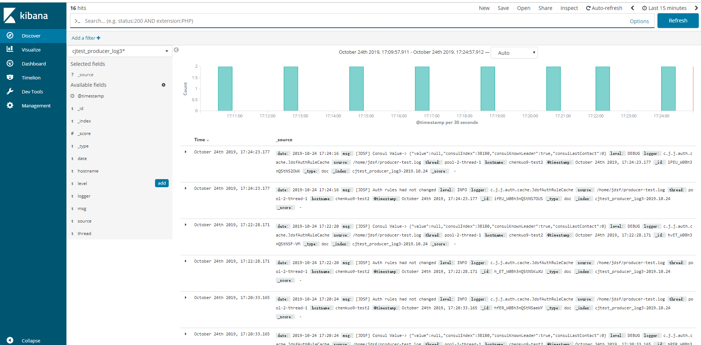

#  Log Configuration Service

Log Service is to provide users with functions such as log collection, storage and search for the application. JD Distributed Service Framework manages logs via ES; Users can configure the log collection rules and other information for the application.

The process for users to use log configuration service on the JDSF platform is as follows.

## Operation Scenario

After the application is successfully deployed, users can record the data information of the running application by log to locate business problems.

## Environment Preparation

Enable ES service first.

**Note: JDSF platform will write data into ES provided that users should maintain ES by themselves to guarantee there are sufficient resources to store and process the log.**

## Operation Steps

###  Configure log for the application

### Step 1: Create ES

1. Create one ES

If you want to how to use Kibana, please refer to: [Create ES](../../../JCS-for-Elasticsearch/Introduction/Product-Overview.md)  

**Note: ES needs to use 6.5.4 version, and be in the same VPC with the user application.** 

### Step 2: Create log configuration

1. Log in the JD Distributed Service Framework Console. Click **Log Management** on the left side navigation bar and log in the application list page.

2. Click **Create Application** on the top of list and log in the creation page.

The main field descriptions are as follows:

| Field	|  Description  |
| :- | :- | 
|  Field	|  Region. Please note that the log needs to be in the same VPC with the application. |
|   Name |  Name of Log Configuration This name will be used for the operation associated with the deployment group.    	|  
|   ES |   The platform will use ES to store logs generated during the running of application. **Note: ES needs to be in the same VPC with the user application.    	| 
|   Log Type |   Currently two types are supported: Customized Logback and Customized Log4j. 	| 
|   Log Format |   Log configuration format needs to be the consistent with the log configuration in the application. 	| 
|   Log Path |   The absolute path address of the log needs to be filled in here.   	| 

3. Set basic information, click **OK** and complete creation.

### Step 3: Associate deployment group

Each log configuration can be associated with multiple deployment groups. The association operation is only to associate the associated log configuration with the deployment group. After the association operation is finished, the deployment is required for the log configuration to take effect.

Currently, there are two entries to associate the log and deployment group.

1. Click **Associate** in operation on the log list page.

2. On the New/Edit page of the deployment group.

### Step 4: Initiate deployment to bring the log configuration into effect.

Application will be re-deployed in the initiation process of the deployment, please pay attention to your operation. Currently, there are two entries to associate the log and deployment group.

1. Click **Initiate Deployment** in operation on the log list page.

2. Directly initiate deployment in the deployment group of the application.

### Step 5: View log.

Define the index mode and select Index Patterns. The index name is "Log Configuration Name", which needs to be same name as ES. The figure below is shown as an example:

Click **View Log** in "Operation" to view the log information

If you want to how to use Kibana, please refer to: [Use Kibana](../../../JCS-for-Elasticsearch/Best-Practices/using_kibana.md)  

