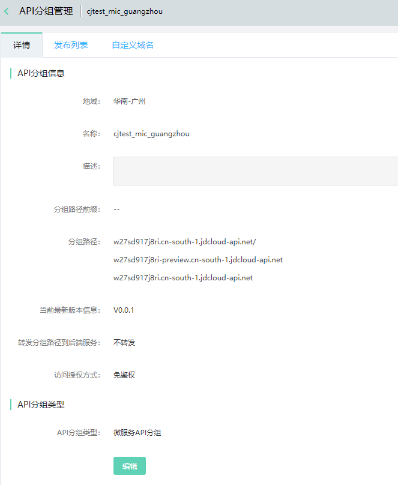
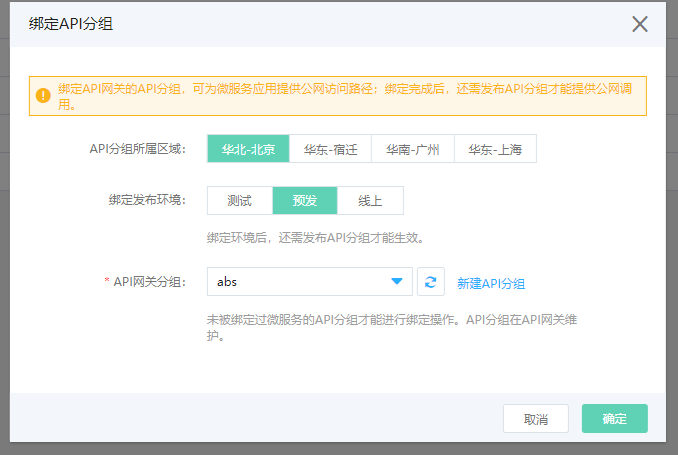
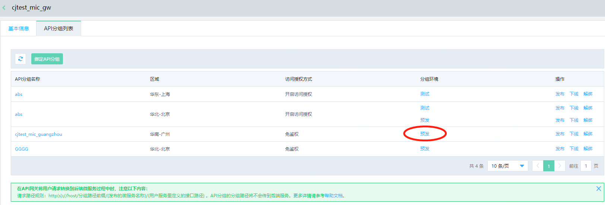

#   Create service
With the JD Distributed Service of JD Cloud, the service is opened to other services of Intranet and also opened to the public network for access with cooperation of the API gateway. If the registration center service of JD Distributed Service Framework is used, the JD Distributed Service gateway can automatically complete service discovery and Load Balancer when being called, without using another Load Balancer or gateway service. If the service is released on the Load Balancer service in Intranet via other methods, seamless connection to the API gateway can also be realized via JD Distributed Service gateway. To avoid exposure to public network, it neither needs to apply for Public IP nor incurs any public network traffic cost.

Now, JD Distributed Service Gateway Service supports two calling methods: external calling via API Gateway and calling during applications via the VPC agent mode. This document specifies how to set up JD Distributed Service gateway for applications based on [JD Cloud API Gateway](../../../API-Gateway/Introduction/Product-Overview.md) and JD Distributed Service gateway of JD Distributed Service Framework of JD Cloud.

## Operation Scenario
If the user is implementing JD Distributed Service transformation and has created a group of JD Distributed Service applications on JD Distributed Service Framework of JD Cloud, you can create a group of JD Distributed Service gateway services as per the following processes to provide calling services between external requests and each JD Distributed Service.


## Preparatory Work

Assume that a user has created its own VPC on the JD Cloud platform, subscribed JD Distributed Service Framework and created the registration center, the JD Distributed Service applications have been deployed to this registration center at the same time.


## Operation Steps

1. 	Log in the JD Distributed Service Framework Console.

2. 	Click **JD Distributed Service Gateway** on the left side navigation bar and log in the service list page.

3. 	Click **JD Distributed Service Gateway Service** on the top of service list and log in the creation page.

4.	 Set service information, click **Buy Now** button and complete creation. After creation, the system will create a JD Distributed Service gateway service instance. If the Internet access is required, it is recommended that such service shall be provided via the API gateway.


| Information Item |Description |
|---|---|
| Region and Availability Zone | The system assignment method is recommended for use to guarantee high availability of system at the greatest extent. Please note during creation that the different regional resource intranets neither be interconnected to each other, nor be changed upon creation.  |
| JD Distributed Service Gateway Service Name |  The service name can serve as the bridge between the API Gateway and JD Distributed Service gateway and cannot be modified upon creation.   |
| Creation Method-General Method of JD Distributed Service Gateway | Used for calling each JD Distributed Service and served as the general method of JD Distributed Service. If the user selects to adopt this method with the API gateway, he/she needs to select the "JD Distributed Service API Group" at the time of selecting the API group type while creating API group in the API Gateway.    |
| Creation Method-VPC Agent | It can call the Internet via the API Gateway when the service of accessing IP and port via the Internet is not subscribed, to further guarantee security of user’s external service. If the user selects to adopt this method with the API Gateway, he/she needs to select the "General API Group" at the time of selecting the API group type while creating API group in the API Gateway. |
| Registration Center & Application List  | One JD Distributed Service gateway service can only be affiliated to one registration center. Meanwhile, it needs to select and indicate which applications under this registration center can be called by this JD Distributed Service gateway service. Those unchecked applications will not be discovered by the gateway service. Applications can be added or deleted as required after JD Distributed Service gateway service is created.
|  QPS Specification  | Now, product billing is made as per specification. |


## Operation Process in Combination with API Gateway

Next, operation processes in combination with API Gateway are specified as below. Before introduction, it is believed by default that the following preparation is well made by users:

-  The user has subscribed API Gateway and JD Distributed Service Framework.

-  The user has created registration center and deployed applications on JD Distributed Service Framework.

-  Users have read common information and process about API gateway products.


###    General Steps for Release JD Distributed Service Gateway Service via API Gateway

#####  STEP 1: Create JD Distributed Service gateway service. In which, the creation method is selected as "JD Distributed Service Gateway".

-  When the method is selected, please specify the registration center of such gateway.

-  It also needs to specify and select those applications providing service via JD Distributed Service gateway under the registration center. The applications are not required to be filled in when service is created and can be updated at any time as required when service is created.

 


#####  STEP2: Create an API group Please select API group type as "JD Distributed Service API Group".

-  There is no forced sequent relationship between Step 1 and Step 2 at the time of creation. The user can create the API group first or the JD Distributed Service gateway service.

-  When API Gateway forwards requests to JD Distributed Service gateway, the JD Distributed Service API group type does not support forwarding of group path prefix content to the JD Distributed Service gateway.

-  To facilitate the demonstration, the "Free Access Authentication" mode is selected as access authorization mode.


Information of created API group is as follows:


 
 


#####  STEP3: Associate with each other.

-  There are two association entrances:

       -  1. Associate among API gateway products. Click **Associate** operation in the group information on the API group list page.

       -  2. Associate among JD Distributed Service gateway products.

-  The association operations are shown as follows:



Note:

	-  Each release environment of API group can be associated with only one backend service. 
	    
	   For example, where the "pre-release" environment of this group is not associated with any JD Distributed Service, this group under the "pre-release" environment can only be associated to the new JD Distributed Service gateway service;
	
	-  If the API group has been associated with other JD Distributed Service gateway service, it cannot be associated with others.
	
	-  API group information here refers to API group list information which is filtered and can be associated. API groups associated in this environment will not appear in the list.


-  The associated information will show contents such as associated API group information and API group environment information. In addition, operation entrances such as release, off-line and disassociation of API group will be provided.

 


#####   STEP4: Release an API group.

After release, user can call the public network via the API gateway. There are two API group release entrances:

1. Directly click **Release** on the API group list page of JD Distributed Service gateway service. For release here, environment information and version information related to API groups cannot be modified.


2. Click **Release** among API gateway products.

-  For release here, you can select to release the API group to different environments (test, pre-release and on-line).

-  Under each environment, the same or different JD Distributed Service gateway services can be adopted as the backend services.


#####   STEP5: Call.


######   Call Method in VPC

1. Open API Group Basic Information tab Tag of JD Distributed Service Gateway Service to see path call rules in VPC. For example:


2. Call services according to the rule spelling path through calling statements. For example:


```
curl -X GET http://jdsf-mgw-126aemarp4s1s-nlb.jvessel-open-hb.jdcloud.com:8080/jdsf-server/server/get
```    

Path Description:

| Content 	| Description	|  
| :- | :- | 
|  http://jdsf-mgw-126aemarp4s1s-nlb.jvessel-open-hb.jdcloud.com:8080/  	|   Call Path Generated for JD Distributed Service Framework	|
| jdsf-server  | Namely, {serviceName} content, which is the application that already exists in your registration center and is normally accessible  | 
| server/get   | Namely, {path} content, which is the path of application  | 


######   Public Network Call Method

1. First ensure that the API Group has been released to the environment. Then, the Internet call path can be obtained from the deployment environment of API Group.

The path to search Internet call has two entries:


-  In JD Distributed Service Gateway, view API Group List tab Tag of JD Distributed Service Gateway Service, click group environment to view the call address as show in the below




-  In API Gateway, view the call address in release environment tab Tag of group details


2. Call address.

1) You can enter the call address directly into the browser. For example:

```
    http://w27vqwu8gkzy-preview.cn-north-1.jdcloud-api.net/jdsf-server/server/get
```    


2) Through call statements. For example:


```
curl -X GET http://w27vqwu8gkzy-preview.cn-north-1.jdcloud-api.net/jdsf-server/server/get
```    

Path Description:

| Content 	| Description	|  
| :- | :- | 
|  http://w27vqwu8gkzy-preview.cn-north-1.jdcloud-api.net/ 	|   Perform public network call for call address generated for API Gateway.	|
| jdsf-server  | Namely, {serviceName} content, which is the application that already exists in your registration center and is normally accessible  | 
| server/get   | Namely, {path} content, which is the path of application  | 


####    Release VPC agent service steps via API gateway

#####   STEP 1: Create JD Distributed Service gateway service. Select "VPC" agent as the creation method

-  Please note that the IP forward address is: Private IP+port method and the port is the required option.

-  It needs to specify network information of VPC. Please note that mutual calling can be enabled only in the same VPC.

-  Now, the https  web service of agent backend with the private certificate is not supported now

For example:

Create contents as follows:


 
Creation Completed:
 
 can also be selected as its backend services.

- To facilitate the demonstration, the group information is set as follow, do not forward the group path to the backend, and select Free Access Authentication mode.

For example: Create API Group with the name of vpctest


#####   STEP3: Release. There are two entries:

1. Release among API gateway products.


2. Release among JD Distributed Service gateway products.


	


#####   STEP4: Call.


######   Call Method in VPC

1. Open API Group Basic Information tab Tag of JD Distributed Service Gateway Service to see path call rules in VPC.

2. Call services according to the rule spelling path through calling statements. For example:

```
curl -X GET http://jdsf-mgw-l6mnhdd1zpc-nlb.jvessel-open-sh.jdcloud.com:8080/10.0.0.69:9999/server/get
```    


Path Description:

| Content 	| Description	|  
| :- | :- | 
|  http://jdsf-mgw-l6mnhdd1zpc-nlb.jvessel-open-sh.jdcloud.com:8080/ 	|   Call Path Generated for JD Distributed Service Framework	|
| 10.0.0.69:9999 | For Private IP+Port | 
| jdsf-server  | Namely, {serviceName} content, which is the application that already exists in your registration center and is normally accessible  | 
| server/get   | Namely, {path} content, which is the path of application  | 


######   Call Method Through API Gateway

1. First ensure that the API Group has been released to the environment. Then, the Internet call path can be obtained from the deployment environment of API Group.

The path to search Internet call has two entries:


-  In JD Distributed Service Gateway, view API Group List tab Tag of JD Distributed Service Gateway Service, click group environment to view the call address as show in the below


-  In API Gateway, view the call address in release environment tab Tag of group details


2. Call address.

1) You can enter the call address directly into the browser. For example:

```
    http://w2xmjqwbx62p-test.cn-north-1.jdcloud-api.net/server/get
```    


2) Through call statements. For example:


```
curl -X GET http://w2xmjqwbx62p-test.cn-north-1.jdcloud-api.net/server/get
```    
 


-   See the DEMO Example: [Best Practices](../../Getting-Started/GW_VPC.md) for the above  


