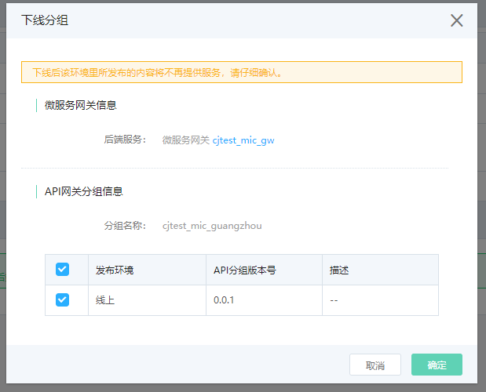

#  View service

## Operation Scenario
View service information of the running JD Distributed Service gateway which is created by the current user.

## Operation Steps

###  View JD Distributed Service gateway service details

1. 	Log in the JD Distributed Service Framework Console

2. 	Click **JD Distributed Service Gateway** on the left side navigation bar and log in the service list page

3. 	Click the service name to be viewed in the service list and enter the Details to view information. A JD Distributed Service gateway service comprises two parts: basic information and API group list information.

 
 

####  The basic information tab page comprises two information parts:

1.	 Basic information of JD Distributed Service gateway service itself.

2.	 Information related to the registration center served by JD Distributed Service gateway.

-  Users can update application information list under the registration center at any time. Only the selected applications can be discovered by JD Distributed Service gateway service.

-  When users call applications, please access as per calling path rules in VPC.

 
 
  

####   The API group list tab page shows information summary of API group associated and selected after JD Distributed Service gateway service is released through the API gateway.

 
 
1.	 One JD Distributed Service gateway service can provide access to several API groups.

2.	 API groups and JD Distributed Service gateway may be in different regions.

3. 	After the client send a request to API gateway, please attach importance to the following items when API gateway switches user requests to backend JD Distributed Service:

-  When the client requests the API gateway, the request path rule is: http(s)://host/group path prefix/{released JD Distributed Service name}/{API path defined in user service}.

-  API Gateway now cannot transmit group path prefix information of API group to the JD Distributed Service gateway service at backend.

4. 	Associate API group operation: the process associating JD Distributed Service gateway service with API groups. During association, it needs to be accurate to the release environment of API group. Note:

-  Only the API group of the "JD Distributed Service API Group" type can appear in the optional association list.

-  Each release environment of API group can be associated with only one backend service. Therefore, during the environment information association process, the API group which has not been associated under this environment can appear in the association list. Moreover, the system will automatically filter API group information which cannot be associated.

For example, the API group with the name of abs has been selected as the backend service for the JD Distributed Service gateway service cjtest_mic_gw under the test environment, then the API group abs can only be associated under the pre-release and on-line environments.

As shown in the figure below, as the API group abs hasn’t been associated with any information in the pre-release environment, it can be associated in the pre-release environment.

 

 

As shown in the figure below, the API group abs will not appear in the associated API group list under the test environment. This is because the test environment of this API group has been associated with other JD Distributed Service gateway services.
 
 

 
5. 	Release operation: Access to JD Distributed Service applications can be provided only when the API group release takes into effect.

 

 

6. 	Off-line operation: After the group is off-line under a specific environment (such as the pre-release environment), the service cannot be accessed anymore under this environment.

 

 
 
7.	 Disassociation operation: Release the relationship between the API gateway group and JD Distributed Service gateway service.

- If the API group is released in the release environment, it cannot be disassociated before making the group off-line.
 
 

 

###  View list of JD Distributed Service gateway service

1. 	Log in the JD Distributed Service Framework Console

2. 	Click **JD Distributed Service Gateway** on the left side navigation bar and log in the service list page
 
 

Operations which can be made by the user on the service list page include:

1. Create gateway service: Create one new JD Distributed Service gateway service.

2. View details: View details of created JD Distributed Service gateway service.

3. Associate: If it is expected to provide the created JD Distributed Service gateway service externally via the API gateway, it needs to associate the API group for calling by the client.

4. Update application: Update accessible application information.

-  If the general gateway service of JD Distributed Service is selected during creation, the user can update applications under the registration center depending on business conditions upon creation, for calling by JD Distributed Service gateway;

-  The JD Distributed Service gateway service in the VPC agent mode does not have this function.

5. Resize: Upgrade current specification.

-  To guarantee service stability, now it is not allowed to degrade the configuration to the QPS specification during resizing.

 

6. Delete: Delete JD Distributed Service gateway service.

-  The precondition for deletion is that the service is not associated with any released API group.

-  If the API group is released in any deployment environment (test, pre-release or on-line), please make it off-line first and then delete.

 

