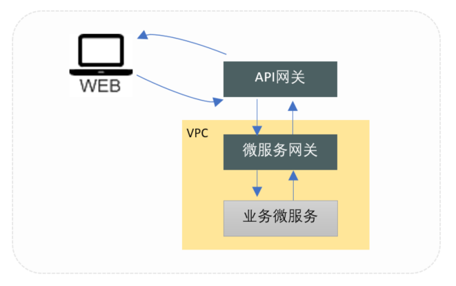
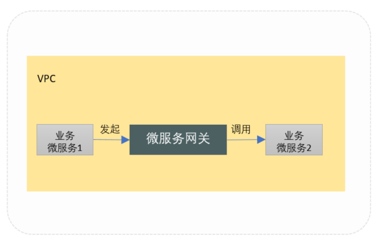

# Overview

JD Distributed Service gateway of JD Cloud is the service open to the external. With the JD Distributed Service of JD Cloud, the service is opened to other services of Intranet and also opened to the public network for access with cooperation of the API gateway. If the registration center service of JD Distributed Service Framework is used, the JD Distributed Service gateway can automatically complete service discovery and Load Balancer when being called, without using another Load Balancer or gateway service. If the service is released on the Load Balancer service in Intranet via other methods, seamless connection to the API gateway can also be realized via JD Distributed Service gateway. To avoid exposure to public network, it neither needs to apply for Public IP nor incurs any public network traffic cost.

JD Distributed Service gateway of JD Cloud has the following benefits:

- The JD Distributed Service gateway encapsulates internal structure of the JD Distributed Service application and provides the client with the unified calling entrance. When there is any calling request, the request will be forwarded by JD Distributed Service gateway to the authorized and released JD Distributed Service instance.

- With seamless integration between JD Distributed Service of JD Cloud and JD Cloud API Gateway, you can directly release your JD Distributed Service applications to the public network via API Gateway for calling, avoiding direct service exposure by the service provider, resulting in no need to applying for Public IP and incurring no public network traffic cost.

- Based on API Gateway, API traffic control policy, access authorization and other functions are realized, helping business developers attach more focuses on its own business development. 

- Simplify development workload of the client. The client only needs to interact with the gateway, without focusing on internal details such as service location, scaling of service instance, etc.

## Application Scenarios

JD Distributed Service gateway of JD Cloud helps users to call external JD Distributed Service applications without exposing service. At present, the following two calling methods are provided:

- JD Distributed Service gateway mode:

The JD Distributed Service gateway service can serve as the backend service for API group of API gateway; when the API group is released in the deployment environment, users can call the JD Distributed Service gateway through API gateway and further call JD Distributed Service application instances in VPC. The JD Distributed Service gateway completes service discovery and Load Balancer (random mode).

- VPC agent mode:

The JD Distributed Service gateway can serve as the VPC agent, directly exposing any service which is deployed through the ip+ port in vpc to the public network via an API gateway, without direct exposure by Public IP and public network. For specific calling method, please refer to the example: Use APIs in Open VPC of API Gateway

 
 
## Relationships Between Concepts

Relationships between API group, JD Distributed Service gateway service, registration center and application of API gateway are as follows:

|Noun|Description|
|---|---|
| API Group  |  The API management unit provided by API provider, one API group comprises several APIs; API release, calling, authorization and flow control are made in the API group unit. For more details, please refer to: [API Gateway Grouping Description](../../../API-Gateway/Operation-Guide/Create-APIGroup/Create-APIGroup.md). |
| API Group Deployment Environment | API running environment, JD Cloud API gateway provides three environments now, including test, pre-release and on-line. API groups can be called when they are deployed to the environments (test, pre-release and on-line). For more details, please refer to: [API Gateway Release Environment Description](../../../API-Gateway/Operation-Guide/Create-APIGroup/Create-Publish.md). |
| JD Distributed Service Gateway Service  |  JD Distributed Service gateway provides the basic service unit; during the process of providing external service by the JD Distributed Service application, a specific JD Distributed Service gateway service instance is required for communication. |

Description:

- When the user needs to release one API group to different deployment environments, several JD Distributed Service gateway services can be selected as the business backend services;

- One JD Distributed Service gateway service can also provide backend service to several API groups under different environments;

- One JD Distributed Service gateway service can be associated with only one registration center.

## Billing Rules

- The JD Distributed Service gateway adopts the Pay-As-You-Go mode and is billed as per QPS specification. During Beta, QPS below 3000 is free of charge.
  
- When the client calls through the API gateway, the API gateway will be charged as per the API calling number. For specific charging rules, please refer to [Billing Instructions for API Gateway Product](../../../API-Gateway/Pricing/Billing-Overview.md).

