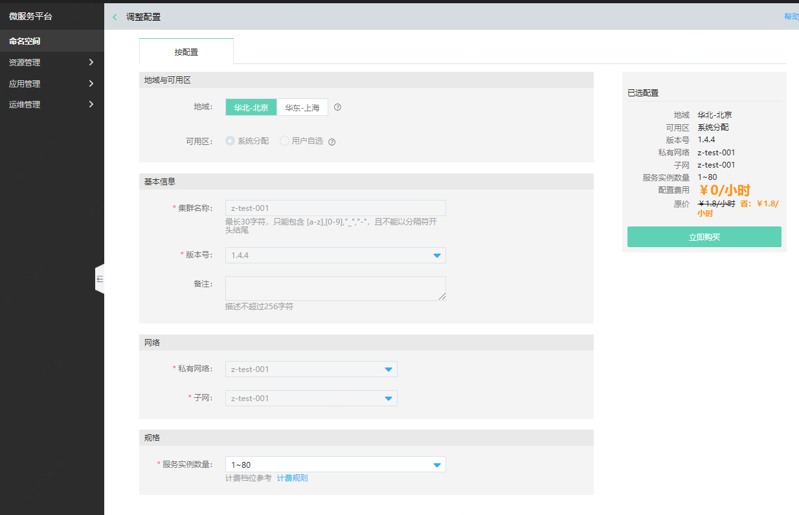
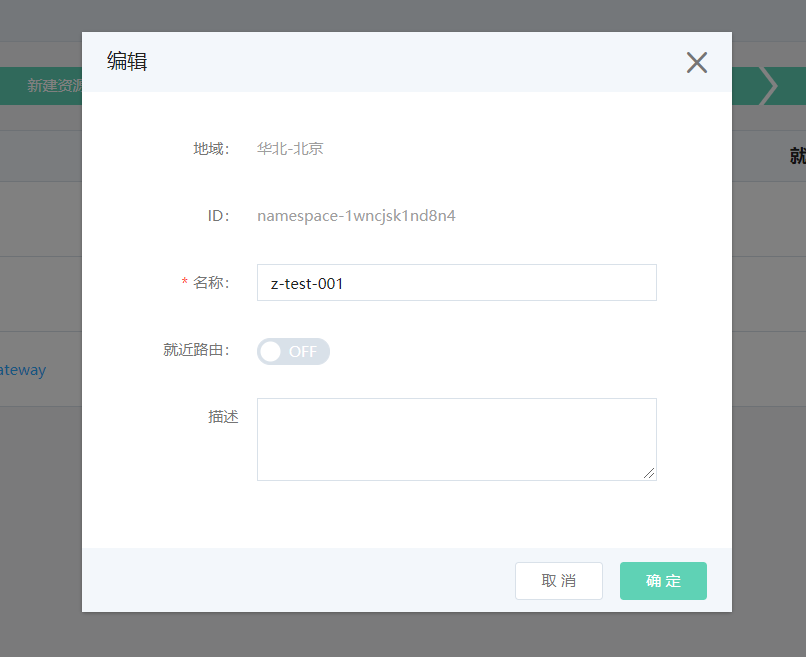

# Namespace
Namespace refers to an abstract collection of a group of resources and objects, used for resource isolation. A user can create several namespaces under the same VPC.

For example, a user can respectively create 3 namespaces in the same VPC for the development environment, test environment and production environment according to project demands; in addition, in each environment, resources and applications are separated to each other.
 

## Operation Steps

### Create

1. 	Log in the JD Distributed Service Framework Console. Click **Namespace** on the left side navigation bar and enter the namespace list page.

2. 	Click **Create Namespace** on the top of the list and log in the creation page.

3.	 Set service information, click **Buy Now** button and complete creation.

**Description:**

-  The registration center will be synchronously generated to manage all service registration and discovery under the namespace.

-  The application number displayed by the namespace refers to the total number of applications attached under the namespace, including those deployed, failed and un-deployed yet. However, the application number displayed by the registration center refers to the number of applications which are deployed and can be discovered in the registration center.

-  At present, the "system distribution" provides and supports multiple availability zones. "Users can select" 1 availability zone and only 1 availability zone is supported.

### Resize

Through resizing, you can expand the instance types of namespace.

1. Log in JDSF Console and enter the namespace list page.

2. Enter the resize page.

3. Select a requiring specification, click the **Buy Now** button and complete creation.

**Description:**

-  For resizing of current registration center, only expansion other than shrinkage is supported.

 
### Edit

Currently, you can modify the name and description of the namespace.

  

 
 
### Delete

1. Log in the JD Distributed Service Framework Console.	Click **Namespace** on the left side navigation bar and enter the namespace list page.

2. For the namespace to be deleted, click **Delete** on the operation bar.

**Description:**

1. Before deleting a namespace, please clear all applications under such namespace, otherwise, it cannot be deleted.

2. It requires **Registration Center Name to be Unique** in the JDSF platform. Therefore, if a new namespace is to be created after a namespace is deleted, it needs to ensure **Registration Center Name to be Unique**, and it cannot be repeated with the name of the registration center created ever before.

3. Before deleting the data, a user needs to well complete data backup work on his/her own.

