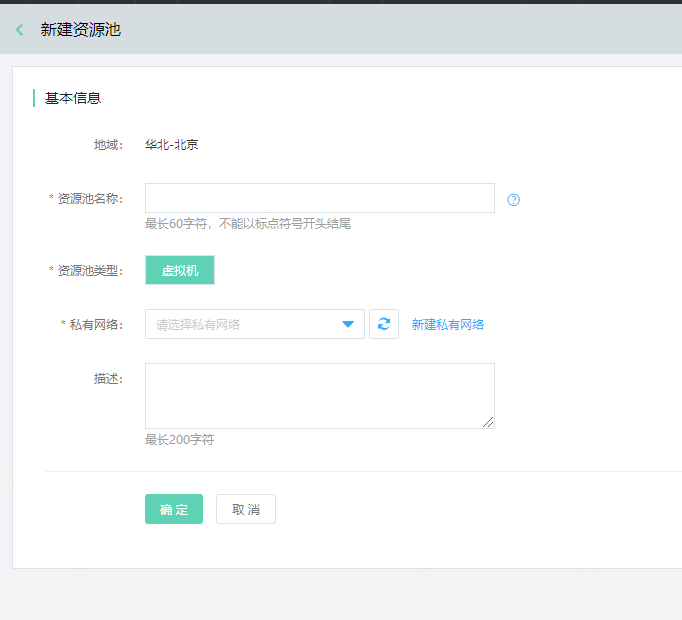

# Resource Pool Management

Resource pool is a concept of a group of resource collection. With the resource pool, resources such as Virtual Machines and Containers under the namespace can be managed.

**Description:**

-   One resource pool can only serve one namespace. However, there are several resource pools under one namespace.
-   A user can create/delete resource pools, import Virtual Machines and export Virtual Machines in the resource pool.

## Preparatory Work

Before creating a resource pool, it is deemed by default that the user has purchased Virtual Machines and other resources.

## Operation Steps

### Create Resource Pool

1. 	Log in the JD Distributed Service Framework Console. Click **Resource Management** on the left side navigation bar and log in the resource pool management list.

2. 	Click **Create Resource Pool** on the top of the list and log in the creation page.

3. Set information of resource pool and click **OK** to complete creation.

**Note:**

-   The resource pool and the namespace to be served by such resource pool shall be in the same VPC.
-   A user can create/delete resource pools, import Virtual Machines and remove Virtual Machines in the resource pool.

### Deletion of Resource Pool

1. 	Log in the JD Distributed Service Framework Console. Click **Resource Management** on the left side navigation bar and log in the resource pool list page.

2. 	For resources to be deleted, click **Deletion** on the operation bar.

**Description:**

1. Before deletion, all Virtual Machines in the resource pool need to be cleared.

2. Before deleting the data, a user needs to well complete data backup work on his/her own.

### Import of Virtual Machines

1. 	Log in the JD Distributed Service Framework Console. Click **Resource Management** on the left side navigation bar and log in the resource pool list page.

2. 	For the resource pool to be operated, click **Import Virtual Machines** on the operation bar.

**Description:**

1. Now, only Virtual Machines under the same VPC can be associated and those unassociated can be imported.

2. One Virtual Machine can be associated with 1 resource pool.

### Removal of Virtual Machines
1. Log in the JD Distributed Service Framework Console.	Click **Resource Management** on the left side navigation bar and log in the resource pool list page.

2. Click ID, log in the list page of Virtual Machines, select Virtual Machines to be removed and delete them. Before deleting data, a user needs to disassociate Virtual Machines from the deployment group and then delete the same.

3. Before deletion, a user needs to complete data backup work on his/her own.

