# User Guide for BookInfo Sample Program

##  Introduction

BookInfo is a sample program officially provided by istio to give a presentation on various features of the ISTIO Service Mesh. The BookInfo application program is divided into four independent JD Distributed Service types:

| Information Item	| Description	|
| :- | :- | 
| Productpage |  (Product page) JD Distributed Service, call JD Distributed Service types of details and reviews to fill the page. | 
| details | JD Distributed Service comprises details of books | 
| reviews | JD Distributed Service comprises the book review. It also calls JD Distributed Service types of ratings | 
| ratings | JD Distributed Service comprises the rating information accompanying with the book review information. | 

Three versions are deployed for Reviews:

| Information Item	| Description	|
| :- | :- | 
| version:v1 | Call no ratings service | 
| version:v2 | Call the ratings service, with each rating displayed with 1-5 black starts | 
| version:3 | Call the ratings service, with each rating displayed with 1-5 red starts | 

The application framework is as shown in the figure below:
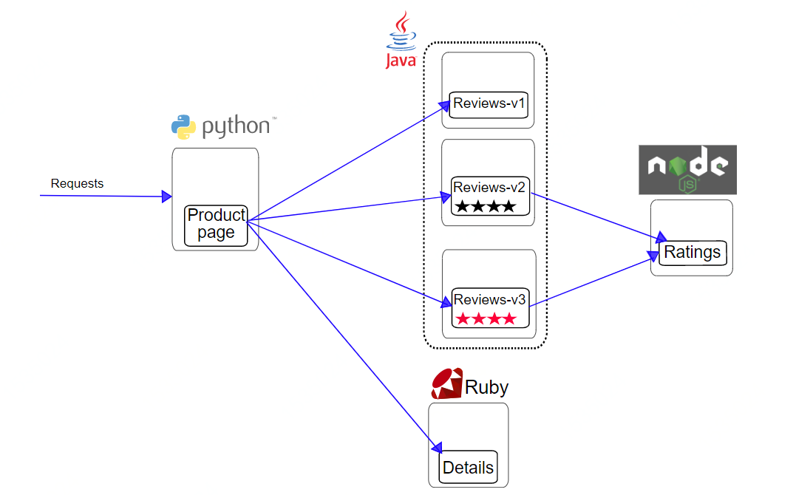
 
 
 
##  Installation Method

#### STEP1: Login the Console, select Deployment and enter the istio deployment interface.

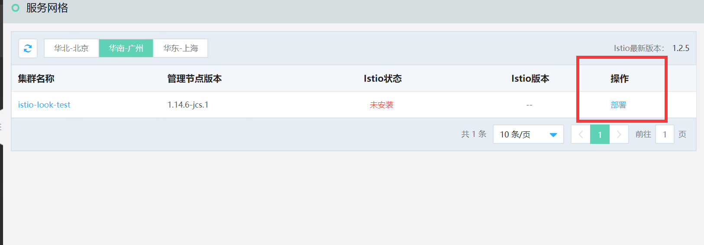
 
 
#### STEP2: Select the choice of enable the sample component. Then the bookinfo sample program will be automatically deployed.
 
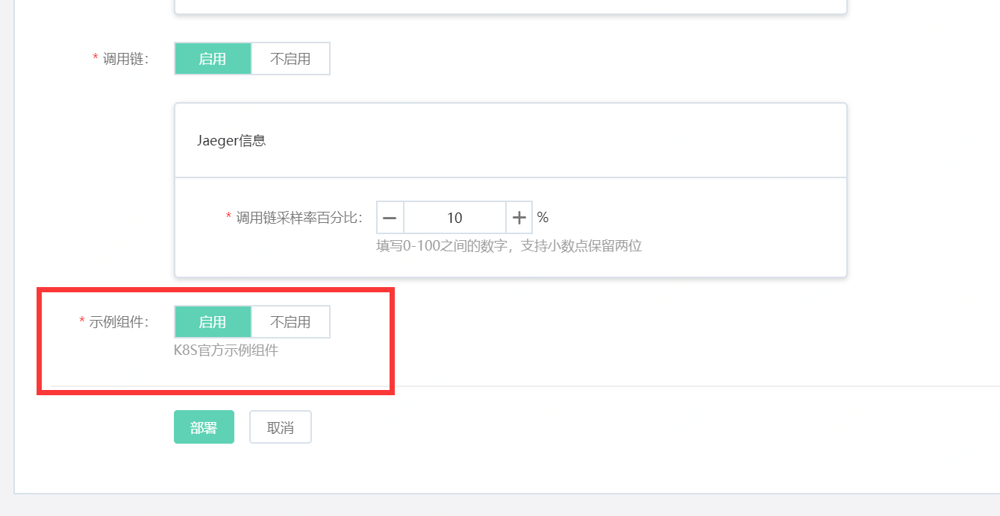

#### STEP3: As shown in the component interface, select a component after successful installation and enter the page to view component installation details.

#### STEP4: The public network calling address and the cluster access address of the installation sample program can be viewed on the component details interface.
 
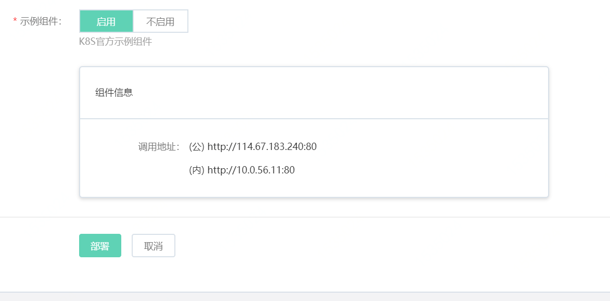

The sample program can be accessed via the public network address +"/productpage" (e.g. http://114.67.183.240/productpage for the cluster), as shown in the following sample program interface.

 

 
##  View instance program service

After installation deployment is successfully made, as shown in the figure below, please enter the Virtual Service page and you can see the bookinfo service successfully deployed.

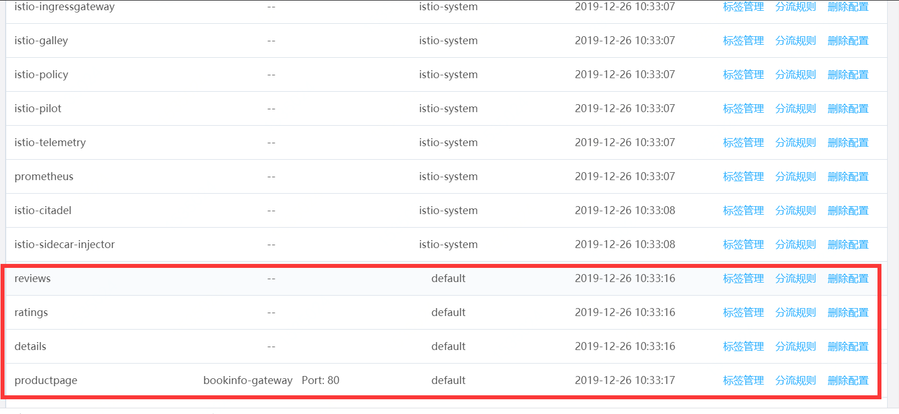   
 
 

##  Representation of the Sample Program Traffic Offloading Function

It is known from the service architecture of Bookinfo sample program that the productpage service calls the reviews service to exhibit the page, but the reviews service is deployed with three different versions (return contents vary with the versions). By default, productpage will access the reviews service at random. Therefore, traffic offloading policies can be configured for the reviews service and the traffic from the productpage service to the reviews service can be managed. The traffic configuration process will be demonstrated via steps below.

#### STEP1: Create Gateway

During the deployment process, the sample program has created a gateway by default, in the name of bookinfo-gateway, with host of * and port of 80, which can be directly used as the default gateway.
  
If you need to configure other gateways, please carry out the following operation:

1) Log in the Service Gateway interface.

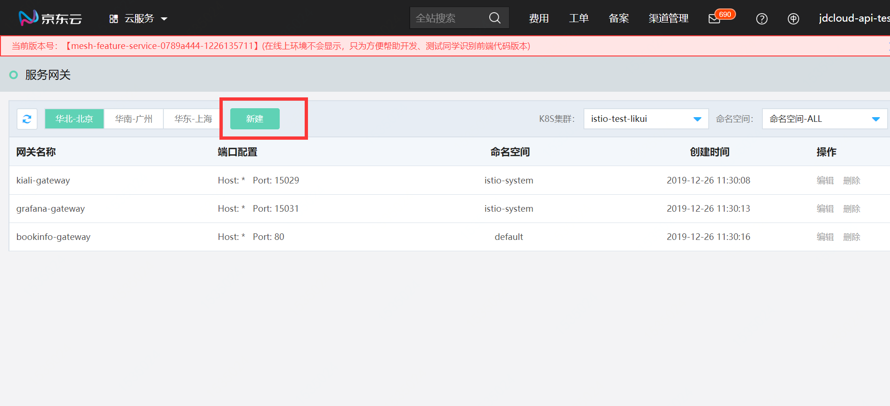  
 
2) Select **Create** and enter the gateway creation interface, as shown in Figure 4-2. Users can freely configure the port number and the namespace. Currently, the host system only supports default configuration (all requests by default). 

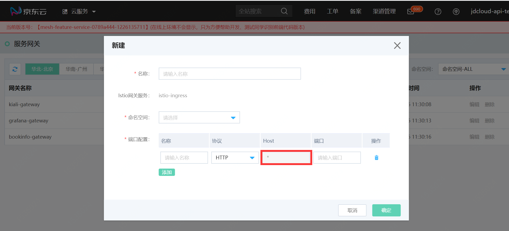  

#### STEP2: Configure Entry Traffic Rules

Enter the Virtual Service page, select and enter the Traffic Rules configuration page of the productpage service.

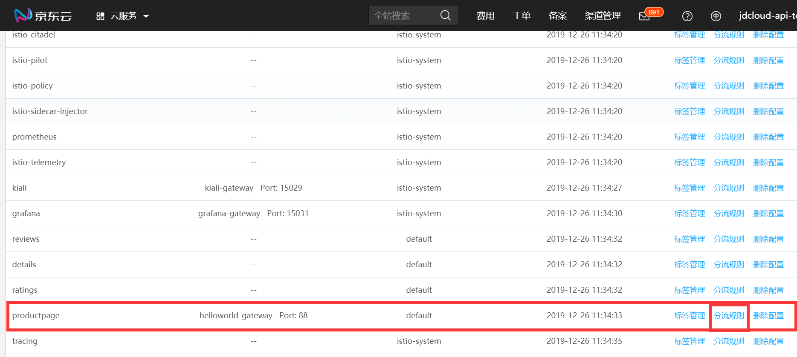  
 
During the installation process of sample program:

-  By default, an Entry Traffic Rule is created for the productpage service and the default host of the rule is * (all external requests)

-  gateway is associated with the bookinfo-gateway created by default. The Traffic Rules can be exactly matched with "/productpage" in url and the default Entry Traffic Rules can be directly used.
 
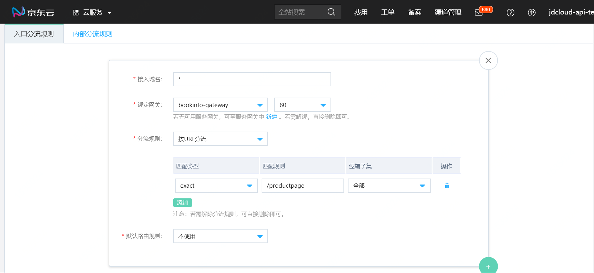  

If you need to create additional Entry Traffic Rules, you are allowed to do so, with access domain freely configured for entry rules, gateway associated and Traffic Rules added.

The traffic rules support three traffic offloading rules, including Header, URI and weight. Generally, the Header and URI methods are frequently used. The URI method supports exact and prefix match.
 
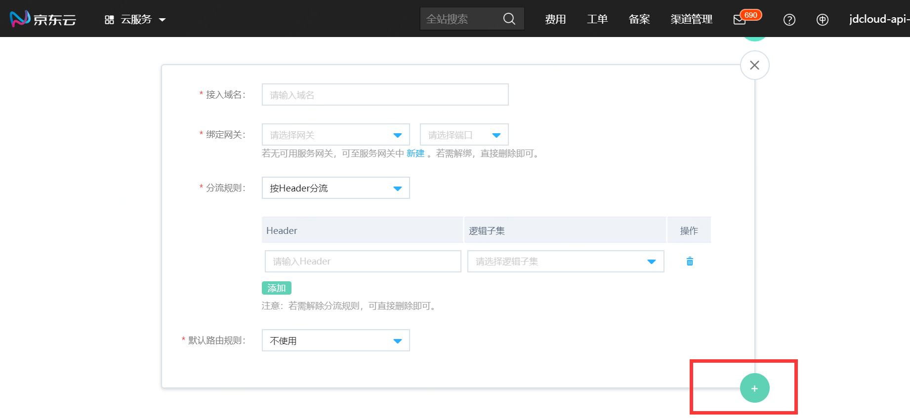  

#### STEP3: Make Tag for Service Load

The Virtual Service page is as shown in the figure below

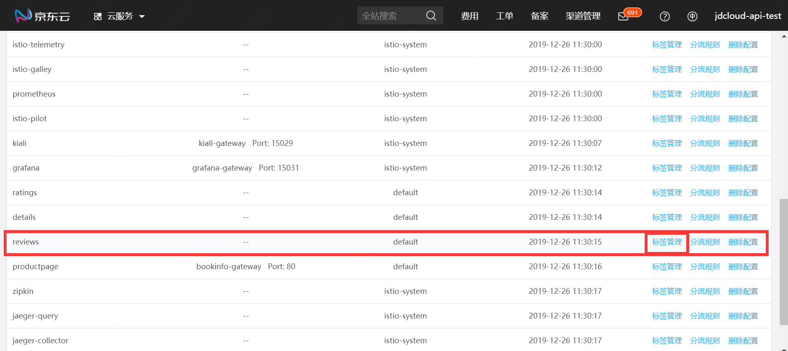  
 
Select and enter the tag management function of reviews service and enter the tag management interface.

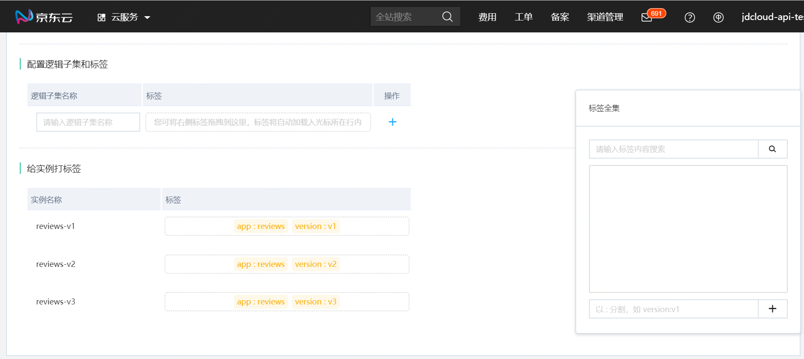  

The instance program has made a version tag (version:v1\version:v2\version:v3) to the reviews Load Balancer instance during installation. The default tag can be used without configuring an instance tag again.

If you need to configure other tags, please carry out the following operation:

As shown in the figure below, carry out step a in the logic set, add tags to be assigned to the instance, carry out step b, drag tags to the specified logic sub-set and make tags to the instance.

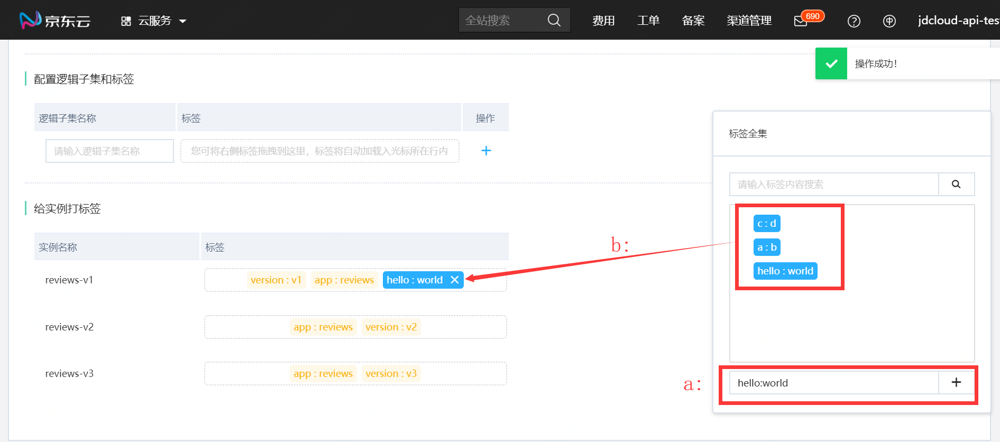  
 
 
 
#### STEP4: Configure Logic Sub-set (destinationrule)

Carry out step a as shown in the following tag operation page. Add tags (tags of different version instances) requiring traffic offloading in the tag set, carry out the step b, drag tags to the logical sub-net and create logical sub-sets to the service.

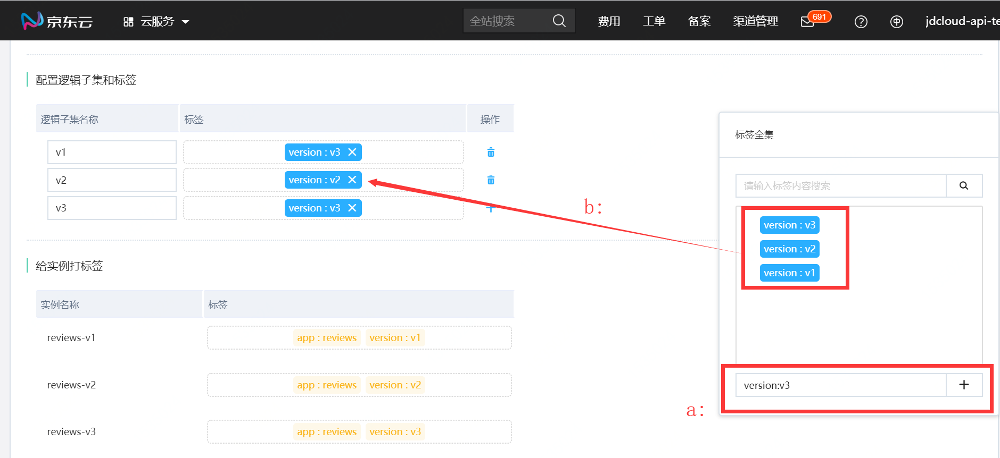  
  
 
#### STEP5: Configure Internal Traffic Offloading Function (virtualservice)

As shown in the figure below (Virtual Service Page), select to enter the Traffic Rules Configuration page in the reviews service.

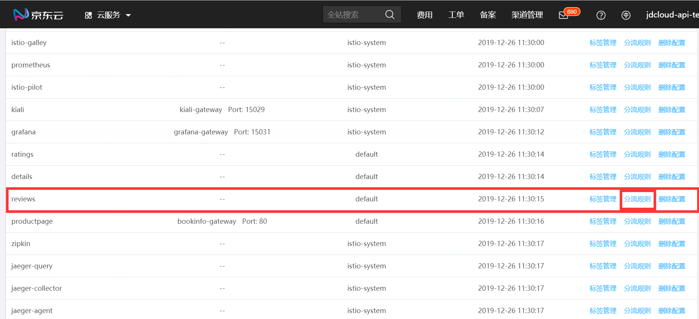  

As shown in the figure below, select to enter the Internal Traffic Rules page for Traffic Rules of the reviews service and select header or url to configure the Traffic Rules.

The document lists demonstration of how to use the header traffic rules:

-  Configure the matched header with end-user:jason traffic offloading to the v1 logical sub-set (version:v1) created in Step 3 

-  Configure the matched header with end-user:alice traffic offloading to the v2 logical sub-set (version:v2) created in Step 3

-  Configure the matched header with end-user:bob traffic offloading to the v3 logical sub-set (version:v3) created in Step 3

-  By default, all reviews instances will be accessed at random (to match with the above header).
 
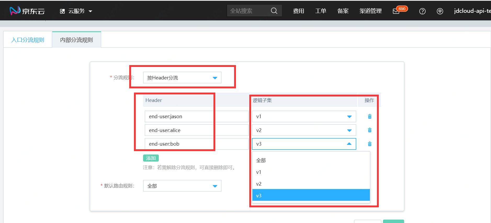  

##  Presentation of Traffic Offloading Effect
Access the instance program demonstration address via the public network ip+"/productpage", as shown in Figure 5-1. Verify the traffic offloading effect is valid or not via login of different users.
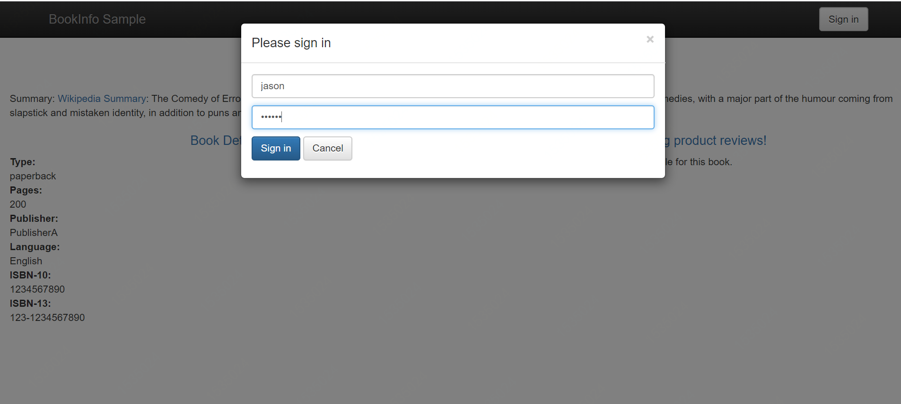   
 
 
####  Demo 1:

Log in the jason user, set any password and refresh the productpage service page. The access page is as shown below. The page does not call the ratings service, indicating that the traffic offloading is made to reviews v1 and proving that the traffic offloading configuration reaches the expected value and effect.

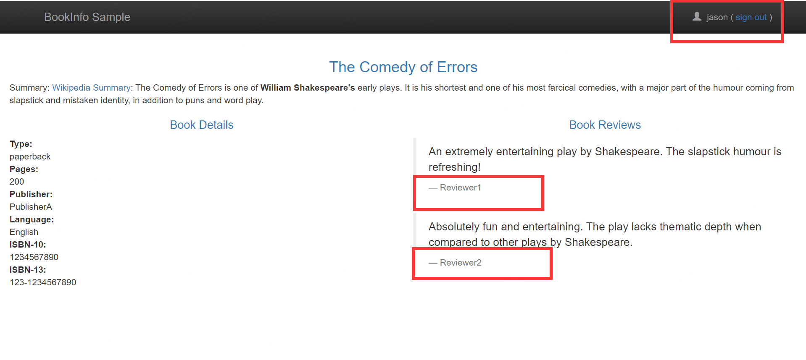   
 
####  Demo 2:

Log in the jason user, set any password and refresh the productpage service page. The access page is as shown below. The page calls the ratings service and then 1-5 black starts are turned, indicating that the traffic offloading is made to reviews v2 and proving that the traffic offloading configuration reaches the expected value and effect.

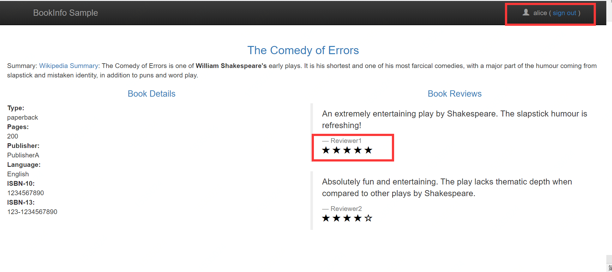    

####  Demo 3:

Log in the bob user, set any password and refresh the productpage service page. The access page is as shown below. The page calls the ratings service and then 1-5 red starts are turned, indicating that the traffic offloading is made to reviews v3 and proving that the traffic offloading configuration reaches the expectation and effect.

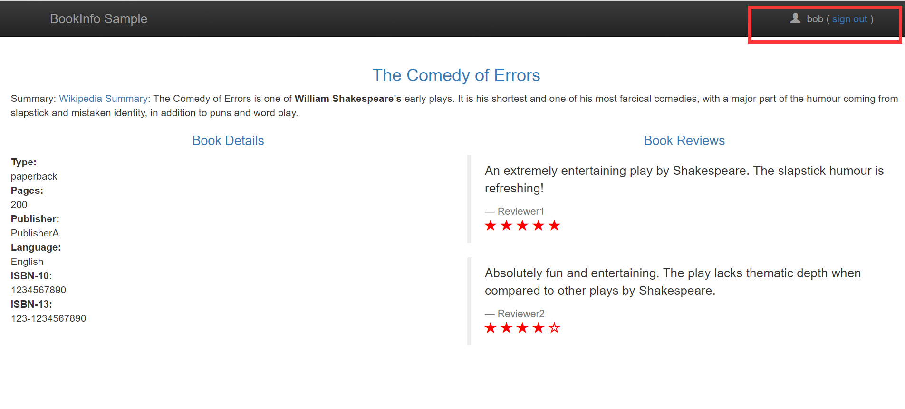     

####  Demo 4:

Do not login any user and refresh the productpage service page. The access page is as shown below. The page will return 1-5 black starts, 1-5 red starts or nothing at random, indicating that the traffic offloading is made to three different reviews versions and proving that the traffic offloading default configuration reaches the expectation and effect.
 
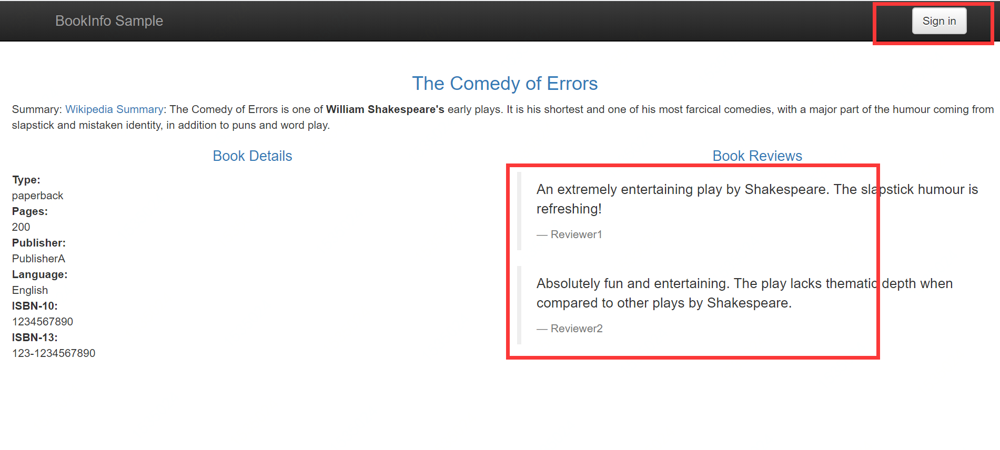     

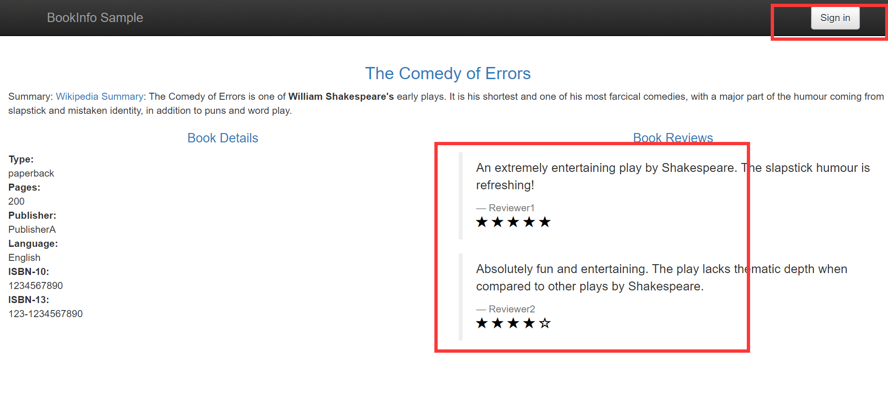     

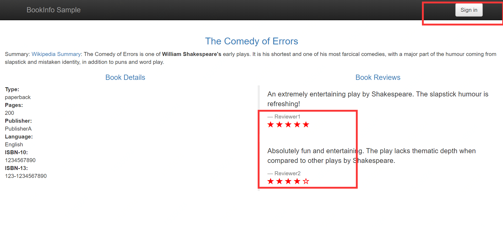     
 

