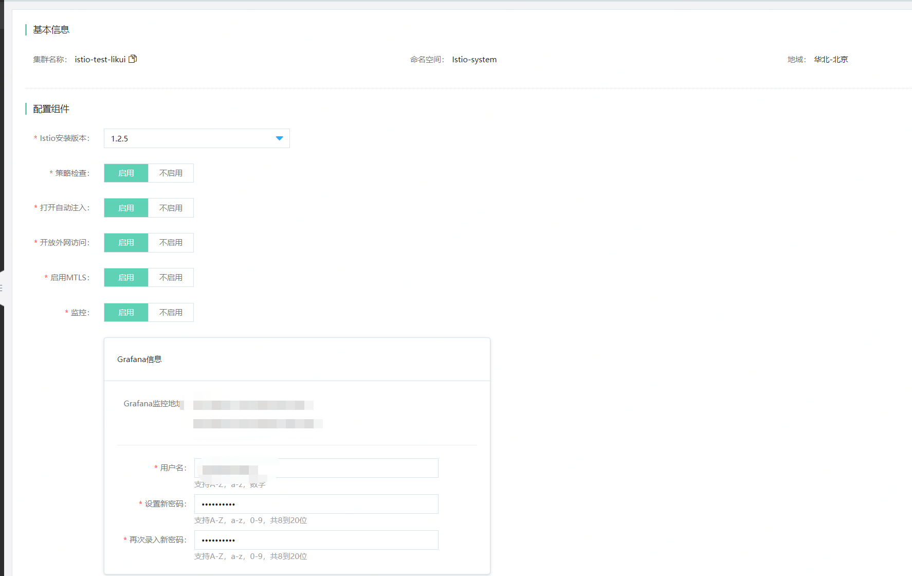

#  Istio Management

Service Management refers to the management for service life cycle, including service registration, discovery, processing relationship with service calling, service monitoring, analysis, etc.

## Environment Preparation

Resources required are subscribed, such as Virtual Machines, Cloud Mesh and K8S Cluster. The Mesh relies on K8S.

**Note:** 

-  If you need to open Internet access, elastic IP cost will be produced. Under this scenario, the system will automatically create JD Cloud Load Balancer components and applies for public IP, with 1Mbps bandwidth. For billing standard, please refer to billing of [Elastic IP](../../../Hyper-Converged-IDC/Cloud-Physical-Server/Operation-Guide/Networking/Elastic-IP-For-Physical-Cloud.md).

-  JD Cloud guarantees that Cloud Service Mesh can be installed and changed when K8S cluster is normal.

-  JD Cloud guarantees that when Istio service is normal, you can manage various Service Management functions of Cloud Service Mesh via this product.

-  You can view running status of Istio service via JD Cloud Monitoring.

-  If you have made wrong operation and maintenance to network configuration of VPC, resources of JCS for Kubernetes, namespace of Istio service and proxy service in application pod, problems such as invalidation of the Cloud Service Mesh function and application data access may be caused.

## Operation Description

###  Deploy Mesh

1. Log in Console. Menu position: Middleware>Cloud Service Mesh>Istio Management
 
 

2. After the K8S cluster is created by the user, the K8S list created by the user can be automatically retrieved in Istio management. Users can select the K8S cluster requiring Mesh deployment, click **Deployment** in the operation bar and go to the cluster to deploy Mesh.
 

Configuration component information description:

| Information Item | Description |
| :- | :- |
| Cluster Name| Deploy target cluster of Istio. |
| Namespace | Deploy the namespace of Istio and istio-system is the default. |
| Region | Regions of current k8s cluster and Mesh. |
| Policy Check | Enable the Mixer component to realize pre-access Policy Check function, such as white list and traffic limit. |
| Enable Internet Access |  When the Internet access permissions are enabled, the system will automatically create the JD Cloud Load Balancer component and apply for Public IP (with the bandwidth of 1Mbps), automatically install Ingress Gateway for related observation components and generate relevant configuration. Users can access the Mesh applications via the external address displayed on the component page.  |
| Enable MTLS | Users can select to enable MTLS or not |
| Monitoring | Enable Grafana to display metric data of indicator or not. In enabled, please set user name and password in advance.  |
| Kiali Observation | Enable Kiali visual Service Mesh or not. In enabled, please set user name and password in advance. |
| Call Chain | Enable Jaeger call chain or not. Users can set call chain sample rate percentage within the range (1-100%). |
| Sample Component | Official Sample Component BookInfo of Istio. |

3.	 After the basic information is configured by the user, click **Deploy** and the system will deploy Istio for the current K8S cluster.

4.	 You can view if deployment is successfully made via methods below.

1)	 After deployment is submitted, deployment process can be viewed via the execution progress. If there is any error information, please make deployment again.

2)	 In the Istio management page, view Istio deployment status of the current cluster.

5) 	Changes are as follows if the deployment is successfully made:

1)	 If you have turned on the observation component and the sample program, the system will automatically create one more Ingress Gateway.

2)	 In "Virtual Service", all service lists in the current K8S cluster will be automatically retrieved and displayed.

###  Component Management

After mesh deployment is completed, Mesh components can be configured again.

Entry: Middleware>Cloud Service Mesh>Istio Management. There is component management operation in the operation bar.

###  Detach

1. Log in the Cloud Service Mesh Console. Click the left side navigation bar and log in the Mesh management list page.

2. Click **Delete** in the operation bar of the list.

-  Upon completion, contents configured to Istio now will be completed deleted.

-  After completion, if Istio is created for the current cluster again, it shall be deemed as the newly-installed one.

