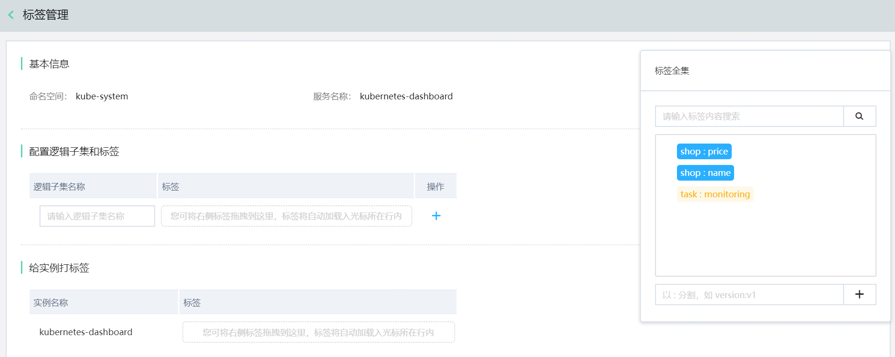
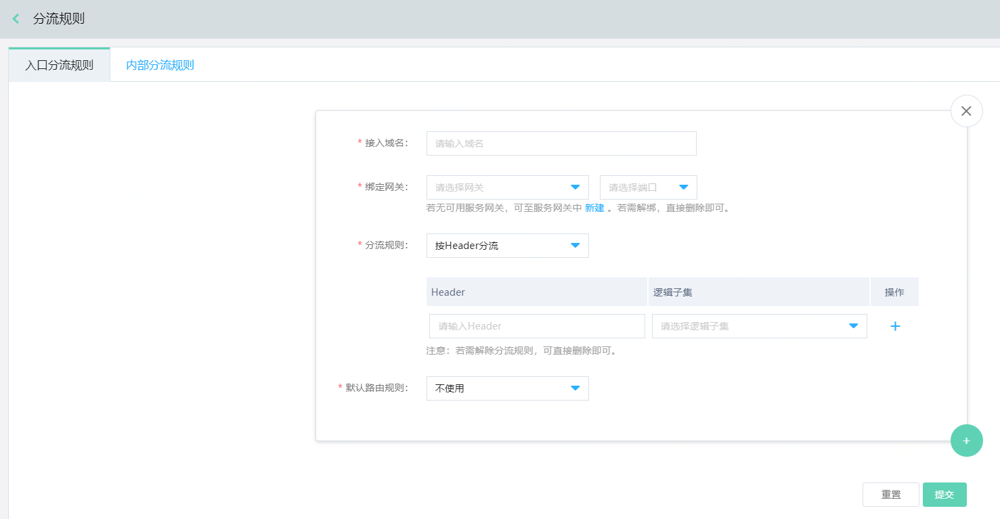
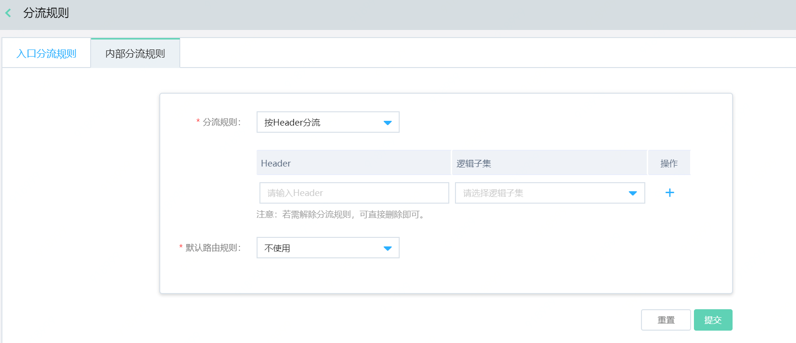

#  Virtual Service

In the virtual service management page, the platform will automatically retrieve and display all service lists in the current K8S cluster. If the content is null, the user needs to create the service in K8S.

##  Environment Preparation

1. 	The user needs to create the K8S cluster first and deploy the Mesh.

2. 	Service has been running in K8S.

3. 	If you need to provide service externally, please prepare the Ingress Gateway in advance.

##  Operation Description

### Logic Sub-set (Destination Rule)

Tags can be made to instances by configuring logic subsets. The next step is to configure Traffic Rules to service.

1. Log in Console. Menu position: Middleware>Cloud Service Mesh>Virtual Service.

2.	 Click **Tag Management** in the operation bar and log in the logic sub-set configuration page.

In this step, you need to configure logic sub-sets and tags and make tags to instances.

Description:

1) 	Tags in logic sub-sets cannot be select from the "Tag Set" on the right.

2) 	Tags in the tag set falls into two types: Initialized tags from K8S and customized tags created by the user.

3) 	You can drag tags to a logic sub-net. Take effect in real time.

4) 	Tags can be made to instances by dragging. Take effect in real time.

### Traffic Rules

The Traffic Rules comprise Entry Traffic Rules and Internal Traffic Rules. Users can make customized configuration or make no configuration.

####  Configure Entry Traffic Rules

When it needs configure Traffic Rules for external requests, please configure them in the Entry Traffic Rules.

1. Log in Console. Menu position: Middleware>Cloud Service Mesh>Virtual Service. Click **Traffic Rules** in the operation bar and select the Entry Traffic Rules.

2.	 Associate Ingress Gateway and port.

3.	 Select effective method of Traffic Rules. Now only 3 traffic offloading methods are supported, i.e., Header, URL and weight. Original Traffic Rules will be automatically replaced while updating.

####  Configure internal Traffic Rules

When it needs call and configure Traffic Rules for internal service types of the Mesh, you make configure the Internal Traffic Rules.

1. Log in Console. Menu position: Middleware>Cloud Service Mesh>Virtual Service. Click **Traffic Rules** in the operation bar and select the Internal Traffic Rules.

2.	 Select effective method of Traffic Rules. Now only 3 traffic offloading methods are supported, i.e., Header, URL and weight.

 

