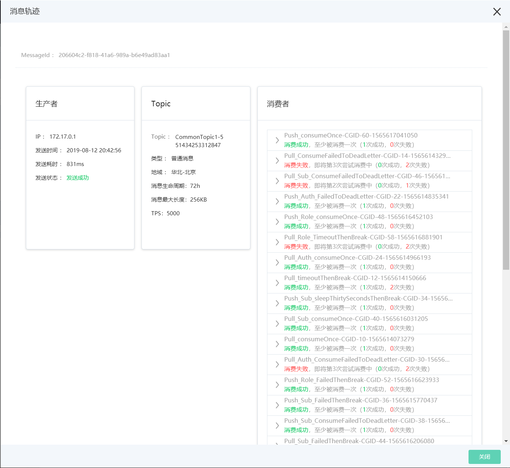

# Message Track

The message trace is the complete key node records of a message from the producer to all consumers. It can help users resolve the problem that the message status cannot be determined either by the producer or the consumer due to decoupling between production and consumption, and help users locate the problem and understand the detailed status of the message.


## Preconditions

At the moment, only messages sent from JAVA SDK support the message trace function. Messages received by and sent from HTTP API do not support message trace query

- Java SDK ([Version](https://mvnrepository.com/artifact/com.jdcloud/jcq-java-sdk)): V1.3.0 and above version
- Ensure that both Producer and Consumer enable the message trace records. The client is configured as disabling by default


The method to enable message trace is as below:

#### Code Example
```Java
        
        //Enable producer message trace and configure the attribute enableMessageTrace
        ProducerConfig producerConfig = ProducerConfig.builder()
                .metaServerAddress(META_SERVER_ADDRESS)
                .enableMessageTrace(true)
                .build();
                
        //Enable consumer message trace and configure the attribute enableMessageTrace        
        ConsumerConfig consumerConfig = ConsumerConfig.builder()
                .consumerGroupId(CONSUMER_GROUP_ID)
                .metaServerAddress(META_SERVER_ADDRESS)
                .enableMessageTrace(true)
                .build();
                
```

## Operation Steps

1. Go to the Message Queue Console and select Message Query on the left menu.
2. Select the region where the message to be inquired is located. Any tag can be selected. Enter the information for message query.
3. Select the problematic message and click **Message Trace** in operation to view the status so as to determine the problem.



Rules:

- Delayed message: The message cannot be inquired in the message query when the system time does not reach the specified delivery time, but you can inquire this message by separately calling the message trace interface.

- Consumption acknowledgement timeout (ACK timeout): If the consumption acknowledgement is time out, the consumption duration cannot be calculated and the consumption status is consumption failed.

- Effective time of message trace: The time of message trace record is same as the life cycle of the message, namely 3 days.

  

## Display Data

The production and consumption of messages involve three roles including the producer, the server and the consumer. Every production and consumption will produce the message trace. The information summarized and displayed by the message trace function is as below:

|          | Producer                                                  | Message Queue                                                 | Consumer                                                  |
| -------- | ------------------------------------------------------- | ------------------------------------------------------------ | ------------------------------------------------------- |
| Display Data | - Producer IP<br/>- Sending Time<br/>- Sending Duration<br/>- Sending Status<br/>- Latency Time | - Storage Topic<br/>- Topic Type<br/>- Topic Region<br/>- Storage Duration<br/>- Topic Relevant Attribute | - Consumer IP<br/>- Consumption Time<br/>- Consumption Status<br/>- Consumption Status |

Interpretations:

- Sending time: the time stamp of a message sent from the client (producer)
- Sending duration: the time that has been consumed of a message from the client (producer) to the server, unit: millisecond
- Sending Status:

| Sending Status              | Status Code         | Remark                                           |
| --------------------- | -------------- | ---------------------------------------------- |
| Sending Succeeded              | SUCCESS_NORMAL | The message has been sent successfully and the server has stored it successfully               |
| Sending failed              | FAILED         | The message sending failed, the server does not store the message, please try again     |
| Sent (delay:? seconds) | SUCCESS_DELAY  | This message is a schedule or latency message so it may not have yet been delivered to the consumer |


- Consumption Time: The time stamp when the client (consumer) starts to consume message
- Consumption Duration: Consumed time from client (consumer) consuming message to message confirmation, unit: millisecond
  - In the case of message confirmation timeout, the consumption duration cannot be calculated
- Consumption Status:

Consumer Group Status

| Consumer Group Consumption Status                         | Status Code      | Remark                                           |
| -------------------------------------- | ------------ | ---------------------------------------------- |
| Unconsumed                                 | UNCONSUMED   | This message has not been sent to consumer group yet or has been filtered due to the mismatched tag |
| Consumption succeeded, at least once               |  SUCCESS       | This message has been successfully consumed by consumer group                     |
| Consumption failed, trying consumption for the Xth time          | FAILED_RETRY | Consumer group consumption failed, waiting to try again                       |
| All consumptions failed, please process this message in the dead letter queue | ALL_FAILED   | All consumptions tried for this message failed                     |
| Unknown Status                               | UNKNOWN      | Unrecorded Status                                     |

consumer Status:

| Consumer Status             | Status Code                | Remark                                                         |
| ------------------------ | --------------------- | ------------------------------------------------------------ |
| Consumption Succeeded                  |  SUCCESS                | This consumption succeeded                                                 |
| Consumption failed, and no consumption result is returned | FAILED_WITHOUT_RESULT | No result for this message consumption method has not yet been returned, or the return is interrupted, resulting in that the consumption results are not returned to server |
| Consumption failed, and consumption confirmation failed   | FAILED_WITH_RESULT    | This consumption failed, and failure is returned for the consumption confirmation                               |
