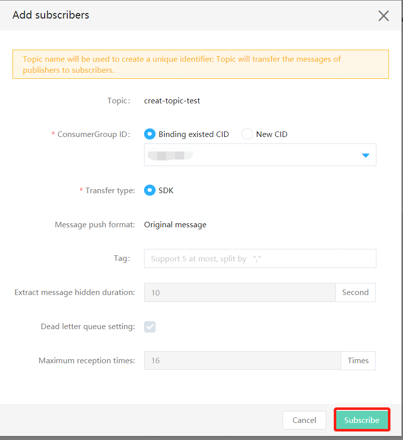

# Subscribe Topic
## Prerequisites
- You have created the topics.

## Considerations
- There is no limit to the number of Consumer Group subscriptions for a topic.
- You can choose the existing Consumer Group, or you can choose to create a new Consumer Group.

## Procedure
### 1. In topic list, choose **Subscribe** button in the subscription topic row.

### 2. When you have entered the subscription information, click **Subscribe** button.

  
I. The Consumer Group ID must be unique under Topic, if a name already exists; you are not able to create a Consumer Group ID any more. The Consumer Group ID only contains letters, numbers, hyphens (-), underscores (_), and the length is 7~64 characters.  
II. The relationship between Consumer Group ID and topic is N:M; that is the same Consumer Group ID can subscribe multiple topics, and the same topic can be bound with multiple Consumer Group ID.   
III. Extract message hidden duration is the length of time that messages received are not visible to other consumers, range: 30 seconds - 600 seconds.  
VI. Parameter of dead letter queue setting decides whether to enable dead letter queue of topic.  
V. Maximum reception times are the maximum times that allow receiving this message before it is sent to the dead letter queue, range: 0-16 times. 

### 3. You can view the subscription information in "Topic Detail > Subscription Management".

- You can click **Modify Configuration** to modify the subscription that has already been created  
- Click **Cancel Subscription** button to cancel the subscription operation.
