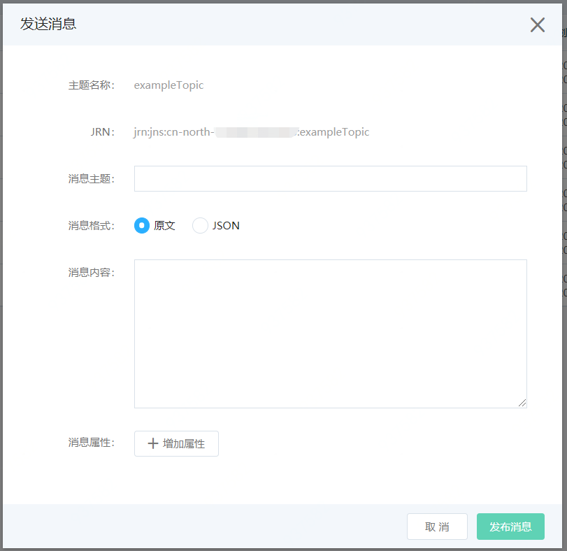

# Message Release
1. Find the topic where the message is released from the topic list and click **Release Message** from the operation bar.

   

2. Fill in the message topic (optional) and select the message format

   

   - Original text: All terminal nodes send the same message contents.

     [Because signature ID and template ID are required for sending SMS, it is not suggested to send messages via the original text for the topic with SMS terminal node. If so, the terminal nodes of other types will also receive signature ID and template ID rather than contents in an SMS template]

   - Json: Message contents of different terminal nodes can be selected via customization.

     ```json
     {
       "default": "Example Message",
       "http": "Example Message of HTTP Terminal Node",
       "https": "Example Message of HTTPS Terminal Node",
       "email": "Example Message of Email Terminal Node",
       "jqs": "Example Message of Queue Service Terminal Node",
       "function": "Example Message of Function Service Function Terminal Node",
       "sms": {
         "templateId": "Template Id",
         "signId": "Signature Id",
         "params": ["Male", "Sophomore"]
       }
     }
     ```
     - parans: Data value corresponding to SMS template variable, in the format of Array, e.g. ["Male", "Sophomore"]
     
3. Fill in message attribute. Set some message attributes for messages to help the subscribers filter policies and messages or classify different messages.

   - The limit for message attribute count is 10. All message attribute components are covered by the message size restriction, maximum 256KB.
   - The message attribute name can contain the following characters: A-Z, a-z, 0-9, underline (_), hyphen (-) and dot (.).
   - Description:
     - 1. The maximum length is 256 characters
     - 2. It must be unique among all attributes of the message
     - 3. It cannot start or end with a dot
     - 4. There can be no consecutive periods in a sequence
   - Message attribute data type: Supported types include: String, String.Array, Number and Binary.
   - Message attribute value: Fill in corresponding contents according to the notification. If the attribute type is "String.Array", please place the array in the square brackets "[]". In this array, the character string value shall be placed in the double quotation marks.

4. Select **Release Message** to release messages to the topic.

5. Receive message: After a terminal is subscribed, the released topic information will be received. The subscribers can view the information by logging in the subscription terminal.

   For SMS and terminal node selected for original text message transmission, only message contents can be viewed and other message metadata is unavailable.

   If you do not select the terminal node for transmitting message of original text, you can see similar messages in json format:

```json
{ 
    "Type": "Notification", 
    "MessageId": "2c9f3f9ef9d348c58fb96a01ded6f886", 
    "TopicJrn": "jrn:jns:cn-north-1:userid:exampleTopic", 
    "Subject": "exampleMessage", 
    "Message": "hello world，hello JDcloud Notification Service。", 
    "TimeStamp": "2020-01-16 15:50:48", 
    "UnsubscribeURL": "http://jns.cn-north-1.jdcloud.com/unsubscribe.html?SubscriptionJrn=xxxxxxxx", 
    "MessageAttributes": { 
        "example": { 
            "StringValue": "2020", 
            "DataType": "Number" 
        } 
    } 
}
```

If you intend to unsubscribe the topic, please send HTTP GET request to UnsubscribeURL and then you can unsubscribe the topic.


## SMS Release

Because of legal security specification, before sending SMS, the sender needs to apply for SMS signature and SMS template. SMS can only be normally sent after the application is approved. So, SMS to be sent in Notification Service can be supplied in [Text Message](https://sms-console.jdcloud.com/overview).

Reference documents:  
[Signature Application](https://docs.jdcloud.com/en/text-message/signature)  
[Template Application](https://docs.jdcloud.com/en/text-message/content)  
[Template Variable Rule](https://docs.jdcloud.com/en/text-message/para)

Fill the signature Id and template Id to be supplied and the variable array in the Json message body of the released message. Then the SMS subscription terminal can receive the message.
