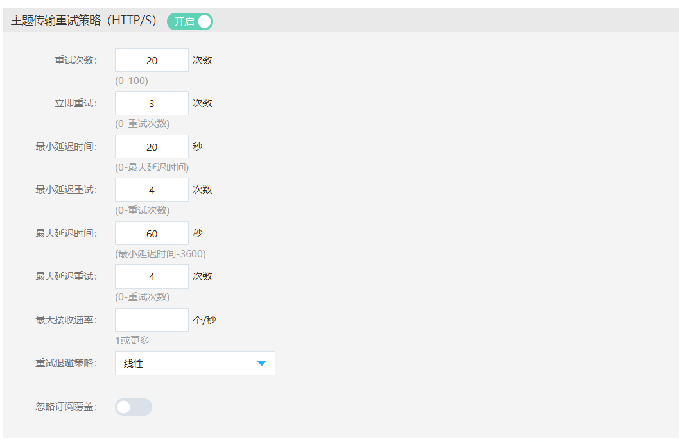

# Message Transmission Retry Policy

The transmission retry policy defines how to make message retry when Notification Service fails to push the message to the subscription terminal node. When the transmission retry policy completes prescribed retry times, the Notification Service will stop retry and discard this message, unless the dead letter queue is subscribed and configured.

## Transmission Retry Policy of Notification Service

| Terminal Node Type         | Immediate Retry          | Minimum Delay Retry/Interval Time | Black-off Retry/Black-off Policy                        | Maximum Delay Retry/Interval Time | Total Try Count        |
| -------------------- | ----------------- | --------------------- | ---------------------------------------- | --------------------- | ----------------- |
| HTTP/S               | Customization (Default 0 Time) | Customization (Default 0 Time)     | Customization (Default 3 Times, Linear Black-off (20 Seconds - 20 Seconds)) | Customization (Default 0 Time)     | Customization (Default 3 Times) |
| SMS          | 0 Time               | 2 Times, 1 Second              | 10 Times, Indicator Black-off (1 Second - 10 Minutes)             | 38 Times, 10 Minutes          | 50 Times             |
| Email        | 1 Time               | 1 Time, 10 Seconds             | 10 Times, Linear Black-off (10 Seconds - 5 Minutes)             | 90 Times, 5 Minutes           | 102 Times             |
| Queue Service (JQS)      | 10 Times              | 100,000 Times, 20 Seconds        | 0 Time                                      | 0 Time                   | 100,010 Times          |
| Function Service (Function) | 0 Time               | 2 Times, 1 Second              | 10 Times, Indicator Black-off (1 Second - 20 Minutes)             | 38 Times and 20 Minutes         | 50 Times             |


### Each transmission retry policy comprises four stages.

1. Immediate retry stage - This stage will occur immediately after the first push failure. In this stage, there is time interval between two retries.
2. Minimum time interval retry stage - This stage will occur immediately after the retry stage. In this stage, the time interval between two retries is the minimum delay time value.
3. Black-off retry stage - This stage will occur after the minimum interval retry stage. In this stage, delay between retries can be controlled via the prescribed black-off policy. In this stage, the minimum delay time, maximum delay time and black-off policy are set. The black-off policy defines the rate for increasing the minimum delay time to the maximum delay time. The retry black-off policy can be of arithmetic, indicator, geometry or linear type.
4. Maximum time interval retry stage - This stage will occur after the black-of retry stage. In this stage, the time interval between two retries is the maximum delay time value.


## Customized HTTP/S Transmission Retry Policy

Users can customize HTTPS transmission retry policies according to different business features. HTTP/S transmission polices can be defined in the topic or subscription. When HTTP/S subscribes and sets the subscription-level transmission retry policy, the topic-level transmission retry policy will be replaced. (Unless **Ignore Subscription Replace** is checked for the topic-level retry transmission policy, the topic-level transmission retry policy will replace the subscription level.)

#### If users intend to set the following policies according to 4 transmission retry stages:

Total retry number: 20 times

1. Immediate retry stage: 3 times
2. Minimum time interval retry stage: 4 times, 20 seconds per interval
3. Black-off retry stage: 10 times, linear black-off, 20 seconds to 60 seconds
4. Minimum time interval retry stage: 4 times, 60 seconds per interval

##### Console Setting



##### SDK Setting- JSON Preview

```
{
  "healthyRetryPolicy": {
    "numRetries": 20,
    "numNoDelayRetries": 3,
    "minDelayTarget": 20,
    "maxDelayTarget": 60,
    "numMinDelayRetries": 4,
    "numMaxDelayRetries": 4,
    "backoffFunction": "linear"
  },
  "disableSubscriptionOverrides": false
}
```
###### JSON Meaning
The transmission policy contains one retry policy and two restriction policies. The transmission policies have 8 attributes in total.

| Policy                           | Description                                                         | Range                                                 |
| :----------------------------- | :----------------------------------------------------------- | :--------------------------------------------------- |
| `numRetries`                   | Total retry number comprises immediate retry, minimum delay retry, black-off retry and maximum delay retry. | 0 - 100 **Default value: ** 3                                |
| `numNoDelayRetries`            | Immediate retry times                                         | 0 or more **Default value:** 0                                |
| `minDelayTarget`               | Minimum delay time of retry. **Unit:** Second                             | 0 to maximum delay time **Default value:** 20                       |
| `maxDelayTarget`               | Maximum delay time of retry. **Unit:** Second                              | Minimum delay time to 3600 **Default value:** 20                    |
| `numMinDelayRetries`           | Retry number of minimum time interval retry stage, the minimum delay time specified between retries. | 0 or more, **Default value:** 0                              |
| `numMaxDelayRetries`           | Retry number of maximum time interval retry stage, the maximum delay time between retries. | 0 or more, **Default value:** 0                              |
| `backoffFunction`              | Black-off policy function between retries.                                       | One of the four options: arithmetic, indicator, geometry and linear type, **default:** linear |
| `maxReceivesPerSecond`         | Maximum transmission number of each subscription per second.                                 | 1 or more, **Default:** No restriction                           |
| `disableSubscriptionOverrides` | Replace subscribed transmission retry policy or not                                   | true or false, **default:** false                         |

Retry number of black-off policy stage:

```
numRetries - numNoDelayRetries - numMinDelayRetries - numMaxDelayRetries
```


Black-off policy function:


y refers to the delay time, x refers to the retry time, y2 refers to the maximum delay time, y1 refers to the minimum delay time, x2 refers to the retry times of black-off policy stage, x1 equals 1 and the α value controls horizontal axis scaling curve

Linear (α=1)

Indicator (α=10) 

Geometry (α=4)

Arithmetic (α=2)
