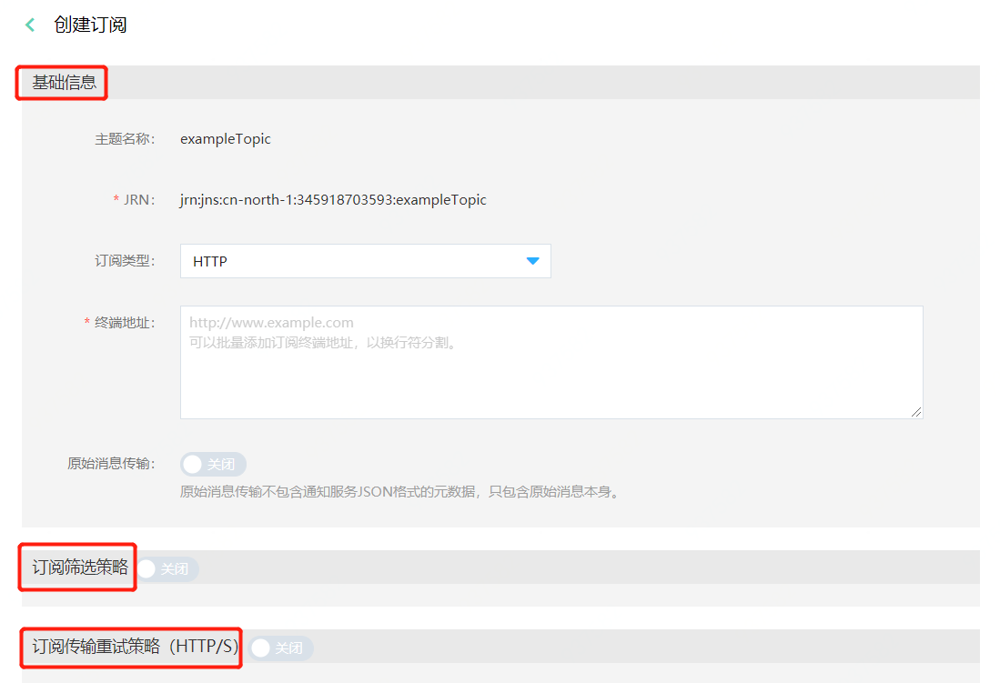

# Subscription Creation
After the topic is created, you need to create subscription under the topic. Then, the subscribing terminal node can receive message released to the topic.

## Create Subscription
1. On the Notification Service Console, find the topic for subscription creation in the list, click **Subscription** in the operation bar and enter the subscription creation page.

2. Log in the topic creation page

Totally, subscription creation comprises three parts:
- Basic Information
- Subscription Filtering Policy
- Subscription Transmission Policy

Complete the information and click **Create Subscription**. If succeeded, the notification of Creation Succeeded will be shown in the upper right corner and the topic subscription list page will be redirected to. If failed, the notification of error message will be shown in the upper right corner. Please make modification according to notification and submit again.

#### Subscription Creation-Basic Information

1. Topic name: Refer to the name of topic to be subscribed.

2. JRN: Required, the topic JRN (unique resource identification ID).

3. Subscription type: Required, the type of terminal node to be subscribed, including: HTTP, HTTPS, JQS and SMS.

4. Terminal address: Required, fill in address of terminal node which receives messages pushed by Notification Service.

| Subscription Type | Example                                                  |
| -------- | ---------------------------------------------------- |
| HTTP     | "http://www.example.com"                             |
| HTTPS    | "https://www.example.com"                            |
| Email    | "example@example.com"                                |
| JQS      | "jrn:jqs:cn-north-1:userPin:testQueue (Standard Queue)"   |
| Fucntion | "Please select the trigger function", "Please select function versions/alias"             |
| SMS      | "13xxxxxxxxx (Domestic)                                |

5. Original message transmission: Required. When the subscription type is HTTP, HTTPS or JQS, this parameter is available. When the original message transmission is enabled, the pushed message does not contain the metadata in JSON format of Notification Service and only comprises the original message itself.
#### Subscription Creation-Subscription Filtering Policy
Subscription filtering policy: Not required. The subscription filtering policy helps filtering of messages released to the topic by the subscribers. Therefore, the subscribers can get messages and notifications which he/she is interested rather than get every message released to the topic. For details, [See](Filtering-Policies.md).

#### Subscription Creation-Subscription Transmission Retry Policy (HTTP/S)
Subscription Transmission Retry Policy (HTTP/S): Not required, only when the subscription type is HTTP or HTTPS, this parameter is available. The transmission retry policy defines how to make message retry when Notification Service fails to push the message to the subscription terminal node. When the transmission retry policy completes prescribed retry times, the Notification Service will stop retry and discard this message, unless the dead letter queue is subscribed and configured. For details, [See](../Message-Management/Reties-Policies.md)
