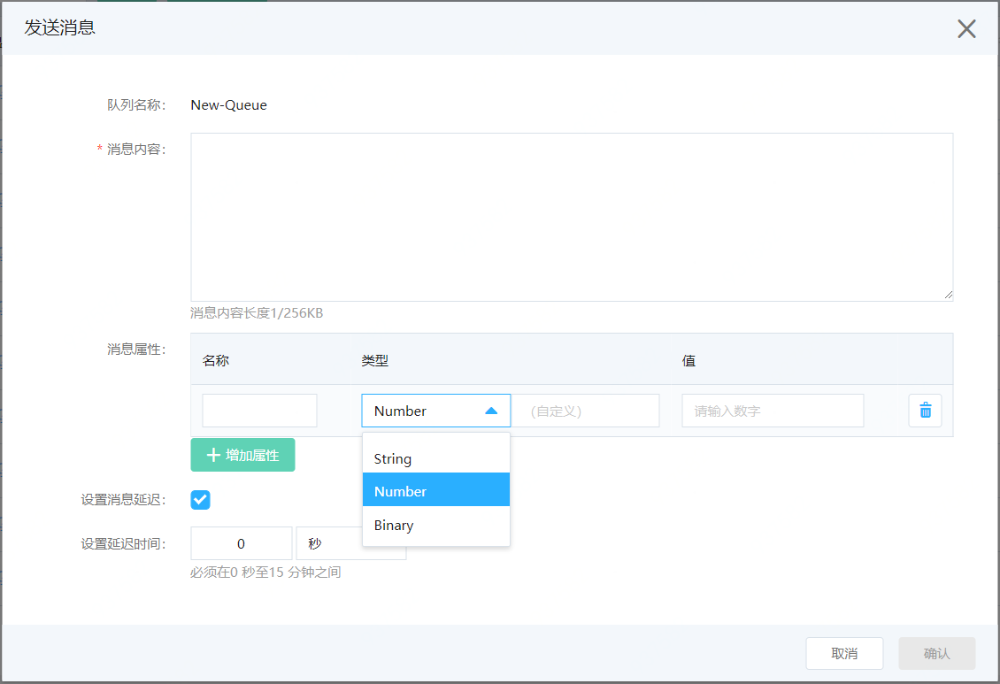

# Send Message

1. Find the queue on which you want to send the message on the Queue Management page, and select **Send Message** in the operation.

2. For sending messages in a standard queue, you can add message attributes to a message and set the latency time for sending latency message.

   Standard Queue-Send Message:

   

   - Message Content: The content size is defined according to the maximum length of the message in the queue attribute
   - Message Attribute:
     - Message Attribute Name:
       1. It can contain the following characters: A-Z, a-z, 0-9, underline (_), hyphen (-)  and dot (.)
       2. The maximum length is 256 characters
       3. It must be unique among all attributes of the message
       4. It cannot start or end with a dot
       5. There can be no consecutive periods in a sequence
     -  Message Attribute Type: Types supported include String, Number and Binary. The next customized input box supports adding customized additional types, such as float,int. Then the attribute will turn to be Number.float, Number.int
     - Message Attribute Value: Depending on the selection of the message attribute type, you need to enter a different type of value
     - All contents of the message attributes are included in the message size limit
   - Set latency time: 0-15 minutes; the unit is second; it will replace the delivery latency in the queue after setting

3. For sending messages in a FIFO queue, you can add message attributes to a message and need to fill in the message group ID as well as the message duplicated data deletion ID.

   FIFO Queue-Send Message:
   

   - Rules of message attribute are the same of those of the standard queue
   - Message Group ID: The parameter that specifies the specific message group which the message belongs to. Messages in the same message group are ordered strictly in the order in which they are sent to the queue (However, messages in different message groups will not be processed in an orderly manner)
   - Message Duplicated Data Deletion ID: The token to delete the duplicated data. If a message with a specific message duplicated data deletion ID is successfully sent, within the 5-minute duplicated data deletion interval, any message with the same message duplicated data deletion ID will be received but will not be delivered
   - Notification: For a FIFO queue that does not check the deduplication based on message content, both the "Message Group ID" and the "Message Duplicated Data Deletion ID" are compulsory. For a FIFO queue that has checked the deduplication based on message content, the "Message Group ID" is compulsory while the "Message Duplicated Data Deletion ID" is optional
