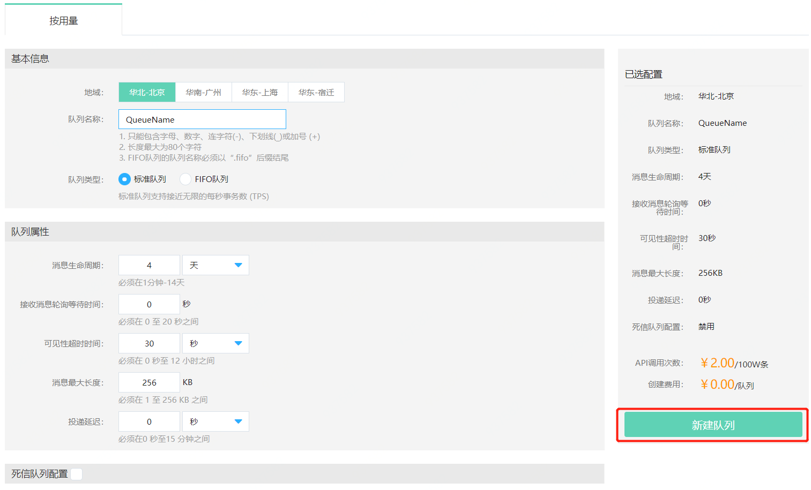

# Create Queue

1. Select the region where you want to create the resource, click the **Create** button to create the queue.

   

2. You need to fill in the “Queue Name” for creating a queue. It can only contain letters, digits, hyphens (-), underlines (_)  or addition operator (+), with the maximum length of 80 characters. Select the type of queue. If a FIFO queue is selected, the name of queue needs to be ended with the “.fifo” suffix.

   

3. Fill in the queue attribute according to your own demands.

   - Life Cycle of Message: 1 minute - 14 days, with the unit of second, referring to the longest liveness time of a message in the queue
   - Round Robin Waiting Time for Receiving Messages: 0-20 seconds, with the unit of second, referring to the response waiting time that the request fails to get the message
   - Visibility Time-out Period: 0-12 hours, with the unit of second, referring to the time during which the messages received are not visible to other receivers
   - Message Maximum Length: 1-256KB, with the unit of KB, referring to the size of the largest message received in the message queue
   - Delivery Delay: 0-15 minutes, with the unit of second, referring to the delay time for messages to be delivered to the queue
   -   Deduplication Based on Message Content (unique attribute of a FIFO queue): Whether the deduplication based on message content is required for a FIFO queue

4. Configure the dead letter queue according to your own demands

   

   - Dead Letter Queue: Select the created queue of the same queue type as the dead letter queue for this newly created queue
   - Maximum Number of Receipt: 1-1,000; messages will be transferred to the target dead letter queue if they are not deleted after the maximum number of times received is reached

5. Then click **Create Queue** to complete the creation
