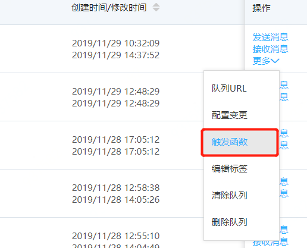

# Trigger Function
  Messages sent to the Queue of Queue Service can use this function if you want to trigger the Function Service to process the messages.
  
## Preconditions

- The standard Queue has been created in the Queue Service. FIFO Queue does not support this function
- The function that Function Service wants to trigger has been configured with service role, and the system policy: JDCloudQueueServiceTriggerFunction has been added to the Function Service Role Permission.

## Note

- The message that triggers the function will be deleted after it is pulled and consumed by the function service and cannot be consumed by other consumers
- A Queue can trigger one or more functions, but the Queue and the function need to be in the same region

## Operation Steps
1. Select the Queue you want to trigger the function, and then select more in the operation column to trigger the Function.

   

2. Select the function you want to trigger, and its version/alias and processing batch size for the trigger configuration. If there is no function created, you can click **Create Function** to create a function (the system policy: JDCloudQueueServiceTriggerFunction needs to be added to the Function Service Role Permission), and then refresh the list to select the function just created.

   

3. The trigger function you just configured can be viewed in the trigger service on tab page of the Queue Detail. By clicking **Modify**, you can modify the processing batch size or delete the trigger function.

   
   

