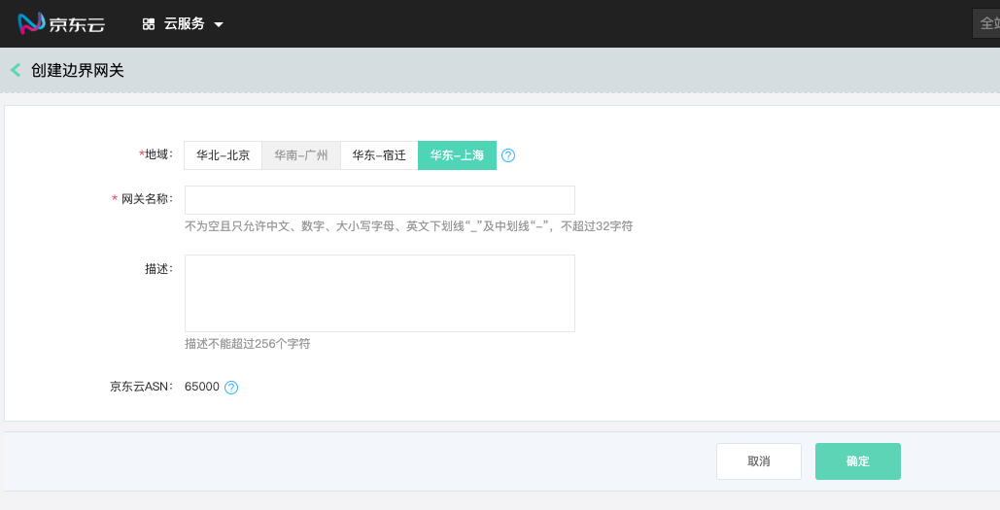

## Border Gateway
Border Gateway (BGW) is a gateway used by JD Cloud & AI to carry VPC north-south traffic. Its main function is to realize Intranet interconnection with other external gateways or environments (such as enterprise IDC).

Current business scenarios realized by border gateway include:
  * Multiple VPCs’ interconnection in the same region;
  * Interconnection between VPC and enterprise IDC/JD Cloud & AI cabinet service through direct connect in the same region;
  * Interconnection between VPC and enterprise IDC/Office/Branch is achieved via VPN;

### Operation Steps
##### 1. Create Border Gateway
a) Log in [JD Cloud & AI Border Gateway Console](https://cns-console.jdcloud.com/host/borderGateway/list);  <br/>
b) Select the region where the cloud resources to be accessed are located, and click **Create**;<br/>
c) Enter border gateway name and create Border Gateway;<br/>
d) The border gateway supports running BGP routing protocol with other gateway devices. The BGP ASN of current JD Cloud & AI border gateway is fixed to 65000, which will be open to modify in the future;<br/>

```
  The function of the border gateway supporting running BGP routing protocol is currently only released in Guangzhou and Shanghai.
```



##### 2. Modify Border Gateway
You can modify name, routing clauses, VPC attachment and transmission of border gateway.<br/>
a) Log in [JD Cloud & AI Border Gateway Console](https://cns-console.jdcloud.com/host/borderGateway/list);  <br/>
b) Click corresponding border gateway and enter border gateway details;<br/>
c) The details support modifying border gateway name, configuring route table, and newly creating/editing VPC attachments, and the BGP ASN will be open to modify in the future;<br/>
d) Configure border gateway route table, which supports two types of routes: Including static routes and BGP dynamic/transmission routes. Static route is statically configured in route table, while BGP dynamic/transmission route is learned from other BGP Peer devices by virtue of BGP Routing Protocol or transmitted through VPC attachments. Static route supports editing, while BGP dynamic route needs to modify the released route at BGP Peer device. VPC transmission route will be updated by modifying transmission segment of VPC attachment. For more contents of border gateway route table configuration route transmission, refer to [VPC Attachment Operation Manual](VPC-Attachment-Configuration.md);<br/>

```
The function of the border gateway supporting running BGP routing protocol is currently only released in Guangzhou and Shanghai.
```


##### 3. Delete Border Gateway
If you do not need Border Gateway anymore, you can delete it.<br/>
a) Log in [JD Cloud & AI Border Gateway Console](https://cns-console.jdcloud.com/host/borderGateway/list);  <br/>
b) Select Border Gateway to be deleted and click **Delete** on the operation bar. The border gateway without private virtual interface, hosted private virtual interface, VPN connection and VPC attachment created can be deleted;<br/>


For more content, refer to [Border Gateway Product Function](https://docs.jdcloud.com/en/direct-connection/border-gateway-features).
