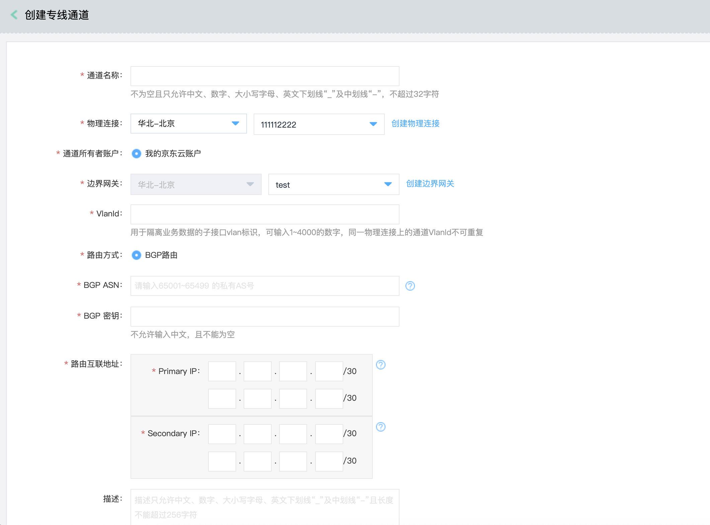
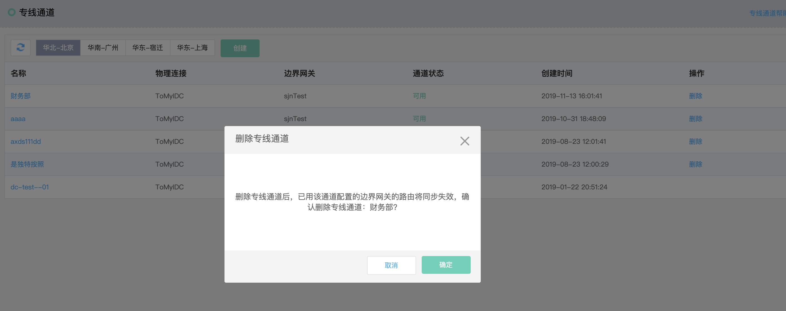

## Private Virtual Interface
Private Virtual Interface is the logical channel on Physical Connection to divide service flow. Different Private Virtual Interfaces deal with different services. The Private Virtual Interface shall be isolated from each other so that they will not affect each other.

```
  Please plan the network segments in the IDC and the VPC in advance to ensure that the network segments in the IDC and the network segments in the VPC do not overlap.
```

### Operation Steps
##### 1. Create Private Virtual Interface
Customers that have a Physical Connection in the status of "available" can use a Private Virtual Interface.<br />
a) Log in [JD Cloud & AI Private Virtual Interface Console](https://cns-console.jdcloud.com/host/dedicatedVif/list);  <br />
b) Select region and click **Create**;<br />
c) Enter the name of Private Virtual Interface, select a Physical Connection and Border Gateway, allocate vlanId, routing method, BGP ASN of client device, BGP key pair, BGP interconnection address and description, and create a Private Virtual Interface;<br />
d) After a Private Virtual Interface is created, and a period of configuration distribution, the Private Virtual Interface shall enter into the status of "available". The configuration distribution process involves the cloud configuration distribution, as well as vlan connection with the client, BGP Session establishment, BGP route learning, etc. Please complete the relevant configuration in the client device in advance;<br />

```
  Only available Physical Connection supports Private Virtual Interface creation.
  At present, only the VPC resources of the same account are allowed to be accessed.

  Private Virtual Interface Parameter Description:
  vlanId: Multiple Private Virtual Interfaces can be created on the same Physical Connection; different Private Virtual Interfaces can be distinguished and isolated by different vlanld, namely vlan number.
  BGP ASN: The protocol running between the Direct Connection device and the client device of JD Cloud & AI is BGP Routing Protocol. The BGP ASN used by JD Cloud & AI is 64512; the range of BGP ASN supported by the client is: 65001~65499.
  BGP Key Pair: The current BGP key pair configuration does not take effect and can be arbitrarily specified here, but please do not configure the BGP key pair when configuring the client.
  Routing Interconnection Address: It is the interconnection address used to establish BGP Session between JD Cloud & AI and the client. From the perspective of high availability, please respectively assign two pairs of /30 addresses, the first of which shall be used by the client, and the second of which shall be used by JD Cloud & AI. The interconnection address supports addresses in three Intranet segments of 10/8, 172.16/12 and 192.168/16.
```

```
  Status instruction for each Private Virtual Interface:
  Configuring: It is the status of Private Virtual Interface in the process of configuration delivery. Please synchronize the client configuration;
  Available: It is the status of Private Virtual Interface upon its configuration delivery and with the BGP Session established with the client. In such a status, normal communication can be conducted;
  Unavailable: It represents the Private Virtual Interface cannot be used for normal communication. After failures are removed, the Private Virtual Interface will enter into the status of "available";
  Deleting: The customers can delete the Private Virtual Interface when they no longer need to use it. When deleting, relevant configuration needs to be cleared, and this period lasts for a while. Upon configuration clearance, the deletion of Private Virtual Interface is completed;
```



##### 2. Modify Private Virtual Interface
You can modify the name and description of Private Virtual Interface.<br />
a) Log in [JD Cloud & AI Private Virtual Interface Console](https://cns-console.jdcloud.com/host/dedicatedVif/list);  <br />
b) Select corresponding Private Virtual Interface and log in the details of Private Virtual Interface;<br />
c) Modification of the name and description of Private Virtual Interface is supported, and the restriction of each configuration item is the same as the creation of Private Virtual Interface;<br />


##### 3. Delete Private Virtual Interface
If you do not need Private Virtual Interface anymore, you can delete it.<br />
a) Log in [JD Cloud & AI Private Virtual Interface Console](https://cns-console.jdcloud.com/host/dedicatedVif/list);  <br />
b) Select corresponding Private Virtual Interface, and click **Delete** on the operation bar;<br />


