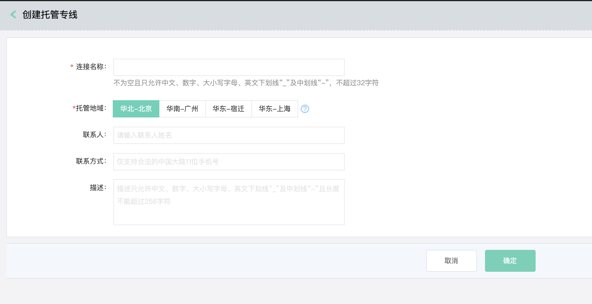
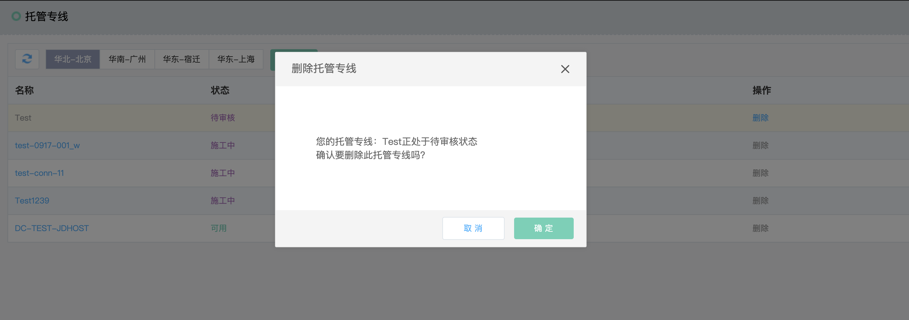

## Hosted Connection
Hosted Connection accesses public cloud via physical link Direct Connection so that the customer’s JD Cloud & AI Cabinet Service can access the VPC resources. Hosted Connection logically represents a physical link.

### Operation Steps
##### 1. Create Hosted Connection
Customers who have completed enterprise real-name verification can use a Hosted Connection.
a) Log in [JD Cloud & AI Hosted Connection Console](https://cns-console.jdcloud.com/host/hConnection/list);  <br />
b) Select region and click **Create**;<br />
c) Enter the name, hosted region, contacts, contact information and description of a Hosted Connection, and create it;<br />
e) Generally speaking, 1 to 2 working days are required for auditing a newly created Hosted Connection;<br />

```
  Status instruction for each Hosted Connection:
  To be audited: After the customer applies for a Hosted Connection, it will enter into the status of "to be audited". The Hosted Connection shall be audited by the background personnel of JD Cloud & AI, and the items to be audited include: whether the customer has completed the enterprise real-name verification or not, etc. If approved, the Hosted Connection will enter into the status of "to be paid", and the corresponding order will be generated. If unapproved, the Hosted Connection will enter into the status of "unapproved";
  To be paid: Under such a status, the customer may make a payment for the corresponding order. After the customer pays for the order, the Hosted Connection will automatically enter into the status of "under construction";
  Under construction: After the physical link connects with the Direct Connection device port of JD Cloud & AI and the link layer is successfully debugged (when port is UP, the optical transmitting and receiving is normal), the construction is deemed as completed, and then the Hosted Connection will enter into the status of "to be confirmed";
  To be confirmed: When the Hosted Connection is in the status of "to be confirmed", the customer can conduct network joint debugging test to physical link with JD Cloud & AI. When the network joint debugging test is passed, the customer shall confirm that the construction of Hosted Connection is completed on JD Cloud & AI Console. Upon confirmation, the Hosted Connection will enter into the status of "available";
  Available: It represents the Hosted Connection can be normally used now. When some causes result the physical link cannot be normally used, the Hosted Connection will enter into the status of "unavailable";
  Unavailable: It represents the Hosted Connection cannot be normally used now. After failures are removed, the Hosted Connection will enter into the status of "available";
  Deleting: When the customers no longer need the Hosted Connection, they can delete it. As the physical link needs to be removed, the customer shall submit an application for link removal 1 month in advance at least. When the customer deletes the Hosted Connection, the Hosted Connection will enter into the status of "deleting". After the physical link is confirmed to have been removed, JD Cloud & AI’s background personnel will verify it, delete the Hosted Connection synchronously and clear all configuration information related to the Hosted Connection in the Direct Connection physical device;
  Unapproved: It is the status when the Hosted Connection is unapproved due to some causes;
```



##### 2. Modify Hosted Connection
You can modify the name and description of Hosted Connection.<br />
a) Log in [JD Cloud & AI Hosted Connection Console](https://cns-console.jdcloud.com/host/hConnection/list);  <br />
b) Select corresponding Hosted Connection and log in the details of Hosted Connection;<br />
c) Modification of the name and description of Hosted Connection is supported, and the restriction of each configuration item is the same as the creation of Hosted Connection;<br />


##### 3. Resize Hosted Connection
If you need to resize the physical port specification due to business changes, please consult with JD Cloud off line for the specific change time and prepare the required single-mode optical module of new specification. The data center personnel will change the port after the hosted connection cuts off the traffic. After the port is changed and the traffic is confirmed to be recovered (the speed limit of the physical port then is the original specification), please resize the port configuration in the Console in order for billing as per the new port specification. The speed limit will be automatically resized as the new rate after the payment is made.<br />
a) Log in [JD Cloud Hosted Connection Console](https://cns-console.jdcloud.com/host/hConnection/list);  <br />
b) Select the corresponding hosted connection and click **Resize** on the operation bar. Please upgrade or downgrade the configuration as per your actual needs;<br />

##### 4. Delete Hosted Connection
If you do not need Hosted Connection anymore, you can delete it.<br />
a) Log in [JD Cloud & AI Hosted Connection Console](https://cns-console.jdcloud.com/host/hConnection/list);  <br />
b) Select the corresponding Hosted Connection and click **Delete** on the operation bar. The Hosted Connection without Private Virtual Interface created can be deleted;<br />


